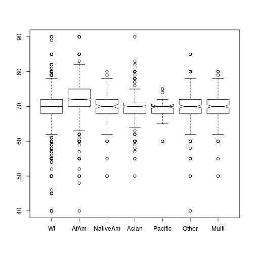
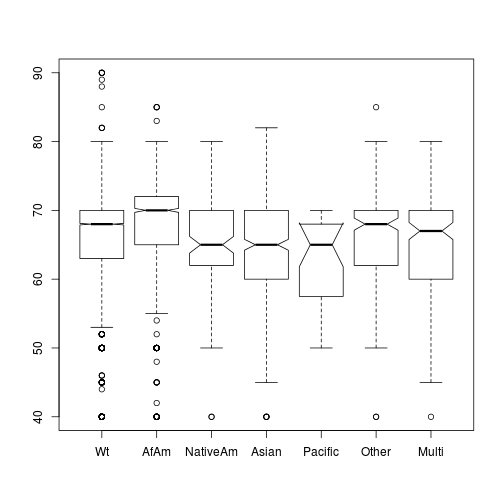
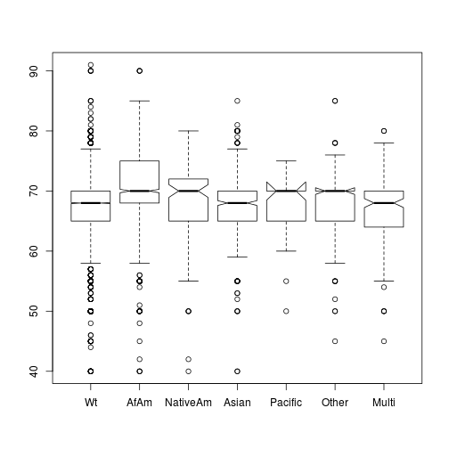
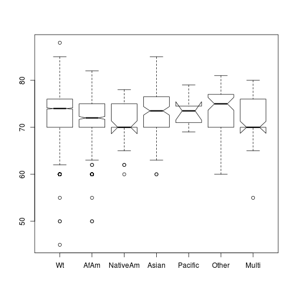
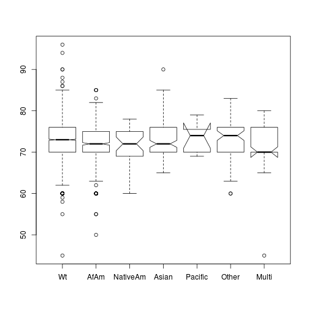

Research Notes for Housing Market Institutions Drive Race and Ethnicity Differences in Energy Consumption
========================================================

Load in the raw data.

```r
RECS <- read.csv("~/Research/EnergyEthnicity/Data/recs2009_public.csv")

#summary(RECS)
```

Lots of recodes in there.


```r
library(plyr)
#ID
RECS$DOEID<-as.factor(RECS$DOEID)  

#Region
RECS$REGIONC<-revalue(as.factor(RECS$REGIONC),c("1"="NE", "2"="MidWest","3"="South","4"="West"))

#Type of Structure
RECS$TYPEHUQ<-revalue(as.factor(RECS$TYPEHUQ), c("1"="Mobile", "2"="SFDetached", "3"="SFAttached", "4"="SmApartment", "5"="LgApartment"))

#Climate zone
RECS$Climate_Region_Pub<-revalue(as.factor(RECS$Climate_Region_Pub),c("1"="VColdCold","2"="HotDryMixedDry","3"="HotHumid","4"="MixedHumid","5"="Marine"))

#Urban vs Rural
RECS$UR<-revalue(as.factor(RECS$UR), c("U"="Urban","R"="Rural"))

RECS$KOWNRENT<-revalue(as.factor(RECS$KOWNRENT),c("1"="Own","2"="Rent","3"="Free"))

#Year Built
summary(RECS$YEARMADE)
```

```
##    Min. 1st Qu.  Median    Mean 3rd Qu.    Max. 
##    1920    1955    1975    1971    1991    2009
```

```r
#Moved in
RECS$OCCUPYYRANGE<-revalue(as.factor(RECS$OCCUPYYRANGE),c("1"="Pre50", "2"="5059","3"="6069","4"="7079","5"="8089","6"="9099", "7"="0004","8"="0509"))

#Bedrooms
RECS$BEDROOMS[RECS$BEDROOMS==-2]<-NA
summary(RECS$BEDROOMS)
```

```
##    Min. 1st Qu.  Median    Mean 3rd Qu.    Max.    NA's 
##    0.00    2.00    3.00    2.86    3.00   13.00     215
```

```r
#Working with cooking end use
summary(RECS$STOVEN)
```

```
##    Min. 1st Qu.  Median    Mean 3rd Qu.    Max. 
##  0.0000  1.0000  1.0000  0.9112  1.0000  3.0000
```

```r
summary(RECS$STOVE)
```

```
##    Min. 1st Qu.  Median    Mean 3rd Qu.    Max. 
##  0.0000  0.0000  0.0000  0.1233  0.0000  2.0000
```

```r
summary(RECS$OVEN)
```

```
##    Min. 1st Qu.  Median    Mean 3rd Qu.    Max. 
##  0.0000  0.0000  0.0000  0.1567  0.0000  3.0000
```

```r
#Stove and oven fuel are only reported if separate

RECS$CookTopElectric<-FALSE
RECS$CookTopElectric[RECS$STOVENFUEL=='5' | RECS$STOVEFUEL=='5' ]<-TRUE

RECS$OvenElectric<-FALSE
RECS$OvenElectric[RECS$STOVENFUEL=='5' | RECS$OVENFUEL=='5' ]<-TRUE

#Just indicating that that cook with electricity
summary(RECS$CookTopElectric)
```

```
##    Mode   FALSE    TRUE    NA's 
## logical    4750    7333       0
```

```r
summary(RECS$OvenElectric)
```

```
##    Mode   FALSE    TRUE    NA's 
## logical    4395    7688       0
```

```r
#How much they use it
RECS$NUMMEAL<-revalue(as.factor(RECS$NUMMEAL),c("0"="Never","1"="ThreeDay","2"="TwoDay", "3"="OneDay", "4"="FewWeek","5"="OneWeek","6"="LessWeek"))

#this is better on cooking fuel.  Don't use the separate oven and cook top from above
RECS$ELectricCook<-FALSE
RECS$ELectricCook[RECS$FUELFOOD=="5"]<-TRUE

#Number of fridges.  Watch out for those with more than 4.
table(RECS$NUMFRIG)
```

```
## 
##    0    1    2    3    4    5    6    7 
##   19 9167 2626  226   34    9    1    1
```

```r
#age of fridge
RECS$AgeFridge<-revalue(as.factor(RECS$AGERFRI1), c("1"="Less2", "2"="2to4Years", "3"="5to9Years","41"="10to14Years","42"="15to19Years","5"="20PlusYears","-2"=NA))

summary(RECS$AgeFridge)
```

```
##       Less2   2to4Years   5to9Years 20PlusYears 10to14Years 15to19Years 
##        1523        2886        4212         546        2163         734 
##        NA's 
##          19
```

```r
#Has Dishwasher
RECS$DishwaherTrue<-revalue(as.factor(RECS$DISHWASH),c("0"=TRUE, "1"=FALSE))

RECS$WASHLOAD<-revalue(as.factor(RECS$WASHLOAD),c("1"="1Less","2"="2to4Loads","3"="5to9Loads","4"="10to15Loads","5"="15PlusLoads","-2"=NA))

RECS$DRYER<-revalue(as.factor(RECS$DRYER), c("0"=FALSE,"1"=TRUE))

RECS$DRYRFUEL<-revalue(as.factor(RECS$DRYRFUEL), c("1"="NG","2"="LPG","5"="Elec","-2"=NA))

##Start Recoding HERE

#Age of Dryer
AGECDRYER<-revalue(as.factor(RECS$AGECDRYER),c("1"="Less2","2"="TwoTo4", "3"="FiveTo9", "41"="TenTo14", "42"="FifteenTo19", "5"="Gr20", "-2"=NA))
summary(RECS$AGECDRYER)
```

```
##    Min. 1st Qu.  Median    Mean 3rd Qu.    Max. 
##   -2.00    1.00    3.00    9.24    3.00   42.00
```

```r
#Number of TVs
summary(RECS$TVCOLOR)
```

```
##    Min. 1st Qu.  Median    Mean 3rd Qu.    Max. 
##   0.000   2.000   2.000   2.588   3.000  14.000
```

```r
#Type of TV 
RECS$TVTYPE1<-revalue(as.factor(RECS$TVTYPE1),c("1"="Standard","2"="LCD", "3"="Plasma", "4"="Projection", "5"="LED", "-2"=NA))

summary(RECS$TVTYPE1)
```

```
##   Standard        LCD     Plasma Projection        LED       NA's 
##       5218       4979       1059        549        130        148
```

```r
#Weekday Use of TV
RECS$TVONWD1<-revalue(as.factor(RECS$TVONWD1),c("1"="LessHour","2"="OneTo3Hrs", "3"="ThreeTo6Hrs", "4"="SixTo10Hrs", "5"="Gr10", "-2"=NA))

summary(RECS$TVONWD1)
```

```
##    LessHour   OneTo3Hrs ThreeTo6Hrs  SixTo10Hrs        Gr10        NA's 
##         621        2991        4608        2249        1466         148
```

```r
#number of computers

summary(RECS$NUMPC)
```

```
##    Min. 1st Qu.  Median    Mean 3rd Qu.    Max. 
##   0.000   1.000   1.000   1.387   2.000  15.000
```

```r
#Time computers on
RECS$TIMEON1<-revalue(as.factor(RECS$TIMEON1),c("1"="LessHour","2"="OneTo3Hrs", "3"="ThreeTo6Hrs", "4"="SixTo10Hrs", "5"="Gr10", "-2"=NA))
summary(RECS$TIMEON1)
```

```
##    LessHour   OneTo3Hrs ThreeTo6Hrs  SixTo10Hrs        Gr10        NA's 
##        1741        3504        1960         873        1391        2614
```

```r
#Well Pump?
RECS$WELLPUMP<-revalue(as.factor(RECS$WELLPUMP),c("0"=FALSE,"1"=TRUE, "-2"=FALSE))
summary(RECS$WELLPUMP)
```

```
## FALSE  TRUE 
## 10688  1395
```

```r
#Heating Fuel
RECS$FUELHEAT<-revalue(as.factor(RECS$FUELHEAT),c("1"="NG","2"="LPG","3"="Oil", "4"="Kerosene", "5"="Elec", "7"="Wood", "8"="Solar", "9"="District", "21"="Other", "-2"=NA))
  
summary(RECS$FUELHEAT)
```

```
##       NG      LPG      Oil Kerosene     Elec     Wood    Solar District 
##     5903      487      817       52     4038      295        1       23 
##    Other     NA's 
##       21      446
```

```r
#Heating Age
RECS$EQUIPAGE<-revalue(as.factor(RECS$EQUIPAGE),c("1"="Less2","2"="TwoTo4", "3"="FiveTo9", "41"="TenTo14", "42"="FifteenTo19", "5"="Gr20", "-2"=NA))
summary(RECS$EQUIPAGE)
```

```
##       Less2      TwoTo4     FiveTo9        Gr20     TenTo14 FifteenTo19 
##        1157        1727        2821        2901        2150        1178 
##        NA's 
##         149
```

```r
#Winter Temp Day when home
RECS$TEMPHOME[RECS$TEMPHOME==-2]<-NA
summary(RECS$TEMPHOME)
```

```
##    Min. 1st Qu.  Median    Mean 3rd Qu.    Max.    NA's 
##   40.00   68.00   70.00   69.68   72.00   90.00     446
```

```r
#Winter Temp Day when away
RECS$TEMPGONE[RECS$TEMPGONE==-2]<-NA
summary(RECS$TEMPGONE)
```

```
##    Min. 1st Qu.  Median    Mean 3rd Qu.    Max.    NA's 
##   40.00   64.00   68.00   66.37   70.00   90.00     446
```

```r
#Winter Temp at Night
RECS$TEMPNITE[RECS$TEMPNITE==-2]<-NA
summary(RECS$TEMPNITE)
```

```
##    Min. 1st Qu.  Median    Mean 3rd Qu.    Max.    NA's 
##   40.00   65.00   68.00   67.69   70.00   91.00     446
```

```r
#Water heater type
RECS$H2OTYPE1<-revalue(as.factor(RECS$H2OTYPE1),c("1"="Storage", "2"="Tankless", "-2"=NA))

summary(RECS$H2OTYPE1)
```

```
##  Storage Tankless     NA's 
##    11727      322       34
```

```r
#Water service fuel
RECS$FUELH2O<-revalue(as.factor(RECS$FUELH2O),c("1"="NG","2"="LPG","3"="Oil", "4"="Kerosene", "5"="Elec", "7"="Wood", "8"="Solar", "9"="District", "21"="Other", "-2"=NA))
```

```
## The following `from` values were not present in `x`: 9
```

```r
summary(RECS$FUELH2O)
```

```
##       NG      LPG      Oil Kerosene     Elec     Wood    Solar    Other 
##     6380      399      457        3     4773       11       17        9 
##     NA's 
##       34
```

```r
#Water heater size.  Keep in mind the tankless.
RECS$WHEATSIZ<-revalue(as.factor(RECS$WHEATSIZ),c("1"="Small", "2"="Med", "3"="Lrg", "-2"=NA))

summary(RECS$WHEATSIZ)
```

```
## Small   Med   Lrg  NA's 
##  1611  6098  4018   356
```

```r
#Water heater age
RECS$WHEATAGE<-revalue(as.factor(RECS$WHEATAGE),c("1"="Less2","2"="TwoTo4", "3"="FiveTo9", "41"="TenTo14", "42"="FifteenTo19", "5"="Gr20", "-2"=NA))

summary(RECS$WHEATAGE)
```

```
##       Less2      TwoTo4     FiveTo9        Gr20     TenTo14 FifteenTo19 
##        1513        2256        3776        1197        2354         953 
##        NA's 
##          34
```

```r
#AC is used?
RECS$AIRCOND<-revalue(as.factor(RECS$AIRCOND),c("0"=FALSE, "1"=TRUE))
summary(RECS$AIRCOND)
```

```
## FALSE  TRUE 
##  2143  9940
```

```r
#AC Type
RECS$COOLTYPE<-revalue(as.factor(RECS$COOLTYPE),c("1"="Central", "2"="Window", "3"="Both", "-2"=NA))
summary(RECS$COOLTYPE)
```

```
## Central  Window    Both    NA's 
##    7283    2504     153    2143
```

```r
#Central AC is heatpump.  Remember only Central AC
RECS$CENACHP<-revalue(as.factor(RECS$CENACHP),c("0"=FALSE, "1"=TRUE, "-2"=NA))
summary(RECS$CENACHP)
```

```
## FALSE  TRUE  NA's 
##  6102  1334  4647
```

```r
#Age Central AC
RECS$AGECENAC<-revalue(as.factor(RECS$AGECENAC),c("1"="Less2","2"="TwoTo4", "3"="FiveTo9", "41"="TenTo14", "42"="FifteenTo19", "5"="Gr20", "-2"=NA))

summary(RECS$AGECENAC)
```

```
##       Less2      TwoTo4     FiveTo9        Gr20     TenTo14 FifteenTo19 
##         658        1237        2269         925        1626         721 
##        NA's 
##        4647
```

```r
#Use Central AC?
RECS$USECENAC<-revalue(as.factor(RECS$USECENAC),c("1"="Rare","2"="Frequent", "3"="All", "-2"=NA))
summary(RECS$USECENAC)
```

```
##     Rare Frequent      All     NA's 
##     2104     1494     3838     4647
```

```r
#Temp AC when home in day
RECS$TEMPHOMEAC[RECS$TEMPHOMEAC=="-2"]<-NA
summary(RECS$TEMPHOMEAC)
```

```
##    Min. 1st Qu.  Median    Mean 3rd Qu.    Max.    NA's 
##   45.00   70.00   73.00   73.25   76.00   88.00    6751
```

```r
#Temp AC no home in day
RECS$TEMPGONEAC[RECS$TEMPGONEAC==-2]<-NA
summary(RECS$TEMPGONEAC)
```

```
##    Min. 1st Qu.  Median    Mean 3rd Qu.    Max.    NA's 
##   40.00   72.00   75.00   75.16   78.00   96.00    6751
```

```r
#Temp AC at night
RECS$TEMPNITEAC[RECS$TEMPNITEAC==-2]<-NA
summary(RECS$TEMPNITEAC)
```

```
##    Min. 1st Qu.  Median    Mean 3rd Qu.    Max.    NA's 
##   45.00   70.00   73.00   73.02   76.00   96.00    6751
```

```r
#Number of wall AC units
RECS$NUMBERAC[RECS$NUMBERAC==-2]<-NA
summary(RECS$NUMBERAC)
```

```
##    Min. 1st Qu.  Median    Mean 3rd Qu.    Max.    NA's 
##   1.000   1.000   2.000   1.811   2.000   9.000    9426
```

```r
#age of wall AC
RECS$WWACAGE<-revalue(as.factor(RECS$WWACAGE),c("1"="Less2","2"="TwoTo4", "3"="FiveTo9", "41"="TenTo14", "42"="FifteenTo19", "5"="Gr20", "-2"=NA))
summary(RECS$WWACAGE)
```

```
##       Less2      TwoTo4     FiveTo9        Gr20     TenTo14 FifteenTo19 
##         390         823         840         169         338          97 
##        NA's 
##        9426
```

```r
#Wall AC is energy Star?
RECS$ESWWAC<-revalue(as.factor(RECS$ESWWAC),c("0"=TRUE, "1"=FALSE, "-2"=FALSE, "-8"=FALSE, "-9"=FALSE))
summary(RECS$ESWWAC)
```

```
## FALSE  TRUE 
## 11404   679
```

```r
#How frequent wall ac
RECS$USEWWAC<-revalue(as.factor(RECS$USEWWAC),c("1"="Rare","2"="Frequent", "3"="All", "-2"=NA))
summary(RECS$USEWWAC)
```

```
##     Rare Frequent      All     NA's 
##     1501      553      603     9426
```

```r
#Have pool?
RECS$SWIMPOOL<-revalue(as.factor(RECS$SWIMPOOL),c("0"=FALSE,"1"=TRUE, "-2"=FALSE))
summary(RECS$SWIMPOOL)
```

```
## FALSE  TRUE 
## 11186   897
```

```r
#Pool heated?
RECS$POOL<-revalue(as.factor(RECS$POOL),c("0"=FALSE,"1"=TRUE, "-2"=FALSE))

summary(RECS$POOL)
```

```
## FALSE  TRUE 
## 11846   237
```

```r
#Fuel used for pool
RECS$FUELPOOL<-revalue(as.factor(RECS$FUELPOOL),c("1"="NG","2"="LPG", "3"="FuelOil","4"="Kerosene", "5"="Elec","8"="Solar","21"="Other", "-2"=NA))
```

```
## The following `from` values were not present in `x`: 4
```

```r
summary(RECS$FUELPOOL)
```

```
##      NG     LPG FuelOil    Elec   Solar   Other    NA's 
##     118      24       2      60      32       1   11846
```

```r
#Hot Tub used
RECS$RECBATH<-revalue(as.factor(RECS$RECBATH),c("0"=FALSE,"1"=TRUE))
summary(RECS$RECBATH)
```

```
## FALSE  TRUE 
## 11389   694
```

```r
#Hot tub fuel
RECS$FUELTUB<-revalue(as.factor(RECS$FUELTUB),c("1"="NG","2"="LPG", "3"="FuelOil","4"="Kerosene", "5"="Elec","8"="Solar","21"="Other", "-2"=NA))
```

```
## The following `from` values were not present in `x`: 4
```

```r
summary(RECS$FUELTUB)
```

```
##      NG     LPG FuelOil    Elec   Solar   Other    NA's 
##     168      18       7     493       5       3   11389
```

```r
RECS$TYPEGLASS<-revalue(as.factor(RECS$TYPEGLASS),c("1"="SinglePane","2"="DoublePane", "3"="TriplePane", "-2"=NA))
summary(RECS$TYPEGLASS)
```

```
## SinglePane DoublePane TriplePane       NA's 
##       5071       6766        177         69
```

```r
#Electricity used for cooling
RECS$ELCOOL<-revalue(as.factor(RECS$ELCOOL),c("0"=FALSE,"1"=TRUE))
summary(RECS$ELCOOL)
```

```
## FALSE  TRUE 
##  2143  9940
```

```r
#Electricity used for space heating
RECS$ELWARM<-revalue(as.factor(RECS$ELWARM),c("0"=FALSE,"1"=TRUE))
summary(RECS$ELWARM)
```

```
## FALSE  TRUE 
##  5929  6154
```

```r
#Electricity used for water heating
RECS$ELWATER<-revalue(as.factor(RECS$ELWATER),c("0"=FALSE,"1"=TRUE))
summary(RECS$ELWATER)
```

```
## FALSE  TRUE 
##  7270  4813
```

```r
#Electricity used for cooking
RECS$ELFOOD<-revalue(as.factor(RECS$ELFOOD),c("0"=FALSE,"1"=TRUE))
summary(RECS$ELFOOD)
```

```
## FALSE  TRUE 
##  4387  7696
```

```r
#May need to do some editing on this.  Low values are too low
summary(RECS$KWH)/12
```

```
##      Min.   1st Qu.    Median      Mean   3rd Qu.      Max. 
##     1.417   486.417   801.917   940.833  1230.000 12525.000
```

```r
#This is the sqft variable to use
summary(RECS$TOTSQFT_EN)
```

```
##    Min. 1st Qu.  Median    Mean 3rd Qu.    Max. 
##     100    1052    1696    2022    2606   15470
```

```r
#Get income working two ways
#MONEYPY 
RECS$MONEYPY<-revalue(as.factor(RECS$MONEYPY),c("1"="Less2500", "2"="Less5K", "3"="Less7500","4"="Less10K","5"="Less15K","6"="Less20K","7"="Less25K","8"="Less30K", "9"="Less35K","10"="Less40K","11"="Less45K","12"="Less50K","13"="Less55K","14"="Less60","15"="Less65","16"="Less70","17"="Less75","18"="Less80", "19"="Less85", "20"="Less90","21"="Less95","22"="Less100K","23"="Less120K","24"="Gr120K"))
summary(RECS$MONEYPY)
```

```
## Less2500   Less5K Less7500  Less10K  Less15K  Less20K  Less25K  Less30K 
##      310      152      176      328      686      602      746      755 
##  Less35K  Less40K  Less45K  Less50K  Less55K   Less60   Less65   Less70 
##      698      671      622      787      526      374      450      406 
##   Less75   Less80   Less85   Less90   Less95 Less100K Less120K   Gr120K 
##      393      302      289      287      231      250      653     1389
```

```r
RECS$RENTHELP<-revalue(as.factor(RECS$RENTHELP),c("0"=FALSE, "1"=TRUE, "-2"=FALSE))
summary(RECS$RENTHELP)
```

```
## FALSE  TRUE 
## 11913   170
```

```r
RECS$FOODASST<-revalue(as.factor(RECS$FOODASST),c("0"=FALSE, "1"=TRUE))
summary(RECS$FOODASST)
```

```
## FALSE  TRUE 
## 10795  1288
```

```r
#Age of HH looks ok
summary(RECS$HHAGE)
```

```
##    Min. 1st Qu.  Median    Mean 3rd Qu.    Max. 
##   16.00   37.00   49.00   49.74   62.00   85.00
```

```r
#number of people
summary(RECS$NHSLDMEM)
```

```
##    Min. 1st Qu.  Median    Mean 3rd Qu.    Max. 
##   1.000   2.000   2.000   2.666   4.000  14.000
```

```r
#Ed level of HH
RECS$EDUCATION<-revalue(as.factor(RECS$EDUCATION),c("0"="None","1"="NoHS","2"="HS","3"="SomeCol","4"="AA","5"="BA", "6"="MA", "7"="Prof", "8"="PHD"))
summary(RECS$EDUCATION)
```

```
##    None    NoHS      HS SomeCol      AA      BA      MA    Prof     PHD 
##     200    1033    3193    2701    1193    2428     957     221     157
```

```r
#HH Race
RECS$Householder_Race<-revalue(as.factor(RECS$Householder_Race),c("1"="Wt","2"="AfAm","3"="NativeAm","4"="Asian","5"="Pacific", "6"="Other", "7"="Multi"))
summary(RECS$Householder_Race)
```

```
##       Wt     AfAm NativeAm    Asian  Pacific    Other    Multi 
##     9578     1517      110      457       40      211      170
```

```r
#Hispanic
RECS$Hispanic<-FALSE
RECS$Hispanic[RECS$SDESCENT=="1"]<-TRUE
summary(RECS$Hispanic)
```

```
##    Mode   FALSE    TRUE    NA's 
## logical   10409    1674       0
```

```r
#Need state ie REPORTABLE_DOMAIN
```
Checkign out the weight variable

```r
summary(RECS$NWEIGHT)
```

```
##    Min. 1st Qu.  Median    Mean 3rd Qu.    Max. 
##   476.1  6297.0  7971.0  9403.0 11330.0 95780.0
```

```r
plot(hist(RECS$NWEIGHT))
```

  
Looks like it is the number of equivelent HH in population style.

the weights are a little odd, too large differences.  Investigate the top end to find.

```r
#summary(RECS[RECS$NWEIGHT>40000,])
```
They are very poor.  Solution is to drop the ones with weights greater than 40K.  TODO


Looking at weather

```r
summary(RECS$HDD65)
```

```
##    Min. 1st Qu.  Median    Mean 3rd Qu.    Max. 
##       0    2198    4483    4141    5913   12520
```

```r
summary(RECS$CDD65)
```

```
##    Min. 1st Qu.  Median    Mean 3rd Qu.    Max. 
##       0     561    1045    1415    1897    5480
```
Nothing odd.


This is the data ME created from the HUD report on the number of complaints per 100K population


```r
HUD <- read.csv("~/Research/EnergyEthnicity/Data/HUD.csv")

#And the clean up from importing from excell
HUD$pop<-as.numeric(gsub(",","",HUD$pop))
HUD$reportablen<-as.factor(HUD$reportablen)
summary(HUD)
```

```
##         state    compltothudfhap       pop              comppop      
##  Alabama   : 1   Min.   :   4.0   Min.   :  532981   Min.   :0.4132  
##  Alaska    : 1   1st Qu.:  63.5   1st Qu.: 1654728   1st Qu.:2.1526  
##  Arizona   : 1   Median : 107.0   Median : 4287931   Median :2.8810  
##  Arkansas  : 1   Mean   : 200.2   Mean   : 5968134   Mean   :3.4185  
##  California: 1   3rd Qu.: 202.0   3rd Qu.: 6554834   3rd Qu.:4.3463  
##  Colorado  : 1   Max.   :1108.0   Max.   :36580371   Max.   :8.7306  
##  (Other)   :45                                                       
##   reportablen   reporttot     
##  1      : 5   Min.   : 1.812  
##  10     : 4   1st Qu.: 4.222  
##  14     : 4   Median : 9.258  
##  23     : 4   Mean   : 9.592  
##  27     : 4   3rd Qu.:13.504  
##  18     : 3   Max.   :20.496  
##  (Other):27
```
# Some Ideas on what matters

```r
table(RECS$UR, RECS$RENTHELP)
```

```
##        
##         FALSE TRUE
##   Rural  2416   11
##   Urban  9497  159
```

```r
table(RECS$TYPEHUQ,RECS$KOWNRENT)
```

```
##              
##                Own Rent Free
##   Mobile       431   99   11
##   SFDetached  6835  879   89
##   SFAttached   506  373   11
##   SmApartment  144  769   13
##   LgApartment  224 1681   18
```

```r
#Dump the houses that are free

boxplot(RECS$TOTSQFT_EN~RECS$REPORTABLE_DOMAIN )
```

 

```r
boxplot(RECS$TOTSQFT_EN~RECS$EDUCATION )
```

 

```r
boxplot(RECS$TOTSQFT_EN~RECS$UR )
```

 

```r
table(RECS$EDUCATION)
```

```
## 
##    None    NoHS      HS SomeCol      AA      BA      MA    Prof     PHD 
##     200    1033    3193    2701    1193    2428     957     221     157
```

```r
table(RECS$UR,RECS$Householder_Race)
```

```
##        
##           Wt AfAm NativeAm Asian Pacific Other Multi
##   Rural 2131  201       28    14       6    17    30
##   Urban 7447 1316       82   443      34   194   140
```


That should finish the data wrangling.

# Electricity Model

A really basic model

```r
summary(lm(KWH~TOTSQFT_EN:HDD65+TOTSQFT_EN:CDD65 +Householder_Race+KOWNRENT:TYPEHUQ, data=RECS))
```

```
## 
## Call:
## lm(formula = KWH ~ TOTSQFT_EN:HDD65 + TOTSQFT_EN:CDD65 + Householder_Race + 
##     KOWNRENT:TYPEHUQ, data = RECS)
## 
## Residuals:
##    Min     1Q Median     3Q    Max 
## -34086  -3877  -1131   2708 111470 
## 
## Coefficients: (1 not defined because of singularities)
##                                   Estimate Std. Error t value Pr(>|t|)    
## (Intercept)                      6.147e+03  1.508e+03   4.077 4.60e-05 ***
## Householder_RaceAfAm             3.298e+02  1.805e+02   1.827  0.06772 .  
## Householder_RaceNativeAm         6.714e+02  6.132e+02   1.095  0.27358    
## Householder_RaceAsian           -2.063e+03  3.074e+02  -6.710 2.03e-11 ***
## Householder_RacePacific         -1.146e+03  1.012e+03  -1.132  0.25769    
## Householder_RaceOther           -8.584e+02  4.459e+02  -1.925  0.05423 .  
## Householder_RaceMulti           -1.146e+02  4.948e+02  -0.232  0.81692    
## TOTSQFT_EN:HDD65                 1.041e-04  7.276e-06  14.312  < 2e-16 ***
## TOTSQFT_EN:CDD65                 1.192e-03  2.270e-05  52.485  < 2e-16 ***
## KOWNRENTOwn:TYPEHUQMobile        3.889e+03  1.538e+03   2.529  0.01147 *  
## KOWNRENTRent:TYPEHUQMobile       5.147e+03  1.638e+03   3.142  0.00168 ** 
## KOWNRENTFree:TYPEHUQMobile       4.586e+03  2.445e+03   1.876  0.06074 .  
## KOWNRENTOwn:TYPEHUQSFDetached    2.021e+03  1.511e+03   1.338  0.18103    
## KOWNRENTRent:TYPEHUQSFDetached   1.380e+03  1.522e+03   0.907  0.36445    
## KOWNRENTFree:TYPEHUQSFDetached   2.713e+03  1.653e+03   1.641  0.10073    
## KOWNRENTOwn:TYPEHUQSFAttached   -1.030e+03  1.533e+03  -0.671  0.50192    
## KOWNRENTRent:TYPEHUQSFAttached   6.819e+02  1.542e+03   0.442  0.65828    
## KOWNRENTFree:TYPEHUQSFAttached  -1.517e+03  2.444e+03  -0.621  0.53483    
## KOWNRENTOwn:TYPEHUQSmApartment  -1.445e+03  1.598e+03  -0.905  0.36567    
## KOWNRENTRent:TYPEHUQSmApartment -1.080e+03  1.523e+03  -0.709  0.47823    
## KOWNRENTFree:TYPEHUQSmApartment -1.295e+03  2.324e+03  -0.557  0.57735    
## KOWNRENTOwn:TYPEHUQLgApartment  -2.185e+03  1.566e+03  -1.395  0.16303    
## KOWNRENTRent:TYPEHUQLgApartment -1.443e+03  1.514e+03  -0.954  0.34034    
## KOWNRENTFree:TYPEHUQLgApartment         NA         NA      NA       NA    
## ---
## Signif. codes:  0 '***' 0.001 '**' 0.01 '*' 0.05 '.' 0.1 ' ' 1
## 
## Residual standard error: 6384 on 12060 degrees of freedom
## Multiple R-squared:  0.3032,	Adjusted R-squared:  0.3019 
## F-statistic: 238.5 on 22 and 12060 DF,  p-value: < 2.2e-16
```

Time to kill those living for free and with the crazy large weights

```r
summary(lm(KWH~TOTSQFT_EN:HDD65+TOTSQFT_EN:CDD65 +Householder_Race:Hispanic+KOWNRENT:TYPEHUQ, data=RECS[RECS$KOWNRENT!="Free" & RECS$NWEIGHT<40000,]))
```

```
## 
## Call:
## lm(formula = KWH ~ TOTSQFT_EN:HDD65 + TOTSQFT_EN:CDD65 + Householder_Race:Hispanic + 
##     KOWNRENT:TYPEHUQ, data = RECS[RECS$KOWNRENT != "Free" & RECS$NWEIGHT < 
##     40000, ])
## 
## Residuals:
##    Min     1Q Median     3Q    Max 
## -34514  -3878  -1058   2702 111142 
## 
## Coefficients: (2 not defined because of singularities)
##                                          Estimate Std. Error t value
## (Intercept)                             3.282e+03  1.391e+03   2.360
## TOTSQFT_EN:HDD65                        9.650e-05  7.367e-06  13.099
## TOTSQFT_EN:CDD65                        1.202e-03  2.266e-05  53.037
## Householder_RaceWt:HispanicFALSE        1.760e+03  1.386e+03   1.270
## Householder_RaceAfAm:HispanicFALSE      1.886e+03  1.394e+03   1.353
## Householder_RaceNativeAm:HispanicFALSE  3.167e+03  1.570e+03   2.017
## Householder_RaceAsian:HispanicFALSE    -5.895e+02  1.416e+03  -0.416
## Householder_RacePacific:HispanicFALSE  -2.247e+02  1.741e+03  -0.129
## Householder_RaceOther:HispanicFALSE     2.092e+02  1.509e+03   0.139
## Householder_RaceMulti:HispanicFALSE     1.625e+03  1.480e+03   1.098
## Householder_RaceWt:HispanicTRUE         4.638e+02  1.394e+03   0.333
## Householder_RaceAfAm:HispanicTRUE       1.128e+03  1.760e+03   0.641
## Householder_RaceNativeAm:HispanicTRUE   2.704e+02  1.732e+03   0.156
## Householder_RaceAsian:HispanicTRUE     -2.371e+03  2.936e+03  -0.808
## Householder_RacePacific:HispanicTRUE    5.490e+03  3.459e+03   1.587
## Householder_RaceOther:HispanicTRUE      1.179e+03  1.523e+03   0.774
## Householder_RaceMulti:HispanicTRUE             NA         NA      NA
## KOWNRENTOwn:TYPEHUQMobile               5.222e+03  3.474e+02  15.033
## KOWNRENTRent:TYPEHUQMobile              6.401e+03  6.641e+02   9.640
## KOWNRENTOwn:TYPEHUQSFDetached           3.330e+03  1.959e+02  16.999
## KOWNRENTRent:TYPEHUQSFDetached          2.820e+03  2.682e+02  10.515
## KOWNRENTOwn:TYPEHUQSFAttached           2.903e+02  3.270e+02   0.888
## KOWNRENTRent:TYPEHUQSFAttached          2.085e+03  3.642e+02   5.726
## KOWNRENTOwn:TYPEHUQSmApartment         -2.336e+02  5.543e+02  -0.422
## KOWNRENTRent:TYPEHUQSmApartment         4.297e+02  2.771e+02   1.551
## KOWNRENTOwn:TYPEHUQLgApartment         -8.855e+02  4.531e+02  -1.954
## KOWNRENTRent:TYPEHUQLgApartment                NA         NA      NA
##                                        Pr(>|t|)    
## (Intercept)                              0.0183 *  
## TOTSQFT_EN:HDD65                        < 2e-16 ***
## TOTSQFT_EN:CDD65                        < 2e-16 ***
## Householder_RaceWt:HispanicFALSE         0.2041    
## Householder_RaceAfAm:HispanicFALSE       0.1760    
## Householder_RaceNativeAm:HispanicFALSE   0.0437 *  
## Householder_RaceAsian:HispanicFALSE      0.6772    
## Householder_RacePacific:HispanicFALSE    0.8973    
## Householder_RaceOther:HispanicFALSE      0.8897    
## Householder_RaceMulti:HispanicFALSE      0.2722    
## Householder_RaceWt:HispanicTRUE          0.7393    
## Householder_RaceAfAm:HispanicTRUE        0.5215    
## Householder_RaceNativeAm:HispanicTRUE    0.8759    
## Householder_RaceAsian:HispanicTRUE       0.4192    
## Householder_RacePacific:HispanicTRUE     0.1125    
## Householder_RaceOther:HispanicTRUE       0.4390    
## Householder_RaceMulti:HispanicTRUE           NA    
## KOWNRENTOwn:TYPEHUQMobile               < 2e-16 ***
## KOWNRENTRent:TYPEHUQMobile              < 2e-16 ***
## KOWNRENTOwn:TYPEHUQSFDetached           < 2e-16 ***
## KOWNRENTRent:TYPEHUQSFDetached          < 2e-16 ***
## KOWNRENTOwn:TYPEHUQSFAttached            0.3746    
## KOWNRENTRent:TYPEHUQSFAttached         1.05e-08 ***
## KOWNRENTOwn:TYPEHUQSmApartment           0.6734    
## KOWNRENTRent:TYPEHUQSmApartment          0.1210    
## KOWNRENTOwn:TYPEHUQLgApartment           0.0507 .  
## KOWNRENTRent:TYPEHUQLgApartment              NA    
## ---
## Signif. codes:  0 '***' 0.001 '**' 0.01 '*' 0.05 '.' 0.1 ' ' 1
## 
## Residual standard error: 6338 on 11891 degrees of freedom
## Multiple R-squared:  0.3106,	Adjusted R-squared:  0.3092 
## F-statistic: 223.2 on 24 and 11891 DF,  p-value: < 2.2e-16
```
May have to chunk that up a bit

Back to basic to add a few things.  Start with cooking.  We want only electric cooking so a new variable is needed.


```r
RECS$ElecMeals<-RECS$NUMMEAL
levels(RECS$ElecMeals)<-c(levels(RECS$ElecMeals),"NoElec")
RECS$ElecMeals[RECS$ELectricCook==FALSE]<-"NoElec"
RECS$ElecMeals<-relevel(RECS$ElecMeals, "NoElec")

summary(lm(KWH~TOTSQFT_EN:HDD65+TOTSQFT_EN:CDD65 +Householder_Race+KOWNRENT:TYPEHUQ 
           +ElecMeals, data=RECS))
```

```
## 
## Call:
## lm(formula = KWH ~ TOTSQFT_EN:HDD65 + TOTSQFT_EN:CDD65 + Householder_Race + 
##     KOWNRENT:TYPEHUQ + ElecMeals, data = RECS)
## 
## Residuals:
##    Min     1Q Median     3Q    Max 
## -33639  -3716   -888   2538 114305 
## 
## Coefficients: (1 not defined because of singularities)
##                                   Estimate Std. Error t value Pr(>|t|)    
## (Intercept)                      4.738e+03  1.459e+03   3.247 0.001169 ** 
## Householder_RaceAfAm             6.543e+02  1.752e+02   3.734 0.000189 ***
## Householder_RaceNativeAm         7.424e+02  5.929e+02   1.252 0.210479    
## Householder_RaceAsian           -1.663e+03  2.980e+02  -5.582 2.44e-08 ***
## Householder_RacePacific         -1.345e+03  9.789e+02  -1.374 0.169339    
## Householder_RaceOther           -4.873e+02  4.314e+02  -1.130 0.258696    
## Householder_RaceMulti            5.704e+01  4.784e+02   0.119 0.905095    
## ElecMealsThreeDay                4.283e+03  2.831e+02  15.127  < 2e-16 ***
## ElecMealsTwoDay                  3.847e+03  1.722e+02  22.344  < 2e-16 ***
## ElecMealsOneDay                  3.282e+03  1.492e+02  22.004  < 2e-16 ***
## ElecMealsFewWeek                 2.555e+03  1.749e+02  14.610  < 2e-16 ***
## ElecMealsOneWeek                 2.178e+03  3.845e+02   5.663 1.52e-08 ***
## ElecMealsLessWeek                1.139e+03  3.871e+02   2.942 0.003262 ** 
## TOTSQFT_EN:HDD65                 9.617e-05  7.049e-06  13.643  < 2e-16 ***
## TOTSQFT_EN:CDD65                 1.154e-03  2.201e-05  52.438  < 2e-16 ***
## KOWNRENTOwn:TYPEHUQMobile        3.569e+03  1.487e+03   2.400 0.016425 *  
## KOWNRENTRent:TYPEHUQMobile       4.708e+03  1.584e+03   2.972 0.002964 ** 
## KOWNRENTFree:TYPEHUQMobile       4.698e+03  2.364e+03   1.988 0.046881 *  
## KOWNRENTOwn:TYPEHUQSFDetached    1.636e+03  1.461e+03   1.120 0.262712    
## KOWNRENTRent:TYPEHUQSFDetached   9.474e+02  1.472e+03   0.644 0.519711    
## KOWNRENTFree:TYPEHUQSFDetached   2.274e+03  1.598e+03   1.423 0.154776    
## KOWNRENTOwn:TYPEHUQSFAttached   -1.242e+03  1.483e+03  -0.837 0.402382    
## KOWNRENTRent:TYPEHUQSFAttached  -1.673e+01  1.491e+03  -0.011 0.991050    
## KOWNRENTFree:TYPEHUQSFAttached  -2.127e+03  2.363e+03  -0.900 0.368053    
## KOWNRENTOwn:TYPEHUQSmApartment  -1.355e+03  1.545e+03  -0.877 0.380364    
## KOWNRENTRent:TYPEHUQSmApartment -1.558e+03  1.473e+03  -1.058 0.290132    
## KOWNRENTFree:TYPEHUQSmApartment -4.793e+02  2.247e+03  -0.213 0.831091    
## KOWNRENTOwn:TYPEHUQLgApartment  -2.671e+03  1.515e+03  -1.764 0.077835 .  
## KOWNRENTRent:TYPEHUQLgApartment -2.119e+03  1.464e+03  -1.447 0.147837    
## KOWNRENTFree:TYPEHUQLgApartment         NA         NA      NA       NA    
## ---
## Signif. codes:  0 '***' 0.001 '**' 0.01 '*' 0.05 '.' 0.1 ' ' 1
## 
## Residual standard error: 6171 on 12054 degrees of freedom
## Multiple R-squared:  0.3493,	Adjusted R-squared:  0.3478 
## F-statistic: 231.1 on 28 and 12054 DF,  p-value: < 2.2e-16
```
Looks stupid but it is in.

Put the fridges in but don't use houses with more than 4 fridges.


```r
summary(lm(KWH~TOTSQFT_EN:HDD65+TOTSQFT_EN:CDD65 +Householder_Race+KOWNRENT:TYPEHUQ 
           +ElecMeals
           + NUMFRIG+AgeFridge, data=RECS[RECS$KOWNRENT!="Free" & RECS$NWEIGHT<40000 & RECS$NUMFRIG<5,]))
```

```
## 
## Call:
## lm(formula = KWH ~ TOTSQFT_EN:HDD65 + TOTSQFT_EN:CDD65 + Householder_Race + 
##     KOWNRENT:TYPEHUQ + ElecMeals + NUMFRIG + AgeFridge, data = RECS[RECS$KOWNRENT != 
##     "Free" & RECS$NWEIGHT < 40000 & RECS$NUMFRIG < 5, ])
## 
## Residuals:
##    Min     1Q Median     3Q    Max 
## -29446  -3637   -875   2495  59961 
## 
## Coefficients: (1 not defined because of singularities)
##                                   Estimate Std. Error t value Pr(>|t|)    
## (Intercept)                      5.432e+02  2.541e+02   2.138 0.032529 *  
## Householder_RaceAfAm             8.511e+02  1.709e+02   4.980 6.44e-07 ***
## Householder_RaceNativeAm         6.994e+02  5.719e+02   1.223 0.221353    
## Householder_RaceAsian           -1.780e+03  2.897e+02  -6.143 8.38e-10 ***
## Householder_RacePacific         -1.547e+03  9.443e+02  -1.639 0.101333    
## Householder_RaceOther           -3.986e+02  4.191e+02  -0.951 0.341584    
## Householder_RaceMulti            1.254e+02  4.657e+02   0.269 0.787664    
## ElecMealsThreeDay                4.061e+03  2.752e+02  14.756  < 2e-16 ***
## ElecMealsTwoDay                  3.832e+03  1.674e+02  22.890  < 2e-16 ***
## ElecMealsOneDay                  3.372e+03  1.450e+02  23.248  < 2e-16 ***
## ElecMealsFewWeek                 2.673e+03  1.697e+02  15.748  < 2e-16 ***
## ElecMealsOneWeek                 2.358e+03  3.731e+02   6.319 2.73e-10 ***
## ElecMealsLessWeek                1.471e+03  3.791e+02   3.880 0.000105 ***
## NUMFRIG                          2.193e+03  1.194e+02  18.370  < 2e-16 ***
## AgeFridge2to4Years               2.325e+01  1.900e+02   0.122 0.902645    
## AgeFridge5to9Years               9.266e+01  1.794e+02   0.516 0.605578    
## AgeFridge20PlusYears            -6.732e+02  3.004e+02  -2.241 0.025027 *  
## AgeFridge10to14Years            -1.692e+01  2.008e+02  -0.084 0.932873    
## AgeFridge15to19Years            -6.306e+02  2.698e+02  -2.337 0.019437 *  
## TOTSQFT_EN:HDD65                 5.956e-05  7.086e-06   8.405  < 2e-16 ***
## TOTSQFT_EN:CDD65                 1.048e-03  2.195e-05  47.737  < 2e-16 ***
## KOWNRENTOwn:TYPEHUQMobile        5.714e+03  3.272e+02  17.465  < 2e-16 ***
## KOWNRENTRent:TYPEHUQMobile       6.636e+03  6.237e+02  10.641  < 2e-16 ***
## KOWNRENTOwn:TYPEHUQSFDetached    3.544e+03  1.853e+02  19.128  < 2e-16 ***
## KOWNRENTRent:TYPEHUQSFDetached   3.008e+03  2.526e+02  11.907  < 2e-16 ***
## KOWNRENTOwn:TYPEHUQSFAttached    8.401e+02  3.072e+02   2.734 0.006260 ** 
## KOWNRENTRent:TYPEHUQSFAttached   2.126e+03  3.426e+02   6.204 5.69e-10 ***
## KOWNRENTOwn:TYPEHUQSmApartment   5.715e+02  5.212e+02   1.097 0.272850    
## KOWNRENTRent:TYPEHUQSmApartment  5.998e+02  2.605e+02   2.302 0.021348 *  
## KOWNRENTOwn:TYPEHUQLgApartment  -4.331e+02  4.250e+02  -1.019 0.308177    
## KOWNRENTRent:TYPEHUQLgApartment         NA         NA      NA       NA    
## ---
## Signif. codes:  0 '***' 0.001 '**' 0.01 '*' 0.05 '.' 0.1 ' ' 1
## 
## Residual standard error: 5951 on 11858 degrees of freedom
##   (17 observations deleted due to missingness)
## Multiple R-squared:  0.3703,	Adjusted R-squared:  0.3688 
## F-statistic: 240.5 on 29 and 11858 DF,  p-value: < 2.2e-16
```


Add the TVs and computers

```r
summary(lm(KWH~TOTSQFT_EN:HDD65+TOTSQFT_EN:CDD65 +Householder_Race+KOWNRENT:TYPEHUQ 
           +ElecMeals
           + NUMFRIG+AgeFridge
           +TVONWD1:TVTYPE1
           +NUMPC+TIMEON1, data=RECS[RECS$KOWNRENT!="Free" & RECS$NWEIGHT<40000 & RECS$NUMFRIG<5,]))
```

```
## 
## Call:
## lm(formula = KWH ~ TOTSQFT_EN:HDD65 + TOTSQFT_EN:CDD65 + Householder_Race + 
##     KOWNRENT:TYPEHUQ + ElecMeals + NUMFRIG + AgeFridge + TVONWD1:TVTYPE1 + 
##     NUMPC + TIMEON1, data = RECS[RECS$KOWNRENT != "Free" & RECS$NWEIGHT < 
##     40000 & RECS$NUMFRIG < 5, ])
## 
## Residuals:
##    Min     1Q Median     3Q    Max 
## -22549  -3750   -885   2546  58671 
## 
## Coefficients: (2 not defined because of singularities)
##                                        Estimate Std. Error t value
## (Intercept)                           1.498e+03  2.046e+03   0.732
## Householder_RaceAfAm                  7.257e+02  2.071e+02   3.505
## Householder_RaceNativeAm              4.748e+02  6.927e+02   0.685
## Householder_RaceAsian                -2.026e+03  3.201e+02  -6.328
## Householder_RacePacific              -2.462e+03  1.072e+03  -2.297
## Householder_RaceOther                -6.847e+02  4.864e+02  -1.408
## Householder_RaceMulti                -3.259e+02  5.338e+02  -0.610
## ElecMealsThreeDay                     3.850e+03  3.188e+02  12.076
## ElecMealsTwoDay                       3.828e+03  1.937e+02  19.764
## ElecMealsOneDay                       3.364e+03  1.653e+02  20.346
## ElecMealsFewWeek                      2.714e+03  1.945e+02  13.953
## ElecMealsOneWeek                      2.833e+03  4.605e+02   6.152
## ElecMealsLessWeek                     1.982e+03  4.840e+02   4.095
## NUMFRIG                               1.896e+03  1.309e+02  14.486
## AgeFridge2to4Years                    1.017e+02  2.144e+02   0.474
## AgeFridge5to9Years                    2.517e+02  2.024e+02   1.244
## AgeFridge20PlusYears                 -3.709e+02  3.680e+02  -1.008
## AgeFridge10to14Years                  2.287e+02  2.299e+02   0.995
## AgeFridge15to19Years                 -4.219e+02  3.129e+02  -1.349
## NUMPC                                 5.630e+02  6.687e+01   8.419
## TIMEON1OneTo3Hrs                     -3.323e+01  1.808e+02  -0.184
## TIMEON1ThreeTo6Hrs                    2.471e+02  2.079e+02   1.189
## TIMEON1SixTo10Hrs                     2.916e+02  2.638e+02   1.105
## TIMEON1Gr10                           1.172e+03  2.379e+02   4.925
## TOTSQFT_EN:HDD65                      5.747e-05  7.797e-06   7.370
## TOTSQFT_EN:CDD65                      1.019e-03  2.392e-05  42.609
## KOWNRENTOwn:TYPEHUQMobile             6.093e+03  4.293e+02  14.194
## KOWNRENTRent:TYPEHUQMobile            7.443e+03  9.319e+02   7.987
## KOWNRENTOwn:TYPEHUQSFDetached         3.387e+03  2.256e+02  15.012
## KOWNRENTRent:TYPEHUQSFDetached        2.485e+03  3.054e+02   8.136
## KOWNRENTOwn:TYPEHUQSFAttached         9.151e+02  3.536e+02   2.588
## KOWNRENTRent:TYPEHUQSFAttached        1.693e+03  4.087e+02   4.144
## KOWNRENTOwn:TYPEHUQSmApartment        7.042e+02  5.956e+02   1.182
## KOWNRENTRent:TYPEHUQSmApartment       5.854e+02  3.326e+02   1.760
## KOWNRENTOwn:TYPEHUQLgApartment       -5.186e+02  4.950e+02  -1.048
## KOWNRENTRent:TYPEHUQLgApartment              NA         NA      NA
## TVONWD1LessHour:TVTYPE1Standard      -3.155e+03  2.051e+03  -1.538
## TVONWD1OneTo3Hrs:TVTYPE1Standard     -2.663e+03  2.025e+03  -1.315
## TVONWD1ThreeTo6Hrs:TVTYPE1Standard   -1.797e+03  2.022e+03  -0.889
## TVONWD1SixTo10Hrs:TVTYPE1Standard    -1.085e+03  2.029e+03  -0.535
## TVONWD1Gr10:TVTYPE1Standard          -1.716e+02  2.037e+03  -0.084
## TVONWD1LessHour:TVTYPE1LCD           -2.280e+03  2.061e+03  -1.106
## TVONWD1OneTo3Hrs:TVTYPE1LCD          -1.855e+03  2.023e+03  -0.917
## TVONWD1ThreeTo6Hrs:TVTYPE1LCD        -1.255e+03  2.020e+03  -0.621
## TVONWD1SixTo10Hrs:TVTYPE1LCD         -9.036e+02  2.027e+03  -0.446
## TVONWD1Gr10:TVTYPE1LCD                1.297e+02  2.036e+03   0.064
## TVONWD1LessHour:TVTYPE1Plasma        -1.114e+03  2.247e+03  -0.496
## TVONWD1OneTo3Hrs:TVTYPE1Plasma       -8.713e+02  2.054e+03  -0.424
## TVONWD1ThreeTo6Hrs:TVTYPE1Plasma     -7.689e+02  2.038e+03  -0.377
## TVONWD1SixTo10Hrs:TVTYPE1Plasma      -1.179e+02  2.065e+03  -0.057
## TVONWD1Gr10:TVTYPE1Plasma             1.487e+03  2.111e+03   0.704
## TVONWD1LessHour:TVTYPE1Projection    -2.562e+03  2.494e+03  -1.027
## TVONWD1OneTo3Hrs:TVTYPE1Projection   -3.755e+02  2.102e+03  -0.179
## TVONWD1ThreeTo6Hrs:TVTYPE1Projection -1.573e+03  2.061e+03  -0.763
## TVONWD1SixTo10Hrs:TVTYPE1Projection  -4.607e+02  2.093e+03  -0.220
## TVONWD1Gr10:TVTYPE1Projection         2.099e+03  2.183e+03   0.962
## TVONWD1LessHour:TVTYPE1LED           -5.097e+03  3.371e+03  -1.512
## TVONWD1OneTo3Hrs:TVTYPE1LED          -8.692e+02  2.272e+03  -0.383
## TVONWD1ThreeTo6Hrs:TVTYPE1LED        -3.189e+02  2.188e+03  -0.146
## TVONWD1SixTo10Hrs:TVTYPE1LED         -2.296e+03  2.583e+03  -0.889
## TVONWD1Gr10:TVTYPE1LED                       NA         NA      NA
##                                      Pr(>|t|)    
## (Intercept)                           0.46404    
## Householder_RaceAfAm                  0.00046 ***
## Householder_RaceNativeAm              0.49307    
## Householder_RaceAsian                2.60e-10 ***
## Householder_RacePacific               0.02165 *  
## Householder_RaceOther                 0.15927    
## Householder_RaceMulti                 0.54159    
## ElecMealsThreeDay                     < 2e-16 ***
## ElecMealsTwoDay                       < 2e-16 ***
## ElecMealsOneDay                       < 2e-16 ***
## ElecMealsFewWeek                      < 2e-16 ***
## ElecMealsOneWeek                     7.98e-10 ***
## ElecMealsLessWeek                    4.25e-05 ***
## NUMFRIG                               < 2e-16 ***
## AgeFridge2to4Years                    0.63534    
## AgeFridge5to9Years                    0.21370    
## AgeFridge20PlusYears                  0.31356    
## AgeFridge10to14Years                  0.31978    
## AgeFridge15to19Years                  0.17753    
## NUMPC                                 < 2e-16 ***
## TIMEON1OneTo3Hrs                      0.85417    
## TIMEON1ThreeTo6Hrs                    0.23448    
## TIMEON1SixTo10Hrs                     0.26905    
## TIMEON1Gr10                          8.57e-07 ***
## TOTSQFT_EN:HDD65                     1.85e-13 ***
## TOTSQFT_EN:CDD65                      < 2e-16 ***
## KOWNRENTOwn:TYPEHUQMobile             < 2e-16 ***
## KOWNRENTRent:TYPEHUQMobile           1.55e-15 ***
## KOWNRENTOwn:TYPEHUQSFDetached         < 2e-16 ***
## KOWNRENTRent:TYPEHUQSFDetached       4.62e-16 ***
## KOWNRENTOwn:TYPEHUQSFAttached         0.00967 ** 
## KOWNRENTRent:TYPEHUQSFAttached       3.45e-05 ***
## KOWNRENTOwn:TYPEHUQSmApartment        0.23711    
## KOWNRENTRent:TYPEHUQSmApartment       0.07847 .  
## KOWNRENTOwn:TYPEHUQLgApartment        0.29479    
## KOWNRENTRent:TYPEHUQLgApartment            NA    
## TVONWD1LessHour:TVTYPE1Standard       0.12404    
## TVONWD1OneTo3Hrs:TVTYPE1Standard      0.18850    
## TVONWD1ThreeTo6Hrs:TVTYPE1Standard    0.37410    
## TVONWD1SixTo10Hrs:TVTYPE1Standard     0.59276    
## TVONWD1Gr10:TVTYPE1Standard           0.93286    
## TVONWD1LessHour:TVTYPE1LCD            0.26868    
## TVONWD1OneTo3Hrs:TVTYPE1LCD           0.35916    
## TVONWD1ThreeTo6Hrs:TVTYPE1LCD         0.53432    
## TVONWD1SixTo10Hrs:TVTYPE1LCD          0.65578    
## TVONWD1Gr10:TVTYPE1LCD                0.94919    
## TVONWD1LessHour:TVTYPE1Plasma         0.62014    
## TVONWD1OneTo3Hrs:TVTYPE1Plasma        0.67138    
## TVONWD1ThreeTo6Hrs:TVTYPE1Plasma      0.70600    
## TVONWD1SixTo10Hrs:TVTYPE1Plasma       0.95447    
## TVONWD1Gr10:TVTYPE1Plasma             0.48126    
## TVONWD1LessHour:TVTYPE1Projection     0.30437    
## TVONWD1OneTo3Hrs:TVTYPE1Projection    0.85822    
## TVONWD1ThreeTo6Hrs:TVTYPE1Projection  0.44530    
## TVONWD1SixTo10Hrs:TVTYPE1Projection   0.82575    
## TVONWD1Gr10:TVTYPE1Projection         0.33612    
## TVONWD1LessHour:TVTYPE1LED            0.13061    
## TVONWD1OneTo3Hrs:TVTYPE1LED           0.70206    
## TVONWD1ThreeTo6Hrs:TVTYPE1LED         0.88414    
## TVONWD1SixTo10Hrs:TVTYPE1LED          0.37394    
## TVONWD1Gr10:TVTYPE1LED                     NA    
## ---
## Signif. codes:  0 '***' 0.001 '**' 0.01 '*' 0.05 '.' 0.1 ' ' 1
## 
## Residual standard error: 6031 on 9190 degrees of freedom
##   (2656 observations deleted due to missingness)
## Multiple R-squared:  0.3924,	Adjusted R-squared:  0.3885 
## F-statistic: 102.3 on 58 and 9190 DF,  p-value: < 2.2e-16
```


now the well pump

```r
summary(lm(KWH~TOTSQFT_EN:HDD65+TOTSQFT_EN:CDD65 +Householder_Race+KOWNRENT:TYPEHUQ 
           +ElecMeals
           + NUMFRIG+AgeFridge
           +TVONWD1:TVTYPE1
           +NUMPC+TIMEON1
           +WELLPUMP, data=RECS[RECS$KOWNRENT!="Free" & RECS$NWEIGHT<40000 & RECS$NUMFRIG<5,]))
```

```
## 
## Call:
## lm(formula = KWH ~ TOTSQFT_EN:HDD65 + TOTSQFT_EN:CDD65 + Householder_Race + 
##     KOWNRENT:TYPEHUQ + ElecMeals + NUMFRIG + AgeFridge + TVONWD1:TVTYPE1 + 
##     NUMPC + TIMEON1 + WELLPUMP, data = RECS[RECS$KOWNRENT != 
##     "Free" & RECS$NWEIGHT < 40000 & RECS$NUMFRIG < 5, ])
## 
## Residuals:
##    Min     1Q Median     3Q    Max 
## -23775  -3704   -885   2502  57282 
## 
## Coefficients: (2 not defined because of singularities)
##                                        Estimate Std. Error t value
## (Intercept)                           1.819e+03  2.030e+03   0.896
## Householder_RaceAfAm                  8.291e+02  2.057e+02   4.031
## Householder_RaceNativeAm              3.414e+02  6.875e+02   0.497
## Householder_RaceAsian                -1.931e+03  3.178e+02  -6.075
## Householder_RacePacific              -2.323e+03  1.064e+03  -2.184
## Householder_RaceOther                -6.459e+02  4.828e+02  -1.338
## Householder_RaceMulti                -3.548e+02  5.298e+02  -0.670
## ElecMealsThreeDay                     3.648e+03  3.168e+02  11.513
## ElecMealsTwoDay                       3.729e+03  1.924e+02  19.378
## ElecMealsOneDay                       3.203e+03  1.646e+02  19.455
## ElecMealsFewWeek                      2.628e+03  1.932e+02  13.607
## ElecMealsOneWeek                      2.715e+03  4.572e+02   5.938
## ElecMealsLessWeek                     1.966e+03  4.803e+02   4.093
## NUMFRIG                               1.871e+03  1.299e+02  14.402
## AgeFridge2to4Years                    1.237e+02  2.128e+02   0.581
## AgeFridge5to9Years                    2.386e+02  2.009e+02   1.187
## AgeFridge20PlusYears                 -4.163e+02  3.653e+02  -1.140
## AgeFridge10to14Years                  1.960e+02  2.282e+02   0.859
## AgeFridge15to19Years                 -4.271e+02  3.105e+02  -1.375
## NUMPC                                 5.876e+02  6.640e+01   8.849
## TIMEON1OneTo3Hrs                      2.394e+01  1.795e+02   0.133
## TIMEON1ThreeTo6Hrs                    3.246e+02  2.064e+02   1.573
## TIMEON1SixTo10Hrs                     3.348e+02  2.619e+02   1.279
## TIMEON1Gr10                           1.220e+03  2.361e+02   5.168
## WELLPUMPTRUE                          2.411e+03  2.029e+02  11.882
## TOTSQFT_EN:HDD65                      4.501e-05  7.809e-06   5.764
## TOTSQFT_EN:CDD65                      1.017e-03  2.375e-05  42.841
## KOWNRENTOwn:TYPEHUQMobile             5.557e+03  4.284e+02  12.971
## KOWNRENTRent:TYPEHUQMobile            6.956e+03  9.257e+02   7.514
## KOWNRENTOwn:TYPEHUQSFDetached         3.128e+03  2.250e+02  13.903
## KOWNRENTRent:TYPEHUQSFDetached        2.322e+03  3.034e+02   7.653
## KOWNRENTOwn:TYPEHUQSFAttached         9.191e+02  3.510e+02   2.619
## KOWNRENTRent:TYPEHUQSFAttached        1.706e+03  4.056e+02   4.206
## KOWNRENTOwn:TYPEHUQSmApartment        7.666e+02  5.911e+02   1.297
## KOWNRENTRent:TYPEHUQSmApartment       5.988e+02  3.301e+02   1.814
## KOWNRENTOwn:TYPEHUQLgApartment       -4.891e+02  4.912e+02  -0.996
## KOWNRENTRent:TYPEHUQLgApartment              NA         NA      NA
## TVONWD1LessHour:TVTYPE1Standard      -3.382e+03  2.036e+03  -1.661
## TVONWD1OneTo3Hrs:TVTYPE1Standard     -2.996e+03  2.010e+03  -1.491
## TVONWD1ThreeTo6Hrs:TVTYPE1Standard   -2.079e+03  2.007e+03  -1.036
## TVONWD1SixTo10Hrs:TVTYPE1Standard    -1.346e+03  2.013e+03  -0.669
## TVONWD1Gr10:TVTYPE1Standard          -4.942e+02  2.021e+03  -0.245
## TVONWD1LessHour:TVTYPE1LCD           -2.587e+03  2.046e+03  -1.264
## TVONWD1OneTo3Hrs:TVTYPE1LCD          -2.160e+03  2.008e+03  -1.076
## TVONWD1ThreeTo6Hrs:TVTYPE1LCD        -1.520e+03  2.005e+03  -0.758
## TVONWD1SixTo10Hrs:TVTYPE1LCD         -1.197e+03  2.012e+03  -0.595
## TVONWD1Gr10:TVTYPE1LCD               -1.269e+02  2.021e+03  -0.063
## TVONWD1LessHour:TVTYPE1Plasma        -1.314e+03  2.230e+03  -0.589
## TVONWD1OneTo3Hrs:TVTYPE1Plasma       -1.109e+03  2.038e+03  -0.544
## TVONWD1ThreeTo6Hrs:TVTYPE1Plasma     -1.012e+03  2.023e+03  -0.500
## TVONWD1SixTo10Hrs:TVTYPE1Plasma      -4.178e+02  2.050e+03  -0.204
## TVONWD1Gr10:TVTYPE1Plasma             1.285e+03  2.095e+03   0.613
## TVONWD1LessHour:TVTYPE1Projection    -2.738e+03  2.475e+03  -1.106
## TVONWD1OneTo3Hrs:TVTYPE1Projection   -6.868e+02  2.086e+03  -0.329
## TVONWD1ThreeTo6Hrs:TVTYPE1Projection -1.859e+03  2.046e+03  -0.909
## TVONWD1SixTo10Hrs:TVTYPE1Projection  -5.871e+02  2.077e+03  -0.283
## TVONWD1Gr10:TVTYPE1Projection         1.749e+03  2.166e+03   0.807
## TVONWD1LessHour:TVTYPE1LED           -5.695e+03  3.346e+03  -1.702
## TVONWD1OneTo3Hrs:TVTYPE1LED          -1.052e+03  2.255e+03  -0.466
## TVONWD1ThreeTo6Hrs:TVTYPE1LED        -6.474e+02  2.172e+03  -0.298
## TVONWD1SixTo10Hrs:TVTYPE1LED         -2.312e+03  2.563e+03  -0.902
## TVONWD1Gr10:TVTYPE1LED                       NA         NA      NA
##                                      Pr(>|t|)    
## (Intercept)                           0.37021    
## Householder_RaceAfAm                 5.61e-05 ***
## Householder_RaceNativeAm              0.61954    
## Householder_RaceAsian                1.29e-09 ***
## Householder_RacePacific               0.02899 *  
## Householder_RaceOther                 0.18095    
## Householder_RaceMulti                 0.50307    
## ElecMealsThreeDay                     < 2e-16 ***
## ElecMealsTwoDay                       < 2e-16 ***
## ElecMealsOneDay                       < 2e-16 ***
## ElecMealsFewWeek                      < 2e-16 ***
## ElecMealsOneWeek                     2.99e-09 ***
## ElecMealsLessWeek                    4.29e-05 ***
## NUMFRIG                               < 2e-16 ***
## AgeFridge2to4Years                    0.56121    
## AgeFridge5to9Years                    0.23507    
## AgeFridge20PlusYears                  0.25451    
## AgeFridge10to14Years                  0.39032    
## AgeFridge15to19Years                  0.16905    
## NUMPC                                 < 2e-16 ***
## TIMEON1OneTo3Hrs                      0.89390    
## TIMEON1ThreeTo6Hrs                    0.11581    
## TIMEON1SixTo10Hrs                     0.20109    
## TIMEON1Gr10                          2.41e-07 ***
## WELLPUMPTRUE                          < 2e-16 ***
## TOTSQFT_EN:HDD65                     8.49e-09 ***
## TOTSQFT_EN:CDD65                      < 2e-16 ***
## KOWNRENTOwn:TYPEHUQMobile             < 2e-16 ***
## KOWNRENTRent:TYPEHUQMobile           6.27e-14 ***
## KOWNRENTOwn:TYPEHUQSFDetached         < 2e-16 ***
## KOWNRENTRent:TYPEHUQSFDetached       2.16e-14 ***
## KOWNRENTOwn:TYPEHUQSFAttached         0.00884 ** 
## KOWNRENTRent:TYPEHUQSFAttached       2.63e-05 ***
## KOWNRENTOwn:TYPEHUQSmApartment        0.19474    
## KOWNRENTRent:TYPEHUQSmApartment       0.06972 .  
## KOWNRENTOwn:TYPEHUQLgApartment        0.31944    
## KOWNRENTRent:TYPEHUQLgApartment            NA    
## TVONWD1LessHour:TVTYPE1Standard       0.09673 .  
## TVONWD1OneTo3Hrs:TVTYPE1Standard      0.13611    
## TVONWD1ThreeTo6Hrs:TVTYPE1Standard    0.30033    
## TVONWD1SixTo10Hrs:TVTYPE1Standard     0.50365    
## TVONWD1Gr10:TVTYPE1Standard           0.80684    
## TVONWD1LessHour:TVTYPE1LCD            0.20619    
## TVONWD1OneTo3Hrs:TVTYPE1LCD           0.28195    
## TVONWD1ThreeTo6Hrs:TVTYPE1LCD         0.44845    
## TVONWD1SixTo10Hrs:TVTYPE1LCD          0.55182    
## TVONWD1Gr10:TVTYPE1LCD                0.94994    
## TVONWD1LessHour:TVTYPE1Plasma         0.55569    
## TVONWD1OneTo3Hrs:TVTYPE1Plasma        0.58623    
## TVONWD1ThreeTo6Hrs:TVTYPE1Plasma      0.61706    
## TVONWD1SixTo10Hrs:TVTYPE1Plasma       0.83850    
## TVONWD1Gr10:TVTYPE1Plasma             0.53973    
## TVONWD1LessHour:TVTYPE1Projection     0.26861    
## TVONWD1OneTo3Hrs:TVTYPE1Projection    0.74201    
## TVONWD1ThreeTo6Hrs:TVTYPE1Projection  0.36358    
## TVONWD1SixTo10Hrs:TVTYPE1Projection   0.77743    
## TVONWD1Gr10:TVTYPE1Projection         0.41950    
## TVONWD1LessHour:TVTYPE1LED            0.08883 .  
## TVONWD1OneTo3Hrs:TVTYPE1LED           0.64099    
## TVONWD1ThreeTo6Hrs:TVTYPE1LED         0.76564    
## TVONWD1SixTo10Hrs:TVTYPE1LED          0.36712    
## TVONWD1Gr10:TVTYPE1LED                     NA    
## ---
## Signif. codes:  0 '***' 0.001 '**' 0.01 '*' 0.05 '.' 0.1 ' ' 1
## 
## Residual standard error: 5986 on 9189 degrees of freedom
##   (2656 observations deleted due to missingness)
## Multiple R-squared:  0.4016,	Adjusted R-squared:  0.3977 
## F-statistic: 104.5 on 59 and 9189 DF,  p-value: < 2.2e-16
```

and hot water service

```r
table(RECS$WHEATSIZ,RECS$H2OTYPE1)
```

```
##        
##         Storage Tankless
##   Small    1611        0
##   Med      6098        0
##   Lrg      4018        0
```

```r
table(RECS$FUELH2O,RECS$H2OTYPE1)
```

```
##           
##            Storage Tankless
##   NG          6271      109
##   LPG          378       21
##   Oil          341      116
##   Kerosene       2        1
##   Elec        4698       75
##   Wood          11        0
##   Solar         17        0
##   Other          9        0
```

```r
RECS$ElecWater<-RECS$WHEATSIZ
levels(RECS$ElecWater)<-c(levels(RECS$ElecWater),"Tankless","NoElec")
RECS$ElecWater[RECS$H2OTYPE1=="Tankless"]<-"Tankless"
RECS$ElecWater[RECS$FUELH2O!="Elec"]<-"NoElec"
RECS$ElecWater<-relevel(RECS$ElecWater, "NoElec")


summary(lm(KWH~TOTSQFT_EN:HDD65+TOTSQFT_EN:CDD65 +Householder_Race+KOWNRENT:TYPEHUQ 
           +ElecMeals
           + NUMFRIG+AgeFridge
           +TVONWD1:TVTYPE1
           +NUMPC+TIMEON1
           +WELLPUMP
           + ElecWater, data=RECS[RECS$KOWNRENT!="Free" & RECS$NWEIGHT<40000 & RECS$NUMFRIG<5,]))
```

```
## 
## Call:
## lm(formula = KWH ~ TOTSQFT_EN:HDD65 + TOTSQFT_EN:CDD65 + Householder_Race + 
##     KOWNRENT:TYPEHUQ + ElecMeals + NUMFRIG + AgeFridge + TVONWD1:TVTYPE1 + 
##     NUMPC + TIMEON1 + WELLPUMP + ElecWater, data = RECS[RECS$KOWNRENT != 
##     "Free" & RECS$NWEIGHT < 40000 & RECS$NUMFRIG < 5, ])
## 
## Residuals:
##    Min     1Q Median     3Q    Max 
## -27244  -3304   -599   2369  56503 
## 
## Coefficients: (2 not defined because of singularities)
##                                        Estimate Std. Error t value
## (Intercept)                           8.024e+02  1.909e+03   0.420
## Householder_RaceAfAm                  6.642e+02  1.935e+02   3.432
## Householder_RaceNativeAm              3.360e+02  6.463e+02   0.520
## Householder_RaceAsian                -1.597e+03  2.994e+02  -5.334
## Householder_RacePacific              -2.666e+03  1.000e+03  -2.666
## Householder_RaceOther                -5.984e+02  4.539e+02  -1.318
## Householder_RaceMulti                -4.637e+02  4.980e+02  -0.931
## ElecMealsThreeDay                     1.562e+03  3.045e+02   5.130
## ElecMealsTwoDay                       1.808e+03  1.895e+02   9.539
## ElecMealsOneDay                       1.430e+03  1.637e+02   8.735
## ElecMealsFewWeek                      9.350e+02  1.887e+02   4.956
## ElecMealsOneWeek                      9.258e+02  4.334e+02   2.136
## ElecMealsLessWeek                     1.975e+02  4.550e+02   0.434
## NUMFRIG                               1.993e+03  1.224e+02  16.285
## AgeFridge2to4Years                    8.487e+01  2.002e+02   0.424
## AgeFridge5to9Years                    2.161e+02  1.889e+02   1.144
## AgeFridge20PlusYears                 -3.215e+02  3.438e+02  -0.935
## AgeFridge10to14Years                  2.556e+02  2.146e+02   1.191
## AgeFridge15to19Years                 -3.228e+02  2.922e+02  -1.105
## NUMPC                                 6.458e+02  6.247e+01  10.338
## TIMEON1OneTo3Hrs                      1.025e+02  1.688e+02   0.607
## TIMEON1ThreeTo6Hrs                    3.602e+02  1.942e+02   1.854
## TIMEON1SixTo10Hrs                     4.096e+02  2.462e+02   1.663
## TIMEON1Gr10                           1.214e+03  2.220e+02   5.467
## WELLPUMPTRUE                          1.354e+03  1.931e+02   7.010
## ElecWaterSmall                        3.899e+03  2.743e+02  14.215
## ElecWaterMed                          4.367e+03  1.688e+02  25.872
## ElecWaterLrg                          5.816e+03  1.966e+02  29.580
## ElecWaterTankless                     2.428e+03  7.673e+02   3.165
## TOTSQFT_EN:HDD65                      7.972e-05  7.429e-06  10.731
## TOTSQFT_EN:CDD65                      9.074e-04  2.256e-05  40.230
## KOWNRENTOwn:TYPEHUQMobile             4.563e+03  4.053e+02  11.258
## KOWNRENTRent:TYPEHUQMobile            5.954e+03  8.811e+02   6.757
## KOWNRENTOwn:TYPEHUQSFDetached         3.447e+03  2.131e+02  16.171
## KOWNRENTRent:TYPEHUQSFDetached        2.629e+03  2.862e+02   9.184
## KOWNRENTOwn:TYPEHUQSFAttached         1.203e+03  3.306e+02   3.640
## KOWNRENTRent:TYPEHUQSFAttached        1.956e+03  3.816e+02   5.127
## KOWNRENTOwn:TYPEHUQSmApartment        1.142e+03  5.561e+02   2.053
## KOWNRENTRent:TYPEHUQSmApartment       5.309e+02  3.106e+02   1.709
## KOWNRENTOwn:TYPEHUQLgApartment       -6.307e+02  4.621e+02  -1.365
## KOWNRENTRent:TYPEHUQLgApartment              NA         NA      NA
## TVONWD1LessHour:TVTYPE1Standard      -3.317e+03  1.914e+03  -1.733
## TVONWD1OneTo3Hrs:TVTYPE1Standard     -3.032e+03  1.889e+03  -1.605
## TVONWD1ThreeTo6Hrs:TVTYPE1Standard   -2.205e+03  1.886e+03  -1.169
## TVONWD1SixTo10Hrs:TVTYPE1Standard    -1.448e+03  1.893e+03  -0.765
## TVONWD1Gr10:TVTYPE1Standard          -7.000e+02  1.900e+03  -0.368
## TVONWD1LessHour:TVTYPE1LCD           -2.805e+03  1.923e+03  -1.458
## TVONWD1OneTo3Hrs:TVTYPE1LCD          -2.065e+03  1.887e+03  -1.094
## TVONWD1ThreeTo6Hrs:TVTYPE1LCD        -1.620e+03  1.885e+03  -0.860
## TVONWD1SixTo10Hrs:TVTYPE1LCD         -1.241e+03  1.891e+03  -0.656
## TVONWD1Gr10:TVTYPE1LCD               -2.104e+02  1.900e+03  -0.111
## TVONWD1LessHour:TVTYPE1Plasma        -1.095e+03  2.096e+03  -0.522
## TVONWD1OneTo3Hrs:TVTYPE1Plasma       -1.102e+03  1.916e+03  -0.575
## TVONWD1ThreeTo6Hrs:TVTYPE1Plasma     -1.251e+03  1.902e+03  -0.658
## TVONWD1SixTo10Hrs:TVTYPE1Plasma      -2.975e+02  1.927e+03  -0.154
## TVONWD1Gr10:TVTYPE1Plasma             1.361e+03  1.969e+03   0.691
## TVONWD1LessHour:TVTYPE1Projection    -2.218e+03  2.327e+03  -0.953
## TVONWD1OneTo3Hrs:TVTYPE1Projection   -8.828e+02  1.961e+03  -0.450
## TVONWD1ThreeTo6Hrs:TVTYPE1Projection -1.754e+03  1.923e+03  -0.912
## TVONWD1SixTo10Hrs:TVTYPE1Projection  -6.538e+02  1.953e+03  -0.335
## TVONWD1Gr10:TVTYPE1Projection         1.871e+03  2.039e+03   0.917
## TVONWD1LessHour:TVTYPE1LED           -5.203e+03  3.146e+03  -1.654
## TVONWD1OneTo3Hrs:TVTYPE1LED          -1.243e+03  2.120e+03  -0.586
## TVONWD1ThreeTo6Hrs:TVTYPE1LED        -6.276e+02  2.042e+03  -0.307
## TVONWD1SixTo10Hrs:TVTYPE1LED         -2.654e+03  2.409e+03  -1.102
## TVONWD1Gr10:TVTYPE1LED                       NA         NA      NA
##                                      Pr(>|t|)    
## (Intercept)                          0.674287    
## Householder_RaceAfAm                 0.000602 ***
## Householder_RaceNativeAm             0.603179    
## Householder_RaceAsian                9.84e-08 ***
## Householder_RacePacific              0.007684 ** 
## Householder_RaceOther                0.187449    
## Householder_RaceMulti                0.351846    
## ElecMealsThreeDay                    2.96e-07 ***
## ElecMealsTwoDay                       < 2e-16 ***
## ElecMealsOneDay                       < 2e-16 ***
## ElecMealsFewWeek                     7.32e-07 ***
## ElecMealsOneWeek                     0.032691 *  
## ElecMealsLessWeek                    0.664211    
## NUMFRIG                               < 2e-16 ***
## AgeFridge2to4Years                   0.671550    
## AgeFridge5to9Years                   0.252608    
## AgeFridge20PlusYears                 0.349720    
## AgeFridge10to14Years                 0.233772    
## AgeFridge15to19Years                 0.269237    
## NUMPC                                 < 2e-16 ***
## TIMEON1OneTo3Hrs                     0.543813    
## TIMEON1ThreeTo6Hrs                   0.063725 .  
## TIMEON1SixTo10Hrs                    0.096267 .  
## TIMEON1Gr10                          4.69e-08 ***
## WELLPUMPTRUE                         2.55e-12 ***
## ElecWaterSmall                        < 2e-16 ***
## ElecWaterMed                          < 2e-16 ***
## ElecWaterLrg                          < 2e-16 ***
## ElecWaterTankless                    0.001558 ** 
## TOTSQFT_EN:HDD65                      < 2e-16 ***
## TOTSQFT_EN:CDD65                      < 2e-16 ***
## KOWNRENTOwn:TYPEHUQMobile             < 2e-16 ***
## KOWNRENTRent:TYPEHUQMobile           1.49e-11 ***
## KOWNRENTOwn:TYPEHUQSFDetached         < 2e-16 ***
## KOWNRENTRent:TYPEHUQSFDetached        < 2e-16 ***
## KOWNRENTOwn:TYPEHUQSFAttached        0.000274 ***
## KOWNRENTRent:TYPEHUQSFAttached       3.01e-07 ***
## KOWNRENTOwn:TYPEHUQSmApartment       0.040053 *  
## KOWNRENTRent:TYPEHUQSmApartment      0.087493 .  
## KOWNRENTOwn:TYPEHUQLgApartment       0.172285    
## KOWNRENTRent:TYPEHUQLgApartment            NA    
## TVONWD1LessHour:TVTYPE1Standard      0.083067 .  
## TVONWD1OneTo3Hrs:TVTYPE1Standard     0.108605    
## TVONWD1ThreeTo6Hrs:TVTYPE1Standard   0.242491    
## TVONWD1SixTo10Hrs:TVTYPE1Standard    0.444115    
## TVONWD1Gr10:TVTYPE1Standard          0.712596    
## TVONWD1LessHour:TVTYPE1LCD           0.144829    
## TVONWD1OneTo3Hrs:TVTYPE1LCD          0.273942    
## TVONWD1ThreeTo6Hrs:TVTYPE1LCD        0.389997    
## TVONWD1SixTo10Hrs:TVTYPE1LCD         0.511772    
## TVONWD1Gr10:TVTYPE1LCD               0.911816    
## TVONWD1LessHour:TVTYPE1Plasma        0.601346    
## TVONWD1OneTo3Hrs:TVTYPE1Plasma       0.565300    
## TVONWD1ThreeTo6Hrs:TVTYPE1Plasma     0.510545    
## TVONWD1SixTo10Hrs:TVTYPE1Plasma      0.877341    
## TVONWD1Gr10:TVTYPE1Plasma            0.489557    
## TVONWD1LessHour:TVTYPE1Projection    0.340450    
## TVONWD1OneTo3Hrs:TVTYPE1Projection   0.652632    
## TVONWD1ThreeTo6Hrs:TVTYPE1Projection 0.361676    
## TVONWD1SixTo10Hrs:TVTYPE1Projection  0.737803    
## TVONWD1Gr10:TVTYPE1Projection        0.359072    
## TVONWD1LessHour:TVTYPE1LED           0.098171 .  
## TVONWD1OneTo3Hrs:TVTYPE1LED          0.557614    
## TVONWD1ThreeTo6Hrs:TVTYPE1LED        0.758521    
## TVONWD1SixTo10Hrs:TVTYPE1LED         0.270659    
## TVONWD1Gr10:TVTYPE1LED                     NA    
## ---
## Signif. codes:  0 '***' 0.001 '**' 0.01 '*' 0.05 '.' 0.1 ' ' 1
## 
## Residual standard error: 5626 on 9176 degrees of freedom
##   (2665 observations deleted due to missingness)
## Multiple R-squared:  0.4717,	Adjusted R-squared:  0.468 
## F-statistic:   130 on 63 and 9176 DF,  p-value: < 2.2e-16
```

On to the pools


```r
RECS$ElecPool<-FALSE
RECS$ElecPool[RECS$SWIMPOOL==TRUE & RECS$FUELPOOL=="Elec"]<-TRUE


summary(lm(KWH~TOTSQFT_EN:HDD65+TOTSQFT_EN:CDD65 +Householder_Race+KOWNRENT:TYPEHUQ 
           + ElecMeals
           + NUMFRIG+AgeFridge
           + TVONWD1:TVTYPE1
           + NUMPC+TIMEON1
           + WELLPUMP
           + ElecWater
           + SWIMPOOL + ElecPool, data=RECS[RECS$KOWNRENT!="Free" & RECS$NWEIGHT<40000 & RECS$NUMFRIG<5,]))
```

```
## 
## Call:
## lm(formula = KWH ~ TOTSQFT_EN:HDD65 + TOTSQFT_EN:CDD65 + Householder_Race + 
##     KOWNRENT:TYPEHUQ + ElecMeals + NUMFRIG + AgeFridge + TVONWD1:TVTYPE1 + 
##     NUMPC + TIMEON1 + WELLPUMP + ElecWater + SWIMPOOL + ElecPool, 
##     data = RECS[RECS$KOWNRENT != "Free" & RECS$NWEIGHT < 40000 & 
##         RECS$NUMFRIG < 5, ])
## 
## Residuals:
##    Min     1Q Median     3Q    Max 
## -26921  -3257   -592   2379  53813 
## 
## Coefficients: (2 not defined because of singularities)
##                                        Estimate Std. Error t value
## (Intercept)                           1.249e+03  1.872e+03   0.667
## Householder_RaceAfAm                  8.682e+02  1.902e+02   4.566
## Householder_RaceNativeAm              4.141e+02  6.337e+02   0.653
## Householder_RaceAsian                -1.478e+03  2.937e+02  -5.032
## Householder_RacePacific              -2.407e+03  9.806e+02  -2.455
## Householder_RaceOther                -5.348e+02  4.451e+02  -1.201
## Householder_RaceMulti                -3.728e+02  4.884e+02  -0.763
## ElecMealsThreeDay                     1.469e+03  2.986e+02   4.919
## ElecMealsTwoDay                       1.784e+03  1.859e+02   9.599
## ElecMealsOneDay                       1.409e+03  1.605e+02   8.776
## ElecMealsFewWeek                      9.687e+02  1.850e+02   5.236
## ElecMealsOneWeek                      1.091e+03  4.250e+02   2.567
## ElecMealsLessWeek                     2.250e+02  4.462e+02   0.504
## NUMFRIG                               1.828e+03  1.204e+02  15.182
## AgeFridge2to4Years                    1.325e+02  1.963e+02   0.675
## AgeFridge5to9Years                    2.949e+02  1.853e+02   1.591
## AgeFridge20PlusYears                 -2.683e+02  3.372e+02  -0.796
## AgeFridge10to14Years                  2.967e+02  2.105e+02   1.409
## AgeFridge15to19Years                 -2.360e+02  2.865e+02  -0.824
## NUMPC                                 6.056e+02  6.130e+01   9.879
## TIMEON1OneTo3Hrs                      8.481e+01  1.656e+02   0.512
## TIMEON1ThreeTo6Hrs                    2.847e+02  1.905e+02   1.494
## TIMEON1SixTo10Hrs                     3.114e+02  2.415e+02   1.290
## TIMEON1Gr10                           1.137e+03  2.177e+02   5.222
## WELLPUMPTRUE                          1.163e+03  1.897e+02   6.129
## ElecWaterSmall                        4.000e+03  2.690e+02  14.868
## ElecWaterMed                          4.423e+03  1.656e+02  26.707
## ElecWaterLrg                          5.827e+03  1.931e+02  30.185
## ElecWaterTankless                     2.505e+03  7.525e+02   3.329
## SWIMPOOLTRUE                          3.477e+03  2.178e+02  15.963
## ElecPoolTRUE                          5.459e+03  7.720e+02   7.072
## TOTSQFT_EN:HDD65                      8.391e-05  7.288e-06  11.515
## TOTSQFT_EN:CDD65                      8.138e-04  2.265e-05  35.931
## KOWNRENTOwn:TYPEHUQMobile             4.711e+03  3.975e+02  11.851
## KOWNRENTRent:TYPEHUQMobile            6.068e+03  8.640e+02   7.023
## KOWNRENTOwn:TYPEHUQSFDetached         3.254e+03  2.093e+02  15.544
## KOWNRENTRent:TYPEHUQSFDetached        2.628e+03  2.807e+02   9.361
## KOWNRENTOwn:TYPEHUQSFAttached         1.238e+03  3.242e+02   3.818
## KOWNRENTRent:TYPEHUQSFAttached        2.011e+03  3.742e+02   5.373
## KOWNRENTOwn:TYPEHUQSmApartment        1.203e+03  5.453e+02   2.207
## KOWNRENTRent:TYPEHUQSmApartment       5.379e+02  3.046e+02   1.766
## KOWNRENTOwn:TYPEHUQLgApartment       -5.604e+02  4.531e+02  -1.237
## KOWNRENTRent:TYPEHUQLgApartment              NA         NA      NA
## TVONWD1LessHour:TVTYPE1Standard      -3.436e+03  1.877e+03  -1.831
## TVONWD1OneTo3Hrs:TVTYPE1Standard     -3.155e+03  1.853e+03  -1.703
## TVONWD1ThreeTo6Hrs:TVTYPE1Standard   -2.400e+03  1.850e+03  -1.297
## TVONWD1SixTo10Hrs:TVTYPE1Standard    -1.660e+03  1.856e+03  -0.894
## TVONWD1Gr10:TVTYPE1Standard          -8.579e+02  1.863e+03  -0.460
## TVONWD1LessHour:TVTYPE1LCD           -2.986e+03  1.886e+03  -1.583
## TVONWD1OneTo3Hrs:TVTYPE1LCD          -2.260e+03  1.851e+03  -1.221
## TVONWD1ThreeTo6Hrs:TVTYPE1LCD        -1.810e+03  1.848e+03  -0.979
## TVONWD1SixTo10Hrs:TVTYPE1LCD         -1.410e+03  1.854e+03  -0.760
## TVONWD1Gr10:TVTYPE1LCD               -4.081e+02  1.863e+03  -0.219
## TVONWD1LessHour:TVTYPE1Plasma        -1.497e+03  2.056e+03  -0.728
## TVONWD1OneTo3Hrs:TVTYPE1Plasma       -1.432e+03  1.879e+03  -0.762
## TVONWD1ThreeTo6Hrs:TVTYPE1Plasma     -1.714e+03  1.865e+03  -0.919
## TVONWD1SixTo10Hrs:TVTYPE1Plasma      -5.879e+02  1.890e+03  -0.311
## TVONWD1Gr10:TVTYPE1Plasma             1.038e+03  1.931e+03   0.538
## TVONWD1LessHour:TVTYPE1Projection    -2.189e+03  2.281e+03  -0.960
## TVONWD1OneTo3Hrs:TVTYPE1Projection   -1.220e+03  1.923e+03  -0.634
## TVONWD1ThreeTo6Hrs:TVTYPE1Projection -1.876e+03  1.886e+03  -0.995
## TVONWD1SixTo10Hrs:TVTYPE1Projection  -9.804e+02  1.915e+03  -0.512
## TVONWD1Gr10:TVTYPE1Projection         1.700e+03  2.000e+03   0.850
## TVONWD1LessHour:TVTYPE1LED           -4.846e+03  3.084e+03  -1.571
## TVONWD1OneTo3Hrs:TVTYPE1LED          -1.376e+03  2.079e+03  -0.662
## TVONWD1ThreeTo6Hrs:TVTYPE1LED        -1.465e+03  2.002e+03  -0.731
## TVONWD1SixTo10Hrs:TVTYPE1LED         -2.885e+03  2.363e+03  -1.221
## TVONWD1Gr10:TVTYPE1LED                       NA         NA      NA
##                                      Pr(>|t|)    
## (Intercept)                          0.504691    
## Householder_RaceAfAm                 5.04e-06 ***
## Householder_RaceNativeAm             0.513509    
## Householder_RaceAsian                4.93e-07 ***
## Householder_RacePacific              0.014125 *  
## Householder_RaceOther                0.229604    
## Householder_RaceMulti                0.445273    
## ElecMealsThreeDay                    8.83e-07 ***
## ElecMealsTwoDay                       < 2e-16 ***
## ElecMealsOneDay                       < 2e-16 ***
## ElecMealsFewWeek                     1.67e-07 ***
## ElecMealsOneWeek                     0.010267 *  
## ElecMealsLessWeek                    0.613977    
## NUMFRIG                               < 2e-16 ***
## AgeFridge2to4Years                   0.499708    
## AgeFridge5to9Years                   0.111596    
## AgeFridge20PlusYears                 0.426215    
## AgeFridge10to14Years                 0.158766    
## AgeFridge15to19Years                 0.410049    
## NUMPC                                 < 2e-16 ***
## TIMEON1OneTo3Hrs                     0.608492    
## TIMEON1ThreeTo6Hrs                   0.135150    
## TIMEON1SixTo10Hrs                    0.197231    
## TIMEON1Gr10                          1.81e-07 ***
## WELLPUMPTRUE                         9.18e-10 ***
## ElecWaterSmall                        < 2e-16 ***
## ElecWaterMed                          < 2e-16 ***
## ElecWaterLrg                          < 2e-16 ***
## ElecWaterTankless                    0.000876 ***
## SWIMPOOLTRUE                          < 2e-16 ***
## ElecPoolTRUE                         1.64e-12 ***
## TOTSQFT_EN:HDD65                      < 2e-16 ***
## TOTSQFT_EN:CDD65                      < 2e-16 ***
## KOWNRENTOwn:TYPEHUQMobile             < 2e-16 ***
## KOWNRENTRent:TYPEHUQMobile           2.33e-12 ***
## KOWNRENTOwn:TYPEHUQSFDetached         < 2e-16 ***
## KOWNRENTRent:TYPEHUQSFDetached        < 2e-16 ***
## KOWNRENTOwn:TYPEHUQSFAttached        0.000136 ***
## KOWNRENTRent:TYPEHUQSFAttached       7.92e-08 ***
## KOWNRENTOwn:TYPEHUQSmApartment       0.027364 *  
## KOWNRENTRent:TYPEHUQSmApartment      0.077447 .  
## KOWNRENTOwn:TYPEHUQLgApartment       0.216216    
## KOWNRENTRent:TYPEHUQLgApartment            NA    
## TVONWD1LessHour:TVTYPE1Standard      0.067176 .  
## TVONWD1OneTo3Hrs:TVTYPE1Standard     0.088587 .  
## TVONWD1ThreeTo6Hrs:TVTYPE1Standard   0.194524    
## TVONWD1SixTo10Hrs:TVTYPE1Standard    0.371122    
## TVONWD1Gr10:TVTYPE1Standard          0.645207    
## TVONWD1LessHour:TVTYPE1LCD           0.113433    
## TVONWD1OneTo3Hrs:TVTYPE1LCD          0.222091    
## TVONWD1ThreeTo6Hrs:TVTYPE1LCD        0.327468    
## TVONWD1SixTo10Hrs:TVTYPE1LCD         0.447215    
## TVONWD1Gr10:TVTYPE1LCD               0.826599    
## TVONWD1LessHour:TVTYPE1Plasma        0.466560    
## TVONWD1OneTo3Hrs:TVTYPE1Plasma       0.446008    
## TVONWD1ThreeTo6Hrs:TVTYPE1Plasma     0.358139    
## TVONWD1SixTo10Hrs:TVTYPE1Plasma      0.755754    
## TVONWD1Gr10:TVTYPE1Plasma            0.590889    
## TVONWD1LessHour:TVTYPE1Projection    0.337264    
## TVONWD1OneTo3Hrs:TVTYPE1Projection   0.525938    
## TVONWD1ThreeTo6Hrs:TVTYPE1Projection 0.319773    
## TVONWD1SixTo10Hrs:TVTYPE1Projection  0.608714    
## TVONWD1Gr10:TVTYPE1Projection        0.395204    
## TVONWD1LessHour:TVTYPE1LED           0.116228    
## TVONWD1OneTo3Hrs:TVTYPE1LED          0.508017    
## TVONWD1ThreeTo6Hrs:TVTYPE1LED        0.464498    
## TVONWD1SixTo10Hrs:TVTYPE1LED         0.222110    
## TVONWD1Gr10:TVTYPE1LED                     NA    
## ---
## Signif. codes:  0 '***' 0.001 '**' 0.01 '*' 0.05 '.' 0.1 ' ' 1
## 
## Residual standard error: 5517 on 9174 degrees of freedom
##   (2665 observations deleted due to missingness)
## Multiple R-squared:  0.4921,	Adjusted R-squared:  0.4885 
## F-statistic: 136.8 on 65 and 9174 DF,  p-value: < 2.2e-16
```


Do the same with the hot tubs

```r
RECS$ElecTub<-FALSE
RECS$ElecTub[RECS$RECBATH==TRUE & RECS$FUELTUB=="Elec"]<-TRUE


summary(lm(KWH~TOTSQFT_EN:HDD65+TOTSQFT_EN:CDD65 +Householder_Race+KOWNRENT:TYPEHUQ 
           + ElecMeals
           + NUMFRIG+AgeFridge
           + TVONWD1:TVTYPE1
           + NUMPC+TIMEON1
           + WELLPUMP
           + ElecWater
           + SWIMPOOL + ElecPool
           + RECBATH +ElecTub, data=RECS[RECS$KOWNRENT!="Free" & RECS$NWEIGHT<40000 & RECS$NUMFRIG<5,]))
```

```
## 
## Call:
## lm(formula = KWH ~ TOTSQFT_EN:HDD65 + TOTSQFT_EN:CDD65 + Householder_Race + 
##     KOWNRENT:TYPEHUQ + ElecMeals + NUMFRIG + AgeFridge + TVONWD1:TVTYPE1 + 
##     NUMPC + TIMEON1 + WELLPUMP + ElecWater + SWIMPOOL + ElecPool + 
##     RECBATH + ElecTub, data = RECS[RECS$KOWNRENT != "Free" & 
##     RECS$NWEIGHT < 40000 & RECS$NUMFRIG < 5, ])
## 
## Residuals:
##    Min     1Q Median     3Q    Max 
## -26648  -3233   -584   2356  53532 
## 
## Coefficients: (2 not defined because of singularities)
##                                        Estimate Std. Error t value
## (Intercept)                           1.449e+03  1.866e+03   0.776
## Householder_RaceAfAm                  8.675e+02  1.895e+02   4.578
## Householder_RaceNativeAm              3.849e+02  6.315e+02   0.609
## Householder_RaceAsian                -1.466e+03  2.929e+02  -5.005
## Householder_RacePacific              -2.314e+03  9.773e+02  -2.367
## Householder_RaceOther                -5.100e+02  4.436e+02  -1.150
## Householder_RaceMulti                -3.506e+02  4.867e+02  -0.720
## ElecMealsThreeDay                     1.465e+03  2.976e+02   4.924
## ElecMealsTwoDay                       1.778e+03  1.853e+02   9.595
## ElecMealsOneDay                       1.404e+03  1.600e+02   8.775
## ElecMealsFewWeek                      9.620e+02  1.844e+02   5.217
## ElecMealsOneWeek                      1.074e+03  4.236e+02   2.536
## ElecMealsLessWeek                     1.795e+02  4.446e+02   0.404
## NUMFRIG                               1.764e+03  1.202e+02  14.670
## AgeFridge2to4Years                    1.312e+02  1.956e+02   0.671
## AgeFridge5to9Years                    2.861e+02  1.847e+02   1.550
## AgeFridge20PlusYears                 -2.914e+02  3.360e+02  -0.867
## AgeFridge10to14Years                  3.048e+02  2.098e+02   1.453
## AgeFridge15to19Years                 -2.434e+02  2.855e+02  -0.852
## NUMPC                                 5.886e+02  6.113e+01   9.628
## TIMEON1OneTo3Hrs                      8.729e+01  1.650e+02   0.529
## TIMEON1ThreeTo6Hrs                    2.884e+02  1.898e+02   1.519
## TIMEON1SixTo10Hrs                     3.202e+02  2.407e+02   1.331
## TIMEON1Gr10                           1.123e+03  2.170e+02   5.175
## WELLPUMPTRUE                          1.086e+03  1.892e+02   5.737
## ElecWaterSmall                        4.024e+03  2.682e+02  15.006
## ElecWaterMed                          4.441e+03  1.652e+02  26.879
## ElecWaterLrg                          5.841e+03  1.927e+02  30.307
## ElecWaterTankless                     2.579e+03  7.499e+02   3.439
## SWIMPOOLTRUE                          3.301e+03  2.241e+02  14.731
## ElecPoolTRUE                          4.878e+03  7.756e+02   6.289
## RECBATHTRUE                           8.722e+02  4.293e+02   2.032
## ElecTubTRUE                           1.298e+03  4.917e+02   2.639
## TOTSQFT_EN:HDD65                      8.275e-05  7.264e-06  11.391
## TOTSQFT_EN:CDD65                      8.085e-04  2.268e-05  35.647
## KOWNRENTOwn:TYPEHUQMobile             4.672e+03  3.961e+02  11.794
## KOWNRENTRent:TYPEHUQMobile            6.032e+03  8.610e+02   7.006
## KOWNRENTOwn:TYPEHUQSFDetached         3.179e+03  2.088e+02  15.223
## KOWNRENTRent:TYPEHUQSFDetached        2.625e+03  2.797e+02   9.385
## KOWNRENTOwn:TYPEHUQSFAttached         1.242e+03  3.231e+02   3.845
## KOWNRENTRent:TYPEHUQSFAttached        2.036e+03  3.729e+02   5.459
## KOWNRENTOwn:TYPEHUQSmApartment        1.148e+03  5.435e+02   2.112
## KOWNRENTRent:TYPEHUQSmApartment       5.418e+02  3.035e+02   1.785
## KOWNRENTOwn:TYPEHUQLgApartment       -6.398e+02  4.516e+02  -1.417
## KOWNRENTRent:TYPEHUQLgApartment              NA         NA      NA
## TVONWD1LessHour:TVTYPE1Standard      -3.511e+03  1.870e+03  -1.877
## TVONWD1OneTo3Hrs:TVTYPE1Standard     -3.236e+03  1.846e+03  -1.753
## TVONWD1ThreeTo6Hrs:TVTYPE1Standard   -2.496e+03  1.843e+03  -1.354
## TVONWD1SixTo10Hrs:TVTYPE1Standard    -1.738e+03  1.849e+03  -0.940
## TVONWD1Gr10:TVTYPE1Standard          -9.061e+02  1.857e+03  -0.488
## TVONWD1LessHour:TVTYPE1LCD           -3.155e+03  1.879e+03  -1.678
## TVONWD1OneTo3Hrs:TVTYPE1LCD          -2.424e+03  1.844e+03  -1.314
## TVONWD1ThreeTo6Hrs:TVTYPE1LCD        -1.922e+03  1.842e+03  -1.044
## TVONWD1SixTo10Hrs:TVTYPE1LCD         -1.495e+03  1.848e+03  -0.809
## TVONWD1Gr10:TVTYPE1LCD               -5.110e+02  1.856e+03  -0.275
## TVONWD1LessHour:TVTYPE1Plasma        -1.648e+03  2.048e+03  -0.804
## TVONWD1OneTo3Hrs:TVTYPE1Plasma       -1.564e+03  1.872e+03  -0.835
## TVONWD1ThreeTo6Hrs:TVTYPE1Plasma     -1.841e+03  1.858e+03  -0.991
## TVONWD1SixTo10Hrs:TVTYPE1Plasma      -7.628e+02  1.883e+03  -0.405
## TVONWD1Gr10:TVTYPE1Plasma             8.879e+02  1.924e+03   0.461
## TVONWD1LessHour:TVTYPE1Projection    -2.304e+03  2.274e+03  -1.013
## TVONWD1OneTo3Hrs:TVTYPE1Projection   -1.405e+03  1.917e+03  -0.733
## TVONWD1ThreeTo6Hrs:TVTYPE1Projection -2.049e+03  1.879e+03  -1.090
## TVONWD1SixTo10Hrs:TVTYPE1Projection  -1.081e+03  1.908e+03  -0.566
## TVONWD1Gr10:TVTYPE1Projection         1.614e+03  1.993e+03   0.810
## TVONWD1LessHour:TVTYPE1LED           -5.007e+03  3.075e+03  -1.628
## TVONWD1OneTo3Hrs:TVTYPE1LED          -1.478e+03  2.071e+03  -0.713
## TVONWD1ThreeTo6Hrs:TVTYPE1LED        -1.508e+03  1.995e+03  -0.756
## TVONWD1SixTo10Hrs:TVTYPE1LED         -2.833e+03  2.354e+03  -1.203
## TVONWD1Gr10:TVTYPE1LED                       NA         NA      NA
##                                      Pr(>|t|)    
## (Intercept)                          0.437555    
## Householder_RaceAfAm                 4.76e-06 ***
## Householder_RaceNativeAm             0.542248    
## Householder_RaceAsian                5.68e-07 ***
## Householder_RacePacific              0.017935 *  
## Householder_RaceOther                0.250341    
## Householder_RaceMulti                0.471337    
## ElecMealsThreeDay                    8.63e-07 ***
## ElecMealsTwoDay                       < 2e-16 ***
## ElecMealsOneDay                       < 2e-16 ***
## ElecMealsFewWeek                     1.86e-07 ***
## ElecMealsOneWeek                     0.011241 *  
## ElecMealsLessWeek                    0.686433    
## NUMFRIG                               < 2e-16 ***
## AgeFridge2to4Years                   0.502522    
## AgeFridge5to9Years                   0.121277    
## AgeFridge20PlusYears                 0.385793    
## AgeFridge10to14Years                 0.146330    
## AgeFridge15to19Years                 0.393989    
## NUMPC                                 < 2e-16 ***
## TIMEON1OneTo3Hrs                     0.596748    
## TIMEON1ThreeTo6Hrs                   0.128714    
## TIMEON1SixTo10Hrs                    0.183385    
## TIMEON1Gr10                          2.33e-07 ***
## WELLPUMPTRUE                         9.94e-09 ***
## ElecWaterSmall                        < 2e-16 ***
## ElecWaterMed                          < 2e-16 ***
## ElecWaterLrg                          < 2e-16 ***
## ElecWaterTankless                    0.000586 ***
## SWIMPOOLTRUE                          < 2e-16 ***
## ElecPoolTRUE                         3.35e-10 ***
## RECBATHTRUE                          0.042208 *  
## ElecTubTRUE                          0.008319 ** 
## TOTSQFT_EN:HDD65                      < 2e-16 ***
## TOTSQFT_EN:CDD65                      < 2e-16 ***
## KOWNRENTOwn:TYPEHUQMobile             < 2e-16 ***
## KOWNRENTRent:TYPEHUQMobile           2.63e-12 ***
## KOWNRENTOwn:TYPEHUQSFDetached         < 2e-16 ***
## KOWNRENTRent:TYPEHUQSFDetached        < 2e-16 ***
## KOWNRENTOwn:TYPEHUQSFAttached        0.000121 ***
## KOWNRENTRent:TYPEHUQSFAttached       4.92e-08 ***
## KOWNRENTOwn:TYPEHUQSmApartment       0.034685 *  
## KOWNRENTRent:TYPEHUQSmApartment      0.074305 .  
## KOWNRENTOwn:TYPEHUQLgApartment       0.156605    
## KOWNRENTRent:TYPEHUQLgApartment            NA    
## TVONWD1LessHour:TVTYPE1Standard      0.060510 .  
## TVONWD1OneTo3Hrs:TVTYPE1Standard     0.079676 .  
## TVONWD1ThreeTo6Hrs:TVTYPE1Standard   0.175804    
## TVONWD1SixTo10Hrs:TVTYPE1Standard    0.347378    
## TVONWD1Gr10:TVTYPE1Standard          0.625538    
## TVONWD1LessHour:TVTYPE1LCD           0.093295 .  
## TVONWD1OneTo3Hrs:TVTYPE1LCD          0.188776    
## TVONWD1ThreeTo6Hrs:TVTYPE1LCD        0.296661    
## TVONWD1SixTo10Hrs:TVTYPE1LCD         0.418647    
## TVONWD1Gr10:TVTYPE1LCD               0.783114    
## TVONWD1LessHour:TVTYPE1Plasma        0.421182    
## TVONWD1OneTo3Hrs:TVTYPE1Plasma       0.403499    
## TVONWD1ThreeTo6Hrs:TVTYPE1Plasma     0.321902    
## TVONWD1SixTo10Hrs:TVTYPE1Plasma      0.685491    
## TVONWD1Gr10:TVTYPE1Plasma            0.644555    
## TVONWD1LessHour:TVTYPE1Projection    0.310889    
## TVONWD1OneTo3Hrs:TVTYPE1Projection   0.463668    
## TVONWD1ThreeTo6Hrs:TVTYPE1Projection 0.275576    
## TVONWD1SixTo10Hrs:TVTYPE1Projection  0.571114    
## TVONWD1Gr10:TVTYPE1Projection        0.417990    
## TVONWD1LessHour:TVTYPE1LED           0.103454    
## TVONWD1OneTo3Hrs:TVTYPE1LED          0.475636    
## TVONWD1ThreeTo6Hrs:TVTYPE1LED        0.449890    
## TVONWD1SixTo10Hrs:TVTYPE1LED         0.228899    
## TVONWD1Gr10:TVTYPE1LED                     NA    
## ---
## Signif. codes:  0 '***' 0.001 '**' 0.01 '*' 0.05 '.' 0.1 ' ' 1
## 
## Residual standard error: 5497 on 9172 degrees of freedom
##   (2665 observations deleted due to missingness)
## Multiple R-squared:  0.4958,	Adjusted R-squared:  0.4921 
## F-statistic: 134.6 on 67 and 9172 DF,  p-value: < 2.2e-16
```


Window type

```r
summary(lm(KWH~TOTSQFT_EN:HDD65+TOTSQFT_EN:CDD65 +Householder_Race+KOWNRENT:TYPEHUQ 
           + ElecMeals
           + NUMFRIG+AgeFridge
           + TVONWD1:TVTYPE1
           + NUMPC+TIMEON1
           + WELLPUMP
           + ElecWater
           + SWIMPOOL + ElecPool
           + RECBATH +ElecTub
           + TYPEGLASS:TOTSQFT_EN, data=RECS[RECS$KOWNRENT!="Free" & RECS$NWEIGHT<40000 & RECS$NUMFRIG<5,]))
```

```
## 
## Call:
## lm(formula = KWH ~ TOTSQFT_EN:HDD65 + TOTSQFT_EN:CDD65 + Householder_Race + 
##     KOWNRENT:TYPEHUQ + ElecMeals + NUMFRIG + AgeFridge + TVONWD1:TVTYPE1 + 
##     NUMPC + TIMEON1 + WELLPUMP + ElecWater + SWIMPOOL + ElecPool + 
##     RECBATH + ElecTub + TYPEGLASS:TOTSQFT_EN, data = RECS[RECS$KOWNRENT != 
##     "Free" & RECS$NWEIGHT < 40000 & RECS$NUMFRIG < 5, ])
## 
## Residuals:
##    Min     1Q Median     3Q    Max 
## -26495  -3236   -581   2370  53476 
## 
## Coefficients: (2 not defined because of singularities)
##                                        Estimate Std. Error t value
## (Intercept)                           1.442e+03  1.868e+03   0.772
## Householder_RaceAfAm                  8.695e+02  1.900e+02   4.577
## Householder_RaceNativeAm              4.066e+02  6.364e+02   0.639
## Householder_RaceAsian                -1.495e+03  2.946e+02  -5.074
## Householder_RacePacific              -2.307e+03  9.782e+02  -2.358
## Householder_RaceOther                -4.710e+02  4.469e+02  -1.054
## Householder_RaceMulti                -3.360e+02  4.872e+02  -0.690
## ElecMealsThreeDay                     1.477e+03  2.981e+02   4.955
## ElecMealsTwoDay                       1.783e+03  1.859e+02   9.589
## ElecMealsOneDay                       1.406e+03  1.608e+02   8.746
## ElecMealsFewWeek                      9.622e+02  1.852e+02   5.197
## ElecMealsOneWeek                      1.031e+03  4.252e+02   2.424
## ElecMealsLessWeek                     1.750e+02  4.491e+02   0.390
## NUMFRIG                               1.749e+03  1.209e+02  14.467
## AgeFridge2to4Years                    1.459e+02  1.964e+02   0.743
## AgeFridge5to9Years                    2.958e+02  1.853e+02   1.597
## AgeFridge20PlusYears                 -2.533e+02  3.373e+02  -0.751
## AgeFridge10to14Years                  3.119e+02  2.106e+02   1.481
## AgeFridge15to19Years                 -2.154e+02  2.864e+02  -0.752
## NUMPC                                 5.861e+02  6.134e+01   9.555
## TIMEON1OneTo3Hrs                      9.266e+01  1.657e+02   0.559
## TIMEON1ThreeTo6Hrs                    2.970e+02  1.906e+02   1.559
## TIMEON1SixTo10Hrs                     3.281e+02  2.417e+02   1.358
## TIMEON1Gr10                           1.118e+03  2.179e+02   5.130
## WELLPUMPTRUE                          1.044e+03  1.901e+02   5.493
## ElecWaterSmall                        4.046e+03  2.694e+02  15.019
## ElecWaterMed                          4.456e+03  1.660e+02  26.853
## ElecWaterLrg                          5.866e+03  1.937e+02  30.291
## ElecWaterTankless                     2.665e+03  7.577e+02   3.517
## SWIMPOOLTRUE                          3.262e+03  2.249e+02  14.508
## ElecPoolTRUE                          4.928e+03  7.768e+02   6.344
## RECBATHTRUE                           8.732e+02  4.321e+02   2.021
## ElecTubTRUE                           1.314e+03  4.943e+02   2.659
## TOTSQFT_EN:HDD65                      7.027e-05  9.417e-06   7.462
## TOTSQFT_EN:CDD65                      7.918e-04  2.392e-05  33.097
## KOWNRENTOwn:TYPEHUQMobile             4.705e+03  3.968e+02  11.857
## KOWNRENTRent:TYPEHUQMobile            6.073e+03  8.620e+02   7.045
## KOWNRENTOwn:TYPEHUQSFDetached         3.197e+03  2.098e+02  15.238
## KOWNRENTRent:TYPEHUQSFDetached        2.666e+03  2.819e+02   9.458
## KOWNRENTOwn:TYPEHUQSFAttached         1.260e+03  3.244e+02   3.883
## KOWNRENTRent:TYPEHUQSFAttached        2.068e+03  3.736e+02   5.535
## KOWNRENTOwn:TYPEHUQSmApartment        1.174e+03  5.443e+02   2.158
## KOWNRENTRent:TYPEHUQSmApartment       5.628e+02  3.042e+02   1.850
## KOWNRENTOwn:TYPEHUQLgApartment       -6.173e+02  4.534e+02  -1.362
## KOWNRENTRent:TYPEHUQLgApartment              NA         NA      NA
## TVONWD1LessHour:TVTYPE1Standard      -3.494e+03  1.872e+03  -1.866
## TVONWD1OneTo3Hrs:TVTYPE1Standard     -3.221e+03  1.848e+03  -1.743
## TVONWD1ThreeTo6Hrs:TVTYPE1Standard   -2.479e+03  1.845e+03  -1.343
## TVONWD1SixTo10Hrs:TVTYPE1Standard    -1.704e+03  1.851e+03  -0.921
## TVONWD1Gr10:TVTYPE1Standard          -8.994e+02  1.859e+03  -0.484
## TVONWD1LessHour:TVTYPE1LCD           -3.158e+03  1.881e+03  -1.678
## TVONWD1OneTo3Hrs:TVTYPE1LCD          -2.433e+03  1.846e+03  -1.318
## TVONWD1ThreeTo6Hrs:TVTYPE1LCD        -1.909e+03  1.844e+03  -1.036
## TVONWD1SixTo10Hrs:TVTYPE1LCD         -1.469e+03  1.850e+03  -0.794
## TVONWD1Gr10:TVTYPE1LCD               -5.140e+02  1.858e+03  -0.277
## TVONWD1LessHour:TVTYPE1Plasma        -1.655e+03  2.056e+03  -0.805
## TVONWD1OneTo3Hrs:TVTYPE1Plasma       -1.578e+03  1.874e+03  -0.842
## TVONWD1ThreeTo6Hrs:TVTYPE1Plasma     -1.867e+03  1.861e+03  -1.004
## TVONWD1SixTo10Hrs:TVTYPE1Plasma      -7.531e+02  1.885e+03  -0.399
## TVONWD1Gr10:TVTYPE1Plasma             7.874e+02  1.927e+03   0.409
## TVONWD1LessHour:TVTYPE1Projection    -2.300e+03  2.276e+03  -1.011
## TVONWD1OneTo3Hrs:TVTYPE1Projection   -1.411e+03  1.920e+03  -0.735
## TVONWD1ThreeTo6Hrs:TVTYPE1Projection -2.023e+03  1.882e+03  -1.075
## TVONWD1SixTo10Hrs:TVTYPE1Projection  -1.055e+03  1.910e+03  -0.552
## TVONWD1Gr10:TVTYPE1Projection         1.654e+03  1.995e+03   0.829
## TVONWD1LessHour:TVTYPE1LED           -4.975e+03  3.078e+03  -1.617
## TVONWD1OneTo3Hrs:TVTYPE1LED          -1.544e+03  2.074e+03  -0.745
## TVONWD1ThreeTo6Hrs:TVTYPE1LED        -1.520e+03  1.998e+03  -0.761
## TVONWD1SixTo10Hrs:TVTYPE1LED         -2.873e+03  2.357e+03  -1.219
## TVONWD1Gr10:TVTYPE1LED                       NA         NA      NA
## TOTSQFT_EN:TYPEGLASSDoublePane        9.959e-02  5.184e-02   1.921
## TOTSQFT_EN:TYPEGLASSTriplePane        2.311e-01  1.489e-01   1.553
##                                      Pr(>|t|)    
## (Intercept)                          0.440089    
## Householder_RaceAfAm                 4.79e-06 ***
## Householder_RaceNativeAm             0.522841    
## Householder_RaceAsian                3.96e-07 ***
## Householder_RacePacific              0.018394 *  
## Householder_RaceOther                0.292002    
## Householder_RaceMulti                0.490373    
## ElecMealsThreeDay                    7.35e-07 ***
## ElecMealsTwoDay                       < 2e-16 ***
## ElecMealsOneDay                       < 2e-16 ***
## ElecMealsFewWeek                     2.07e-07 ***
## ElecMealsOneWeek                     0.015355 *  
## ElecMealsLessWeek                    0.696892    
## NUMFRIG                               < 2e-16 ***
## AgeFridge2to4Years                   0.457439    
## AgeFridge5to9Years                   0.110350    
## AgeFridge20PlusYears                 0.452627    
## AgeFridge10to14Years                 0.138767    
## AgeFridge15to19Years                 0.452045    
## NUMPC                                 < 2e-16 ***
## TIMEON1OneTo3Hrs                     0.576050    
## TIMEON1ThreeTo6Hrs                   0.119120    
## TIMEON1SixTo10Hrs                    0.174652    
## TIMEON1Gr10                          2.96e-07 ***
## WELLPUMPTRUE                         4.06e-08 ***
## ElecWaterSmall                        < 2e-16 ***
## ElecWaterMed                          < 2e-16 ***
## ElecWaterLrg                          < 2e-16 ***
## ElecWaterTankless                    0.000439 ***
## SWIMPOOLTRUE                          < 2e-16 ***
## ElecPoolTRUE                         2.35e-10 ***
## RECBATHTRUE                          0.043334 *  
## ElecTubTRUE                          0.007862 ** 
## TOTSQFT_EN:HDD65                     9.33e-14 ***
## TOTSQFT_EN:CDD65                      < 2e-16 ***
## KOWNRENTOwn:TYPEHUQMobile             < 2e-16 ***
## KOWNRENTRent:TYPEHUQMobile           1.98e-12 ***
## KOWNRENTOwn:TYPEHUQSFDetached         < 2e-16 ***
## KOWNRENTRent:TYPEHUQSFDetached        < 2e-16 ***
## KOWNRENTOwn:TYPEHUQSFAttached        0.000104 ***
## KOWNRENTRent:TYPEHUQSFAttached       3.20e-08 ***
## KOWNRENTOwn:TYPEHUQSmApartment       0.030970 *  
## KOWNRENTRent:TYPEHUQSmApartment      0.064329 .  
## KOWNRENTOwn:TYPEHUQLgApartment       0.173387    
## KOWNRENTRent:TYPEHUQLgApartment            NA    
## TVONWD1LessHour:TVTYPE1Standard      0.062048 .  
## TVONWD1OneTo3Hrs:TVTYPE1Standard     0.081423 .  
## TVONWD1ThreeTo6Hrs:TVTYPE1Standard   0.179179    
## TVONWD1SixTo10Hrs:TVTYPE1Standard    0.357286    
## TVONWD1Gr10:TVTYPE1Standard          0.628468    
## TVONWD1LessHour:TVTYPE1LCD           0.093288 .  
## TVONWD1OneTo3Hrs:TVTYPE1LCD          0.187578    
## TVONWD1ThreeTo6Hrs:TVTYPE1LCD        0.300384    
## TVONWD1SixTo10Hrs:TVTYPE1LCD         0.427035    
## TVONWD1Gr10:TVTYPE1LCD               0.782111    
## TVONWD1LessHour:TVTYPE1Plasma        0.420937    
## TVONWD1OneTo3Hrs:TVTYPE1Plasma       0.399935    
## TVONWD1ThreeTo6Hrs:TVTYPE1Plasma     0.315545    
## TVONWD1SixTo10Hrs:TVTYPE1Plasma      0.689584    
## TVONWD1Gr10:TVTYPE1Plasma            0.682882    
## TVONWD1LessHour:TVTYPE1Projection    0.312255    
## TVONWD1OneTo3Hrs:TVTYPE1Projection   0.462456    
## TVONWD1ThreeTo6Hrs:TVTYPE1Projection 0.282355    
## TVONWD1SixTo10Hrs:TVTYPE1Projection  0.580887    
## TVONWD1Gr10:TVTYPE1Projection        0.407118    
## TVONWD1LessHour:TVTYPE1LED           0.106001    
## TVONWD1OneTo3Hrs:TVTYPE1LED          0.456546    
## TVONWD1ThreeTo6Hrs:TVTYPE1LED        0.446774    
## TVONWD1SixTo10Hrs:TVTYPE1LED         0.222873    
## TVONWD1Gr10:TVTYPE1LED                     NA    
## TOTSQFT_EN:TYPEGLASSDoublePane       0.054771 .  
## TOTSQFT_EN:TYPEGLASSTriplePane       0.120552    
## ---
## Signif. codes:  0 '***' 0.001 '**' 0.01 '*' 0.05 '.' 0.1 ' ' 1
## 
## Residual standard error: 5502 on 9116 degrees of freedom
##   (2719 observations deleted due to missingness)
## Multiple R-squared:  0.4953,	Adjusted R-squared:  0.4915 
## F-statistic: 129.7 on 69 and 9116 DF,  p-value: < 2.2e-16
```

People for the plug loads

```r
summary(lm(KWH~TOTSQFT_EN:HDD65+TOTSQFT_EN:CDD65 +Householder_Race+KOWNRENT:TYPEHUQ 
           + ElecMeals
           + NUMFRIG+AgeFridge
           + TVONWD1:TVTYPE1
           + NUMPC+TIMEON1
           + WELLPUMP
           + ElecWater
           + SWIMPOOL + ElecPool
           + RECBATH +ElecTub
           + TYPEGLASS:TOTSQFT_EN
           + NHSLDMEM, data=RECS[RECS$KOWNRENT!="Free" & RECS$NWEIGHT<40000 & RECS$NUMFRIG<5,]))
```

```
## 
## Call:
## lm(formula = KWH ~ TOTSQFT_EN:HDD65 + TOTSQFT_EN:CDD65 + Householder_Race + 
##     KOWNRENT:TYPEHUQ + ElecMeals + NUMFRIG + AgeFridge + TVONWD1:TVTYPE1 + 
##     NUMPC + TIMEON1 + WELLPUMP + ElecWater + SWIMPOOL + ElecPool + 
##     RECBATH + ElecTub + TYPEGLASS:TOTSQFT_EN + NHSLDMEM, data = RECS[RECS$KOWNRENT != 
##     "Free" & RECS$NWEIGHT < 40000 & RECS$NUMFRIG < 5, ])
## 
## Residuals:
##    Min     1Q Median     3Q    Max 
## -26171  -3107   -520   2230  48399 
## 
## Coefficients: (2 not defined because of singularities)
##                                        Estimate Std. Error t value
## (Intercept)                          -1.067e+02  1.831e+03  -0.058
## Householder_RaceAfAm                  6.828e+02  1.863e+02   3.665
## Householder_RaceNativeAm              1.912e+02  6.233e+02   0.307
## Householder_RaceAsian                -1.891e+03  2.892e+02  -6.540
## Householder_RacePacific              -2.788e+03  9.582e+02  -2.910
## Householder_RaceOther                -1.113e+03  4.389e+02  -2.535
## Householder_RaceMulti                -3.805e+02  4.771e+02  -0.798
## ElecMealsThreeDay                     1.172e+03  2.923e+02   4.008
## ElecMealsTwoDay                       1.644e+03  1.822e+02   9.022
## ElecMealsOneDay                       1.563e+03  1.577e+02   9.914
## ElecMealsFewWeek                      1.342e+03  1.823e+02   7.360
## ElecMealsOneWeek                      1.654e+03  4.176e+02   3.962
## ElecMealsLessWeek                     8.809e+02  4.413e+02   1.996
## NUMFRIG                               1.634e+03  1.185e+02  13.792
## AgeFridge2to4Years                    1.202e+02  1.923e+02   0.625
## AgeFridge5to9Years                    3.670e+02  1.815e+02   2.022
## AgeFridge20PlusYears                  1.236e+02  3.308e+02   0.374
## AgeFridge10to14Years                  4.708e+02  2.064e+02   2.280
## AgeFridge15to19Years                  2.247e+01  2.807e+02   0.080
## NUMPC                                 3.783e+02  6.098e+01   6.204
## TIMEON1OneTo3Hrs                     -5.532e+01  1.625e+02  -0.341
## TIMEON1ThreeTo6Hrs                    5.894e+01  1.870e+02   0.315
## TIMEON1SixTo10Hrs                     1.771e+02  2.368e+02   0.748
## TIMEON1Gr10                           9.546e+02  2.135e+02   4.471
## WELLPUMPTRUE                          1.147e+03  1.862e+02   6.159
## ElecWaterSmall                        4.217e+03  2.640e+02  15.976
## ElecWaterMed                          4.505e+03  1.625e+02  27.717
## ElecWaterLrg                          5.788e+03  1.897e+02  30.512
## ElecWaterTankless                     2.699e+03  7.421e+02   3.638
## SWIMPOOLTRUE                          3.081e+03  2.204e+02  13.979
## ElecPoolTRUE                          5.189e+03  7.608e+02   6.820
## RECBATHTRUE                           1.142e+03  4.234e+02   2.697
## ElecTubTRUE                           1.228e+03  4.841e+02   2.537
## NHSLDMEM                              8.278e+02  4.189e+01  19.759
## TOTSQFT_EN:HDD65                      6.268e-05  9.230e-06   6.790
## TOTSQFT_EN:CDD65                      7.736e-04  2.345e-05  32.994
## KOWNRENTOwn:TYPEHUQMobile             4.124e+03  3.897e+02  10.583
## KOWNRENTRent:TYPEHUQMobile            5.349e+03  8.449e+02   6.331
## KOWNRENTOwn:TYPEHUQSFDetached         2.842e+03  2.063e+02  13.779
## KOWNRENTRent:TYPEHUQSFDetached        1.922e+03  2.786e+02   6.900
## KOWNRENTOwn:TYPEHUQSFAttached         1.204e+03  3.177e+02   3.791
## KOWNRENTRent:TYPEHUQSFAttached        1.609e+03  3.666e+02   4.390
## KOWNRENTOwn:TYPEHUQSmApartment        1.221e+03  5.330e+02   2.290
## KOWNRENTRent:TYPEHUQSmApartment       3.683e+02  2.981e+02   1.236
## KOWNRENTOwn:TYPEHUQLgApartment       -2.680e+02  4.444e+02  -0.603
## KOWNRENTRent:TYPEHUQLgApartment              NA         NA      NA
## TVONWD1LessHour:TVTYPE1Standard      -2.906e+03  1.834e+03  -1.585
## TVONWD1OneTo3Hrs:TVTYPE1Standard     -2.931e+03  1.810e+03  -1.619
## TVONWD1ThreeTo6Hrs:TVTYPE1Standard   -2.327e+03  1.807e+03  -1.288
## TVONWD1SixTo10Hrs:TVTYPE1Standard    -1.587e+03  1.813e+03  -0.875
## TVONWD1Gr10:TVTYPE1Standard          -9.458e+02  1.820e+03  -0.520
## TVONWD1LessHour:TVTYPE1LCD           -2.547e+03  1.843e+03  -1.382
## TVONWD1OneTo3Hrs:TVTYPE1LCD          -2.154e+03  1.808e+03  -1.191
## TVONWD1ThreeTo6Hrs:TVTYPE1LCD        -1.709e+03  1.805e+03  -0.946
## TVONWD1SixTo10Hrs:TVTYPE1LCD         -1.390e+03  1.812e+03  -0.767
## TVONWD1Gr10:TVTYPE1LCD               -4.015e+02  1.820e+03  -0.221
## TVONWD1LessHour:TVTYPE1Plasma        -9.818e+02  2.014e+03  -0.487
## TVONWD1OneTo3Hrs:TVTYPE1Plasma       -1.311e+03  1.836e+03  -0.714
## TVONWD1ThreeTo6Hrs:TVTYPE1Plasma     -1.782e+03  1.822e+03  -0.978
## TVONWD1SixTo10Hrs:TVTYPE1Plasma      -8.562e+02  1.846e+03  -0.464
## TVONWD1Gr10:TVTYPE1Plasma             5.278e+02  1.888e+03   0.280
## TVONWD1LessHour:TVTYPE1Projection    -1.661e+03  2.229e+03  -0.745
## TVONWD1OneTo3Hrs:TVTYPE1Projection   -1.132e+03  1.880e+03  -0.602
## TVONWD1ThreeTo6Hrs:TVTYPE1Projection -1.803e+03  1.843e+03  -0.978
## TVONWD1SixTo10Hrs:TVTYPE1Projection  -9.352e+02  1.871e+03  -0.500
## TVONWD1Gr10:TVTYPE1Projection         1.504e+03  1.954e+03   0.770
## TVONWD1LessHour:TVTYPE1LED           -5.191e+03  3.014e+03  -1.722
## TVONWD1OneTo3Hrs:TVTYPE1LED          -1.171e+03  2.031e+03  -0.577
## TVONWD1ThreeTo6Hrs:TVTYPE1LED        -9.815e+02  1.956e+03  -0.502
## TVONWD1SixTo10Hrs:TVTYPE1LED         -2.828e+03  2.308e+03  -1.225
## TVONWD1Gr10:TVTYPE1LED                       NA         NA      NA
## TOTSQFT_EN:TYPEGLASSDoublePane        1.011e-01  5.077e-02   1.991
## TOTSQFT_EN:TYPEGLASSTriplePane        2.490e-01  1.458e-01   1.708
##                                      Pr(>|t|)    
## (Intercept)                          0.953546    
## Householder_RaceAfAm                 0.000249 ***
## Householder_RaceNativeAm             0.759057    
## Householder_RaceAsian                6.49e-11 ***
## Householder_RacePacific              0.003624 ** 
## Householder_RaceOther                0.011256 *  
## Householder_RaceMulti                0.425131    
## ElecMealsThreeDay                    6.18e-05 ***
## ElecMealsTwoDay                       < 2e-16 ***
## ElecMealsOneDay                       < 2e-16 ***
## ElecMealsFewWeek                     1.99e-13 ***
## ElecMealsOneWeek                     7.49e-05 ***
## ElecMealsLessWeek                    0.045933 *  
## NUMFRIG                               < 2e-16 ***
## AgeFridge2to4Years                   0.531917    
## AgeFridge5to9Years                   0.043170 *  
## AgeFridge20PlusYears                 0.708657    
## AgeFridge10to14Years                 0.022607 *  
## AgeFridge15to19Years                 0.936207    
## NUMPC                                5.75e-10 ***
## TIMEON1OneTo3Hrs                     0.733468    
## TIMEON1ThreeTo6Hrs                   0.752645    
## TIMEON1SixTo10Hrs                    0.454682    
## TIMEON1Gr10                          7.89e-06 ***
## WELLPUMPTRUE                         7.64e-10 ***
## ElecWaterSmall                        < 2e-16 ***
## ElecWaterMed                          < 2e-16 ***
## ElecWaterLrg                          < 2e-16 ***
## ElecWaterTankless                    0.000277 ***
## SWIMPOOLTRUE                          < 2e-16 ***
## ElecPoolTRUE                         9.66e-12 ***
## RECBATHTRUE                          0.007015 ** 
## ElecTubTRUE                          0.011193 *  
## NHSLDMEM                              < 2e-16 ***
## TOTSQFT_EN:HDD65                     1.19e-11 ***
## TOTSQFT_EN:CDD65                      < 2e-16 ***
## KOWNRENTOwn:TYPEHUQMobile             < 2e-16 ***
## KOWNRENTRent:TYPEHUQMobile           2.56e-10 ***
## KOWNRENTOwn:TYPEHUQSFDetached         < 2e-16 ***
## KOWNRENTRent:TYPEHUQSFDetached       5.55e-12 ***
## KOWNRENTOwn:TYPEHUQSFAttached        0.000151 ***
## KOWNRENTRent:TYPEHUQSFAttached       1.15e-05 ***
## KOWNRENTOwn:TYPEHUQSmApartment       0.022037 *  
## KOWNRENTRent:TYPEHUQSmApartment      0.216596    
## KOWNRENTOwn:TYPEHUQLgApartment       0.546530    
## KOWNRENTRent:TYPEHUQLgApartment            NA    
## TVONWD1LessHour:TVTYPE1Standard      0.112996    
## TVONWD1OneTo3Hrs:TVTYPE1Standard     0.105390    
## TVONWD1ThreeTo6Hrs:TVTYPE1Standard   0.197781    
## TVONWD1SixTo10Hrs:TVTYPE1Standard    0.381510    
## TVONWD1Gr10:TVTYPE1Standard          0.603313    
## TVONWD1LessHour:TVTYPE1LCD           0.166998    
## TVONWD1OneTo3Hrs:TVTYPE1LCD          0.233567    
## TVONWD1ThreeTo6Hrs:TVTYPE1LCD        0.343990    
## TVONWD1SixTo10Hrs:TVTYPE1LCD         0.442958    
## TVONWD1Gr10:TVTYPE1LCD               0.825391    
## TVONWD1LessHour:TVTYPE1Plasma        0.625935    
## TVONWD1OneTo3Hrs:TVTYPE1Plasma       0.475018    
## TVONWD1ThreeTo6Hrs:TVTYPE1Plasma     0.327980    
## TVONWD1SixTo10Hrs:TVTYPE1Plasma      0.642852    
## TVONWD1Gr10:TVTYPE1Plasma            0.779793    
## TVONWD1LessHour:TVTYPE1Projection    0.456145    
## TVONWD1OneTo3Hrs:TVTYPE1Projection   0.547354    
## TVONWD1ThreeTo6Hrs:TVTYPE1Projection 0.327911    
## TVONWD1SixTo10Hrs:TVTYPE1Projection  0.617169    
## TVONWD1Gr10:TVTYPE1Projection        0.441455    
## TVONWD1LessHour:TVTYPE1LED           0.085075 .  
## TVONWD1OneTo3Hrs:TVTYPE1LED          0.564071    
## TVONWD1ThreeTo6Hrs:TVTYPE1LED        0.615888    
## TVONWD1SixTo10Hrs:TVTYPE1LED         0.220549    
## TVONWD1Gr10:TVTYPE1LED                     NA    
## TOTSQFT_EN:TYPEGLASSDoublePane       0.046539 *  
## TOTSQFT_EN:TYPEGLASSTriplePane       0.087721 .  
## ---
## Signif. codes:  0 '***' 0.001 '**' 0.01 '*' 0.05 '.' 0.1 ' ' 1
## 
## Residual standard error: 5389 on 9115 degrees of freedom
##   (2719 observations deleted due to missingness)
## Multiple R-squared:  0.516,	Adjusted R-squared:  0.5123 
## F-statistic: 138.8 on 70 and 9115 DF,  p-value: < 2.2e-16
```

Time for income.  Need to convert this to a real value from the categories and blending this in with the race and ethnicity.


```r
summary(RECS$MONEYPY)
```

```
## Less2500   Less5K Less7500  Less10K  Less15K  Less20K  Less25K  Less30K 
##      310      152      176      328      686      602      746      755 
##  Less35K  Less40K  Less45K  Less50K  Less55K   Less60   Less65   Less70 
##      698      671      622      787      526      374      450      406 
##   Less75   Less80   Less85   Less90   Less95 Less100K Less120K   Gr120K 
##      393      302      289      287      231      250      653     1389
```

```r
library(plyr)
IncomeTopCode<-150000

RECS$Income<-as.numeric(as.character(revalue(RECS$MONEYPY,c("Less2500"=1250, "Less5K"=3750, "Less7500"=6250,"Less10K"=8750,"Less15K"=12500,"Less20K"=17500,"Less25K"=22500,"Less30K"=27500, "Less35K"=32500,"Less40K"=37500,"Less45K"=42500,"Less50K"=47500,"Less55K"=52500,"Less60"=57500,"Less65"=62500,"Less70"=67500,"Less75"=72500,"Less80"=77500, "Less85"=82500, "Less90"=87500,"Less95"=92500,"Less100K"=97500,"Less120K"=110000,"Gr120K"=IncomeTopCode))))

#Setting left out to wt non-hispanic
RECS$Householder_Race<-relevel(RECS$Householder_Race,"Wt")

summary(lm(KWH~TOTSQFT_EN:HDD65+TOTSQFT_EN:CDD65 +KOWNRENT:TYPEHUQ 
           + ElecMeals
           + NUMFRIG+AgeFridge
           + TVONWD1:TVTYPE1
           + NUMPC+TIMEON1
           + WELLPUMP
           + ElecWater
           + SWIMPOOL + ElecPool
           + RECBATH +ElecTub
           + TYPEGLASS:TOTSQFT_EN
           + NHSLDMEM
           + Income:Hispanic+Householder_Race:Hispanic:Income, data=RECS[RECS$KOWNRENT!="Free" & RECS$NWEIGHT<40000 & RECS$NUMFRIG<5,]))
```

```
## 
## Call:
## lm(formula = KWH ~ TOTSQFT_EN:HDD65 + TOTSQFT_EN:CDD65 + KOWNRENT:TYPEHUQ + 
##     ElecMeals + NUMFRIG + AgeFridge + TVONWD1:TVTYPE1 + NUMPC + 
##     TIMEON1 + WELLPUMP + ElecWater + SWIMPOOL + ElecPool + RECBATH + 
##     ElecTub + TYPEGLASS:TOTSQFT_EN + NHSLDMEM + Income:Hispanic + 
##     Householder_Race:Hispanic:Income, data = RECS[RECS$KOWNRENT != 
##     "Free" & RECS$NWEIGHT < 40000 & RECS$NUMFRIG < 5, ])
## 
## Residuals:
##    Min     1Q Median     3Q    Max 
## -26557  -3111   -554   2232  48298 
## 
## Coefficients: (2 not defined because of singularities)
##                                                 Estimate Std. Error
## (Intercept)                                   -2.190e+02  1.827e+03
## ElecMealsThreeDay                              1.132e+03  2.919e+02
## ElecMealsTwoDay                                1.585e+03  1.824e+02
## ElecMealsOneDay                                1.461e+03  1.577e+02
## ElecMealsFewWeek                               1.276e+03  1.822e+02
## ElecMealsOneWeek                               1.643e+03  4.170e+02
## ElecMealsLessWeek                              9.176e+02  4.406e+02
## NUMFRIG                                        1.552e+03  1.187e+02
## AgeFridge2to4Years                             1.274e+02  1.920e+02
## AgeFridge5to9Years                             3.336e+02  1.812e+02
## AgeFridge20PlusYears                           7.431e+01  3.303e+02
## AgeFridge10to14Years                           4.399e+02  2.063e+02
## AgeFridge15to19Years                          -2.612e+01  2.802e+02
## NUMPC                                          3.287e+02  6.204e+01
## TIMEON1OneTo3Hrs                              -8.519e+01  1.623e+02
## TIMEON1ThreeTo6Hrs                             2.038e+01  1.867e+02
## TIMEON1SixTo10Hrs                              1.278e+02  2.366e+02
## TIMEON1Gr10                                    8.141e+02  2.137e+02
## WELLPUMPTRUE                                   1.119e+03  1.859e+02
## ElecWaterSmall                                 4.302e+03  2.636e+02
## ElecWaterMed                                   4.596e+03  1.625e+02
## ElecWaterLrg                                   5.830e+03  1.895e+02
## ElecWaterTankless                              2.888e+03  7.410e+02
## SWIMPOOLTRUE                                   3.028e+03  2.204e+02
## ElecPoolTRUE                                   5.144e+03  7.597e+02
## RECBATHTRUE                                    1.180e+03  4.235e+02
## ElecTubTRUE                                    1.093e+03  4.837e+02
## NHSLDMEM                                       8.643e+02  4.246e+01
## TOTSQFT_EN:HDD65                               5.550e-05  9.274e-06
## TOTSQFT_EN:CDD65                               7.715e-04  2.348e-05
## KOWNRENTOwn:TYPEHUQMobile                      4.024e+03  3.877e+02
## KOWNRENTRent:TYPEHUQMobile                     5.325e+03  8.429e+02
## KOWNRENTOwn:TYPEHUQSFDetached                  2.663e+03  2.062e+02
## KOWNRENTRent:TYPEHUQSFDetached                 1.891e+03  2.779e+02
## KOWNRENTOwn:TYPEHUQSFAttached                  1.071e+03  3.183e+02
## KOWNRENTRent:TYPEHUQSFAttached                 1.540e+03  3.658e+02
## KOWNRENTOwn:TYPEHUQSmApartment                 1.007e+03  5.326e+02
## KOWNRENTRent:TYPEHUQSmApartment                3.834e+02  2.975e+02
## KOWNRENTOwn:TYPEHUQLgApartment                -5.168e+02  4.445e+02
## KOWNRENTRent:TYPEHUQLgApartment                       NA         NA
## TVONWD1LessHour:TVTYPE1Standard               -2.866e+03  1.830e+03
## TVONWD1OneTo3Hrs:TVTYPE1Standard              -2.859e+03  1.807e+03
## TVONWD1ThreeTo6Hrs:TVTYPE1Standard            -2.177e+03  1.804e+03
## TVONWD1SixTo10Hrs:TVTYPE1Standard             -1.410e+03  1.810e+03
## TVONWD1Gr10:TVTYPE1Standard                   -7.094e+02  1.817e+03
## TVONWD1LessHour:TVTYPE1LCD                    -2.510e+03  1.839e+03
## TVONWD1OneTo3Hrs:TVTYPE1LCD                   -2.110e+03  1.805e+03
## TVONWD1ThreeTo6Hrs:TVTYPE1LCD                 -1.636e+03  1.802e+03
## TVONWD1SixTo10Hrs:TVTYPE1LCD                  -1.276e+03  1.808e+03
## TVONWD1Gr10:TVTYPE1LCD                        -2.060e+02  1.817e+03
## TVONWD1LessHour:TVTYPE1Plasma                 -9.149e+02  2.011e+03
## TVONWD1OneTo3Hrs:TVTYPE1Plasma                -1.281e+03  1.832e+03
## TVONWD1ThreeTo6Hrs:TVTYPE1Plasma              -1.690e+03  1.819e+03
## TVONWD1SixTo10Hrs:TVTYPE1Plasma               -7.065e+02  1.843e+03
## TVONWD1Gr10:TVTYPE1Plasma                      7.474e+02  1.884e+03
## TVONWD1LessHour:TVTYPE1Projection             -1.620e+03  2.225e+03
## TVONWD1OneTo3Hrs:TVTYPE1Projection            -1.065e+03  1.877e+03
## TVONWD1ThreeTo6Hrs:TVTYPE1Projection          -1.712e+03  1.840e+03
## TVONWD1SixTo10Hrs:TVTYPE1Projection           -8.458e+02  1.867e+03
## TVONWD1Gr10:TVTYPE1Projection                  1.675e+03  1.951e+03
## TVONWD1LessHour:TVTYPE1LED                    -4.956e+03  3.009e+03
## TVONWD1OneTo3Hrs:TVTYPE1LED                   -1.177e+03  2.027e+03
## TVONWD1ThreeTo6Hrs:TVTYPE1LED                 -9.137e+02  1.953e+03
## TVONWD1SixTo10Hrs:TVTYPE1LED                  -2.768e+03  2.304e+03
## TVONWD1Gr10:TVTYPE1LED                                NA         NA
## TOTSQFT_EN:TYPEGLASSDoublePane                 7.193e-02  5.098e-02
## TOTSQFT_EN:TYPEGLASSTriplePane                 2.318e-01  1.456e-01
## Income:HispanicFALSE                           9.015e-03  1.582e-03
## Income:HispanicTRUE                           -8.267e-03  3.147e-03
## Income:HispanicFALSE:Householder_RaceAfAm      3.122e-03  2.706e-03
## Income:HispanicTRUE:Householder_RaceAfAm      -3.162e-03  1.600e-02
## Income:HispanicFALSE:Householder_RaceNativeAm -3.640e-03  1.227e-02
## Income:HispanicTRUE:Householder_RaceNativeAm   3.068e-03  1.346e-02
## Income:HispanicFALSE:Householder_RaceAsian    -2.249e-02  3.208e-03
## Income:HispanicTRUE:Householder_RaceAsian     -1.383e-02  4.105e-02
## Income:HispanicFALSE:Householder_RacePacific  -1.665e-02  1.259e-02
## Income:HispanicTRUE:Householder_RacePacific    1.588e-02  5.326e-02
## Income:HispanicFALSE:Householder_RaceOther    -2.779e-02  7.926e-03
## Income:HispanicTRUE:Householder_RaceOther     -2.808e-03  9.790e-03
## Income:HispanicFALSE:Householder_RaceMulti    -1.173e-02  6.812e-03
## Income:HispanicTRUE:Householder_RaceMulti     -1.883e-02  1.871e-02
##                                               t value Pr(>|t|)    
## (Intercept)                                    -0.120 0.904591    
## ElecMealsThreeDay                               3.877 0.000107 ***
## ElecMealsTwoDay                                 8.689  < 2e-16 ***
## ElecMealsOneDay                                 9.264  < 2e-16 ***
## ElecMealsFewWeek                                7.001 2.71e-12 ***
## ElecMealsOneWeek                                3.941 8.19e-05 ***
## ElecMealsLessWeek                               2.083 0.037292 *  
## NUMFRIG                                        13.075  < 2e-16 ***
## AgeFridge2to4Years                              0.664 0.506950    
## AgeFridge5to9Years                              1.841 0.065691 .  
## AgeFridge20PlusYears                            0.225 0.821971    
## AgeFridge10to14Years                            2.133 0.032976 *  
## AgeFridge15to19Years                           -0.093 0.925738    
## NUMPC                                           5.298 1.20e-07 ***
## TIMEON1OneTo3Hrs                               -0.525 0.599665    
## TIMEON1ThreeTo6Hrs                              0.109 0.913095    
## TIMEON1SixTo10Hrs                               0.540 0.588991    
## TIMEON1Gr10                                     3.810 0.000140 ***
## WELLPUMPTRUE                                    6.019 1.82e-09 ***
## ElecWaterSmall                                 16.316  < 2e-16 ***
## ElecWaterMed                                   28.281  < 2e-16 ***
## ElecWaterLrg                                   30.772  < 2e-16 ***
## ElecWaterTankless                               3.897 9.80e-05 ***
## SWIMPOOLTRUE                                   13.740  < 2e-16 ***
## ElecPoolTRUE                                    6.771 1.36e-11 ***
## RECBATHTRUE                                     2.786 0.005341 ** 
## ElecTubTRUE                                     2.259 0.023880 *  
## NHSLDMEM                                       20.353  < 2e-16 ***
## TOTSQFT_EN:HDD65                                5.985 2.25e-09 ***
## TOTSQFT_EN:CDD65                               32.852  < 2e-16 ***
## KOWNRENTOwn:TYPEHUQMobile                      10.379  < 2e-16 ***
## KOWNRENTRent:TYPEHUQMobile                      6.318 2.78e-10 ***
## KOWNRENTOwn:TYPEHUQSFDetached                  12.915  < 2e-16 ***
## KOWNRENTRent:TYPEHUQSFDetached                  6.807 1.06e-11 ***
## KOWNRENTOwn:TYPEHUQSFAttached                   3.364 0.000771 ***
## KOWNRENTRent:TYPEHUQSFAttached                  4.211 2.57e-05 ***
## KOWNRENTOwn:TYPEHUQSmApartment                  1.892 0.058581 .  
## KOWNRENTRent:TYPEHUQSmApartment                 1.289 0.197509    
## KOWNRENTOwn:TYPEHUQLgApartment                 -1.163 0.245058    
## KOWNRENTRent:TYPEHUQLgApartment                    NA       NA    
## TVONWD1LessHour:TVTYPE1Standard                -1.566 0.117370    
## TVONWD1OneTo3Hrs:TVTYPE1Standard               -1.582 0.113583    
## TVONWD1ThreeTo6Hrs:TVTYPE1Standard             -1.207 0.227416    
## TVONWD1SixTo10Hrs:TVTYPE1Standard              -0.779 0.435849    
## TVONWD1Gr10:TVTYPE1Standard                    -0.390 0.696241    
## TVONWD1LessHour:TVTYPE1LCD                     -1.365 0.172434    
## TVONWD1OneTo3Hrs:TVTYPE1LCD                    -1.169 0.242397    
## TVONWD1ThreeTo6Hrs:TVTYPE1LCD                  -0.908 0.363987    
## TVONWD1SixTo10Hrs:TVTYPE1LCD                   -0.706 0.480298    
## TVONWD1Gr10:TVTYPE1LCD                         -0.113 0.909716    
## TVONWD1LessHour:TVTYPE1Plasma                  -0.455 0.649120    
## TVONWD1OneTo3Hrs:TVTYPE1Plasma                 -0.699 0.484651    
## TVONWD1ThreeTo6Hrs:TVTYPE1Plasma               -0.929 0.352848    
## TVONWD1SixTo10Hrs:TVTYPE1Plasma                -0.383 0.701485    
## TVONWD1Gr10:TVTYPE1Plasma                       0.397 0.691634    
## TVONWD1LessHour:TVTYPE1Projection              -0.728 0.466563    
## TVONWD1OneTo3Hrs:TVTYPE1Projection             -0.567 0.570398    
## TVONWD1ThreeTo6Hrs:TVTYPE1Projection           -0.930 0.352174    
## TVONWD1SixTo10Hrs:TVTYPE1Projection            -0.453 0.650622    
## TVONWD1Gr10:TVTYPE1Projection                   0.859 0.390363    
## TVONWD1LessHour:TVTYPE1LED                     -1.647 0.099559 .  
## TVONWD1OneTo3Hrs:TVTYPE1LED                    -0.581 0.561589    
## TVONWD1ThreeTo6Hrs:TVTYPE1LED                  -0.468 0.639947    
## TVONWD1SixTo10Hrs:TVTYPE1LED                   -1.202 0.229571    
## TVONWD1Gr10:TVTYPE1LED                             NA       NA    
## TOTSQFT_EN:TYPEGLASSDoublePane                  1.411 0.158304    
## TOTSQFT_EN:TYPEGLASSTriplePane                  1.592 0.111418    
## Income:HispanicFALSE                            5.700 1.24e-08 ***
## Income:HispanicTRUE                            -2.627 0.008637 ** 
## Income:HispanicFALSE:Householder_RaceAfAm       1.154 0.248600    
## Income:HispanicTRUE:Householder_RaceAfAm       -0.198 0.843348    
## Income:HispanicFALSE:Householder_RaceNativeAm  -0.297 0.766748    
## Income:HispanicTRUE:Householder_RaceNativeAm    0.228 0.819658    
## Income:HispanicFALSE:Householder_RaceAsian     -7.011 2.54e-12 ***
## Income:HispanicTRUE:Householder_RaceAsian      -0.337 0.736138    
## Income:HispanicFALSE:Householder_RacePacific   -1.323 0.185796    
## Income:HispanicTRUE:Householder_RacePacific     0.298 0.765576    
## Income:HispanicFALSE:Householder_RaceOther     -3.506 0.000458 ***
## Income:HispanicTRUE:Householder_RaceOther      -0.287 0.774229    
## Income:HispanicFALSE:Householder_RaceMulti     -1.721 0.085228 .  
## Income:HispanicTRUE:Householder_RaceMulti      -1.006 0.314336    
## ---
## Signif. codes:  0 '***' 0.001 '**' 0.01 '*' 0.05 '.' 0.1 ' ' 1
## 
## Residual standard error: 5378 on 9107 degrees of freedom
##   (2719 observations deleted due to missingness)
## Multiple R-squared:  0.5183,	Adjusted R-squared:  0.5142 
## F-statistic: 125.6 on 78 and 9107 DF,  p-value: < 2.2e-16
```


Now time to add structure type.  I added it just to the weather driven.


```r
summary(lm(KWH~TYPEHUQ:KOWNRENT:TOTSQFT_EN:HDD65+TYPEHUQ:KOWNRENT:TOTSQFT_EN:CDD65 +KOWNRENT:TYPEHUQ 
           + ElecMeals
           + NUMFRIG+AgeFridge
           + TVONWD1:TVTYPE1
           + NUMPC+TIMEON1
           + WELLPUMP
           + ElecWater
           + SWIMPOOL + ElecPool
           + RECBATH +ElecTub
           + TYPEGLASS:TOTSQFT_EN
           + NHSLDMEM
           + Income:Hispanic+Householder_Race:Hispanic:Income, data=RECS[RECS$KOWNRENT!="Free" & RECS$NWEIGHT<40000 & RECS$NUMFRIG<5,]))
```

```
## 
## Call:
## lm(formula = KWH ~ TYPEHUQ:KOWNRENT:TOTSQFT_EN:HDD65 + TYPEHUQ:KOWNRENT:TOTSQFT_EN:CDD65 + 
##     KOWNRENT:TYPEHUQ + ElecMeals + NUMFRIG + AgeFridge + TVONWD1:TVTYPE1 + 
##     NUMPC + TIMEON1 + WELLPUMP + ElecWater + SWIMPOOL + ElecPool + 
##     RECBATH + ElecTub + TYPEGLASS:TOTSQFT_EN + NHSLDMEM + Income:Hispanic + 
##     Householder_Race:Hispanic:Income, data = RECS[RECS$KOWNRENT != 
##     "Free" & RECS$NWEIGHT < 40000 & RECS$NUMFRIG < 5, ])
## 
## Residuals:
##    Min     1Q Median     3Q    Max 
## -26321  -3104   -546   2225  48545 
## 
## Coefficients: (2 not defined because of singularities)
##                                                    Estimate Std. Error
## (Intercept)                                      -5.526e+02  1.858e+03
## ElecMealsThreeDay                                 1.107e+03  2.921e+02
## ElecMealsTwoDay                                   1.539e+03  1.827e+02
## ElecMealsOneDay                                   1.433e+03  1.581e+02
## ElecMealsFewWeek                                  1.260e+03  1.825e+02
## ElecMealsOneWeek                                  1.617e+03  4.170e+02
## ElecMealsLessWeek                                 9.252e+02  4.409e+02
## NUMFRIG                                           1.560e+03  1.189e+02
## AgeFridge2to4Years                                1.250e+02  1.919e+02
## AgeFridge5to9Years                                3.351e+02  1.812e+02
## AgeFridge20PlusYears                              9.826e+01  3.304e+02
## AgeFridge10to14Years                              4.339e+02  2.062e+02
## AgeFridge15to19Years                             -1.821e+01  2.802e+02
## NUMPC                                             3.394e+02  6.218e+01
## TIMEON1OneTo3Hrs                                 -7.913e+01  1.622e+02
## TIMEON1ThreeTo6Hrs                                2.771e+01  1.866e+02
## TIMEON1SixTo10Hrs                                 1.284e+02  2.365e+02
## TIMEON1Gr10                                       8.067e+02  2.136e+02
## WELLPUMPTRUE                                      1.097e+03  1.860e+02
## ElecWaterSmall                                    4.409e+03  2.659e+02
## ElecWaterMed                                      4.597e+03  1.638e+02
## ElecWaterLrg                                      5.809e+03  1.898e+02
## ElecWaterTankless                                 2.927e+03  7.412e+02
## SWIMPOOLTRUE                                      3.028e+03  2.204e+02
## ElecPoolTRUE                                      5.113e+03  7.597e+02
## RECBATHTRUE                                       1.242e+03  4.243e+02
## ElecTubTRUE                                       1.026e+03  4.844e+02
## NHSLDMEM                                          8.661e+02  4.256e+01
## TYPEHUQMobile:KOWNRENTOwn                         3.165e+03  1.010e+03
## TYPEHUQSFDetached:KOWNRENTOwn                     2.979e+03  4.457e+02
## TYPEHUQSFAttached:KOWNRENTOwn                     2.427e+03  7.028e+02
## TYPEHUQSmApartment:KOWNRENTOwn                    2.075e+03  1.200e+03
## TYPEHUQLgApartment:KOWNRENTOwn                    5.476e+02  1.096e+03
## TYPEHUQMobile:KOWNRENTRent                       -1.429e+03  2.114e+03
## TYPEHUQSFDetached:KOWNRENTRent                    2.561e+03  5.950e+02
## TYPEHUQSFAttached:KOWNRENTRent                    2.469e+03  7.971e+02
## TYPEHUQSmApartment:KOWNRENTRent                   1.934e+02  6.793e+02
## TYPEHUQLgApartment:KOWNRENTRent                          NA         NA
## TVONWD1LessHour:TVTYPE1Standard                  -2.837e+03  1.828e+03
## TVONWD1OneTo3Hrs:TVTYPE1Standard                 -2.818e+03  1.805e+03
## TVONWD1ThreeTo6Hrs:TVTYPE1Standard               -2.111e+03  1.802e+03
## TVONWD1SixTo10Hrs:TVTYPE1Standard                -1.394e+03  1.808e+03
## TVONWD1Gr10:TVTYPE1Standard                      -6.887e+02  1.815e+03
## TVONWD1LessHour:TVTYPE1LCD                       -2.478e+03  1.838e+03
## TVONWD1OneTo3Hrs:TVTYPE1LCD                      -2.044e+03  1.803e+03
## TVONWD1ThreeTo6Hrs:TVTYPE1LCD                    -1.597e+03  1.800e+03
## TVONWD1SixTo10Hrs:TVTYPE1LCD                     -1.250e+03  1.807e+03
## TVONWD1Gr10:TVTYPE1LCD                           -1.847e+02  1.815e+03
## TVONWD1LessHour:TVTYPE1Plasma                    -8.298e+02  2.009e+03
## TVONWD1OneTo3Hrs:TVTYPE1Plasma                   -1.207e+03  1.831e+03
## TVONWD1ThreeTo6Hrs:TVTYPE1Plasma                 -1.653e+03  1.817e+03
## TVONWD1SixTo10Hrs:TVTYPE1Plasma                  -6.582e+02  1.841e+03
## TVONWD1Gr10:TVTYPE1Plasma                         6.794e+02  1.883e+03
## TVONWD1LessHour:TVTYPE1Projection                -1.459e+03  2.224e+03
## TVONWD1OneTo3Hrs:TVTYPE1Projection               -1.040e+03  1.875e+03
## TVONWD1ThreeTo6Hrs:TVTYPE1Projection             -1.680e+03  1.838e+03
## TVONWD1SixTo10Hrs:TVTYPE1Projection              -9.392e+02  1.866e+03
## TVONWD1Gr10:TVTYPE1Projection                     1.725e+03  1.949e+03
## TVONWD1LessHour:TVTYPE1LED                       -5.068e+03  3.007e+03
## TVONWD1OneTo3Hrs:TVTYPE1LED                      -1.109e+03  2.025e+03
## TVONWD1ThreeTo6Hrs:TVTYPE1LED                    -9.177e+02  1.951e+03
## TVONWD1SixTo10Hrs:TVTYPE1LED                     -2.683e+03  2.303e+03
## TVONWD1Gr10:TVTYPE1LED                                   NA         NA
## TOTSQFT_EN:TYPEGLASSSinglePane                   -3.230e-01  1.501e-01
## TOTSQFT_EN:TYPEGLASSDoublePane                   -2.255e-01  1.447e-01
## TOTSQFT_EN:TYPEGLASSTriplePane                   -8.639e-02  2.030e-01
## Income:HispanicFALSE                              9.203e-03  1.586e-03
## Income:HispanicTRUE                              -7.918e-03  3.150e-03
## Income:HispanicFALSE:Householder_RaceAfAm         3.305e-03  2.705e-03
## Income:HispanicTRUE:Householder_RaceAfAm         -2.564e-03  1.601e-02
## Income:HispanicFALSE:Householder_RaceNativeAm    -3.371e-03  1.226e-02
## Income:HispanicTRUE:Householder_RaceNativeAm      3.035e-03  1.348e-02
## Income:HispanicFALSE:Householder_RaceAsian       -2.240e-02  3.221e-03
## Income:HispanicTRUE:Householder_RaceAsian        -1.719e-02  4.104e-02
## Income:HispanicFALSE:Householder_RacePacific     -1.604e-02  1.257e-02
## Income:HispanicTRUE:Householder_RacePacific       1.759e-02  5.323e-02
## Income:HispanicFALSE:Householder_RaceOther       -2.793e-02  7.921e-03
## Income:HispanicTRUE:Householder_RaceOther        -3.512e-03  9.785e-03
## Income:HispanicFALSE:Householder_RaceMulti       -1.226e-02  6.808e-03
## Income:HispanicTRUE:Householder_RaceMulti        -2.006e-02  1.870e-02
## TYPEHUQMobile:KOWNRENTOwn:TOTSQFT_EN:HDD65        2.957e-04  1.178e-04
## TYPEHUQSFDetached:KOWNRENTOwn:TOTSQFT_EN:HDD65    9.280e-05  1.885e-05
## TYPEHUQSFAttached:KOWNRENTOwn:TOTSQFT_EN:HDD65    3.969e-05  4.426e-05
## TYPEHUQSmApartment:KOWNRENTOwn:TOTSQFT_EN:HDD65   9.785e-05  7.593e-05
## TYPEHUQLgApartment:KOWNRENTOwn:TOTSQFT_EN:HDD65   1.122e-04  1.428e-04
## TYPEHUQMobile:KOWNRENTRent:TOTSQFT_EN:HDD65       9.047e-04  3.392e-04
## TYPEHUQSFDetached:KOWNRENTRent:TOTSQFT_EN:HDD65   5.788e-05  3.596e-05
## TYPEHUQSFAttached:KOWNRENTRent:TOTSQFT_EN:HDD65   2.774e-05  6.564e-05
## TYPEHUQSmApartment:KOWNRENTRent:TOTSQFT_EN:HDD65  1.464e-04  7.144e-05
## TYPEHUQLgApartment:KOWNRENTRent:TOTSQFT_EN:HDD65  2.158e-04  8.245e-05
## TYPEHUQMobile:KOWNRENTOwn:TOTSQFT_EN:CDD65        9.633e-04  2.121e-04
## TYPEHUQSFDetached:KOWNRENTOwn:TOTSQFT_EN:CDD65    8.594e-04  4.247e-05
## TYPEHUQSFAttached:KOWNRENTOwn:TOTSQFT_EN:CDD65    6.174e-04  1.248e-04
## TYPEHUQSmApartment:KOWNRENTOwn:TOTSQFT_EN:CDD65   3.694e-04  3.879e-04
## TYPEHUQLgApartment:KOWNRENTOwn:TOTSQFT_EN:CDD65   3.381e-04  2.873e-04
## TYPEHUQMobile:KOWNRENTRent:TOTSQFT_EN:CDD65       2.995e-03  5.408e-04
## TYPEHUQSFDetached:KOWNRENTRent:TOTSQFT_EN:CDD65   8.278e-04  9.591e-05
## TYPEHUQSFAttached:KOWNRENTRent:TOTSQFT_EN:CDD65   7.618e-04  1.932e-04
## TYPEHUQSmApartment:KOWNRENTRent:TOTSQFT_EN:CDD65  1.038e-03  2.031e-04
## TYPEHUQLgApartment:KOWNRENTRent:TOTSQFT_EN:CDD65  7.787e-04  1.490e-04
##                                                  t value Pr(>|t|)    
## (Intercept)                                       -0.297 0.766160    
## ElecMealsThreeDay                                  3.790 0.000152 ***
## ElecMealsTwoDay                                    8.424  < 2e-16 ***
## ElecMealsOneDay                                    9.067  < 2e-16 ***
## ElecMealsFewWeek                                   6.904 5.40e-12 ***
## ElecMealsOneWeek                                   3.878 0.000106 ***
## ElecMealsLessWeek                                  2.099 0.035881 *  
## NUMFRIG                                           13.117  < 2e-16 ***
## AgeFridge2to4Years                                 0.651 0.514859    
## AgeFridge5to9Years                                 1.849 0.064455 .  
## AgeFridge20PlusYears                               0.297 0.766199    
## AgeFridge10to14Years                               2.105 0.035356 *  
## AgeFridge15to19Years                              -0.065 0.948184    
## NUMPC                                              5.459 4.92e-08 ***
## TIMEON1OneTo3Hrs                                  -0.488 0.625680    
## TIMEON1ThreeTo6Hrs                                 0.148 0.881952    
## TIMEON1SixTo10Hrs                                  0.543 0.587243    
## TIMEON1Gr10                                        3.777 0.000160 ***
## WELLPUMPTRUE                                       5.894 3.89e-09 ***
## ElecWaterSmall                                    16.578  < 2e-16 ***
## ElecWaterMed                                      28.074  < 2e-16 ***
## ElecWaterLrg                                      30.604  < 2e-16 ***
## ElecWaterTankless                                  3.949 7.92e-05 ***
## SWIMPOOLTRUE                                      13.736  < 2e-16 ***
## ElecPoolTRUE                                       6.731 1.78e-11 ***
## RECBATHTRUE                                        2.927 0.003433 ** 
## ElecTubTRUE                                        2.119 0.034134 *  
## NHSLDMEM                                          20.348  < 2e-16 ***
## TYPEHUQMobile:KOWNRENTOwn                          3.132 0.001741 ** 
## TYPEHUQSFDetached:KOWNRENTOwn                      6.684 2.46e-11 ***
## TYPEHUQSFAttached:KOWNRENTOwn                      3.454 0.000555 ***
## TYPEHUQSmApartment:KOWNRENTOwn                     1.729 0.083847 .  
## TYPEHUQLgApartment:KOWNRENTOwn                     0.500 0.617278    
## TYPEHUQMobile:KOWNRENTRent                        -0.676 0.498924    
## TYPEHUQSFDetached:KOWNRENTRent                     4.304 1.69e-05 ***
## TYPEHUQSFAttached:KOWNRENTRent                     3.098 0.001955 ** 
## TYPEHUQSmApartment:KOWNRENTRent                    0.285 0.775923    
## TYPEHUQLgApartment:KOWNRENTRent                       NA       NA    
## TVONWD1LessHour:TVTYPE1Standard                   -1.552 0.120811    
## TVONWD1OneTo3Hrs:TVTYPE1Standard                  -1.562 0.118409    
## TVONWD1ThreeTo6Hrs:TVTYPE1Standard                -1.171 0.241539    
## TVONWD1SixTo10Hrs:TVTYPE1Standard                 -0.771 0.440610    
## TVONWD1Gr10:TVTYPE1Standard                       -0.379 0.704428    
## TVONWD1LessHour:TVTYPE1LCD                        -1.348 0.177592    
## TVONWD1OneTo3Hrs:TVTYPE1LCD                       -1.134 0.257034    
## TVONWD1ThreeTo6Hrs:TVTYPE1LCD                     -0.887 0.375175    
## TVONWD1SixTo10Hrs:TVTYPE1LCD                      -0.692 0.489054    
## TVONWD1Gr10:TVTYPE1LCD                            -0.102 0.918949    
## TVONWD1LessHour:TVTYPE1Plasma                     -0.413 0.679567    
## TVONWD1OneTo3Hrs:TVTYPE1Plasma                    -0.659 0.509811    
## TVONWD1ThreeTo6Hrs:TVTYPE1Plasma                  -0.910 0.363080    
## TVONWD1SixTo10Hrs:TVTYPE1Plasma                   -0.357 0.720755    
## TVONWD1Gr10:TVTYPE1Plasma                          0.361 0.718177    
## TVONWD1LessHour:TVTYPE1Projection                 -0.656 0.511953    
## TVONWD1OneTo3Hrs:TVTYPE1Projection                -0.555 0.579137    
## TVONWD1ThreeTo6Hrs:TVTYPE1Projection              -0.914 0.360648    
## TVONWD1SixTo10Hrs:TVTYPE1Projection               -0.503 0.614783    
## TVONWD1Gr10:TVTYPE1Projection                      0.885 0.376283    
## TVONWD1LessHour:TVTYPE1LED                        -1.685 0.091951 .  
## TVONWD1OneTo3Hrs:TVTYPE1LED                       -0.548 0.583820    
## TVONWD1ThreeTo6Hrs:TVTYPE1LED                     -0.470 0.638193    
## TVONWD1SixTo10Hrs:TVTYPE1LED                      -1.165 0.244031    
## TVONWD1Gr10:TVTYPE1LED                                NA       NA    
## TOTSQFT_EN:TYPEGLASSSinglePane                    -2.151 0.031472 *  
## TOTSQFT_EN:TYPEGLASSDoublePane                    -1.558 0.119364    
## TOTSQFT_EN:TYPEGLASSTriplePane                    -0.426 0.670480    
## Income:HispanicFALSE                               5.801 6.80e-09 ***
## Income:HispanicTRUE                               -2.514 0.011961 *  
## Income:HispanicFALSE:Householder_RaceAfAm          1.222 0.221873    
## Income:HispanicTRUE:Householder_RaceAfAm          -0.160 0.872754    
## Income:HispanicFALSE:Householder_RaceNativeAm     -0.275 0.783357    
## Income:HispanicTRUE:Householder_RaceNativeAm       0.225 0.821901    
## Income:HispanicFALSE:Householder_RaceAsian        -6.955 3.78e-12 ***
## Income:HispanicTRUE:Householder_RaceAsian         -0.419 0.675279    
## Income:HispanicFALSE:Householder_RacePacific      -1.275 0.202213    
## Income:HispanicTRUE:Householder_RacePacific        0.330 0.741089    
## Income:HispanicFALSE:Householder_RaceOther        -3.527 0.000423 ***
## Income:HispanicTRUE:Householder_RaceOther         -0.359 0.719695    
## Income:HispanicFALSE:Householder_RaceMulti        -1.801 0.071735 .  
## Income:HispanicTRUE:Householder_RaceMulti         -1.073 0.283339    
## TYPEHUQMobile:KOWNRENTOwn:TOTSQFT_EN:HDD65         2.511 0.012060 *  
## TYPEHUQSFDetached:KOWNRENTOwn:TOTSQFT_EN:HDD65     4.924 8.65e-07 ***
## TYPEHUQSFAttached:KOWNRENTOwn:TOTSQFT_EN:HDD65     0.897 0.369879    
## TYPEHUQSmApartment:KOWNRENTOwn:TOTSQFT_EN:HDD65    1.289 0.197552    
## TYPEHUQLgApartment:KOWNRENTOwn:TOTSQFT_EN:HDD65    0.785 0.432237    
## TYPEHUQMobile:KOWNRENTRent:TOTSQFT_EN:HDD65        2.667 0.007661 ** 
## TYPEHUQSFDetached:KOWNRENTRent:TOTSQFT_EN:HDD65    1.609 0.107543    
## TYPEHUQSFAttached:KOWNRENTRent:TOTSQFT_EN:HDD65    0.423 0.672603    
## TYPEHUQSmApartment:KOWNRENTRent:TOTSQFT_EN:HDD65   2.049 0.040499 *  
## TYPEHUQLgApartment:KOWNRENTRent:TOTSQFT_EN:HDD65   2.617 0.008885 ** 
## TYPEHUQMobile:KOWNRENTOwn:TOTSQFT_EN:CDD65         4.543 5.62e-06 ***
## TYPEHUQSFDetached:KOWNRENTOwn:TOTSQFT_EN:CDD65    20.235  < 2e-16 ***
## TYPEHUQSFAttached:KOWNRENTOwn:TOTSQFT_EN:CDD65     4.947 7.69e-07 ***
## TYPEHUQSmApartment:KOWNRENTOwn:TOTSQFT_EN:CDD65    0.952 0.341026    
## TYPEHUQLgApartment:KOWNRENTOwn:TOTSQFT_EN:CDD65    1.177 0.239344    
## TYPEHUQMobile:KOWNRENTRent:TOTSQFT_EN:CDD65        5.538 3.15e-08 ***
## TYPEHUQSFDetached:KOWNRENTRent:TOTSQFT_EN:CDD65    8.631  < 2e-16 ***
## TYPEHUQSFAttached:KOWNRENTRent:TOTSQFT_EN:CDD65    3.942 8.13e-05 ***
## TYPEHUQSmApartment:KOWNRENTRent:TOTSQFT_EN:CDD65   5.110 3.29e-07 ***
## TYPEHUQLgApartment:KOWNRENTRent:TOTSQFT_EN:CDD65   5.227 1.76e-07 ***
## ---
## Signif. codes:  0 '***' 0.001 '**' 0.01 '*' 0.05 '.' 0.1 ' ' 1
## 
## Residual standard error: 5371 on 9088 degrees of freedom
##   (2719 observations deleted due to missingness)
## Multiple R-squared:  0.5205,	Adjusted R-squared:  0.5154 
## F-statistic: 101.7 on 97 and 9088 DF,  p-value: < 2.2e-16
```


# Checking on behaviors
Time to see if the behaviors are different, all exogenous.  Checking temperatures

Here are the winter temps

```r
boxplot(TEMPHOME~Householder_Race, notch=TRUE,data=RECS[RECS$KOWNRENT!="Free" & RECS$NWEIGHT<40000,])
```

```
## Warning in bxp(structure(list(stats = structure(c(62, 68, 70, 72, 78, 63,
## : some notches went outside hinges ('box'): maybe set notch=FALSE
```

 


```r
boxplot(TEMPGONE~Householder_Race, notch=TRUE,data=RECS[RECS$KOWNRENT!="Free" & RECS$NWEIGHT<40000,])
```

```
## Warning in bxp(structure(list(stats = structure(c(53, 63, 68, 70, 80, 55,
## : some notches went outside hinges ('box'): maybe set notch=FALSE
```

 


```r
boxplot(TEMPNITE~Householder_Race, notch=TRUE, data=RECS[RECS$KOWNRENT!="Free" & RECS$NWEIGHT<40000,])
```

```
## Warning in bxp(structure(list(stats = structure(c(58, 65, 68, 70, 77, 58,
## : some notches went outside hinges ('box'): maybe set notch=FALSE
```

 


and the summer temps

```r
boxplot(TEMPHOMEAC~Householder_Race, notch=TRUE, data=RECS[RECS$KOWNRENT!="Free" & RECS$NWEIGHT<40000,])
```

```
## Warning in bxp(structure(list(stats = structure(c(62, 70, 74, 76, 85, 63,
## : some notches went outside hinges ('box'): maybe set notch=FALSE
```

 


```r
boxplot(TEMPGONEAC~Householder_Race, notch=TRUE, data=RECS[RECS$KOWNRENT!="Free" & RECS$NWEIGHT<40000,])
```

```
## Warning in bxp(structure(list(stats = structure(c(64, 72, 75, 78, 87, 60,
## : some notches went outside hinges ('box'): maybe set notch=FALSE
```

 


```r
boxplot(TEMPNITEAC~Householder_Race, notch=TRUE, data=RECS[RECS$KOWNRENT!="Free" & RECS$NWEIGHT<40000,])
```

```
## Warning in bxp(structure(list(stats = structure(c(62, 70, 73, 76, 85, 63,
## : some notches went outside hinges ('box'): maybe set notch=FALSE
```

 

There are differences and it looks like AA are more energy intensive with respect to setpoints


Checking TV use


```r
xtabs(~RECS$TVONWD1+RECS$Householder_Race, data=RECS[RECS$KOWNRENT!="Free" & RECS$NWEIGHT<40000,])
```

```
##              RECS$Householder_Race
## RECS$TVONWD1    Wt AfAm NativeAm Asian Pacific Other Multi
##   LessHour     484   57        7    53       2    10     8
##   OneTo3Hrs   2440  252       26   165       5    66    37
##   ThreeTo6Hrs 3705  552       40   155      16    77    63
##   SixTo10Hrs  1750  359       15    51      11    30    33
##   Gr10        1090  284       21    18       6    24    23
```

