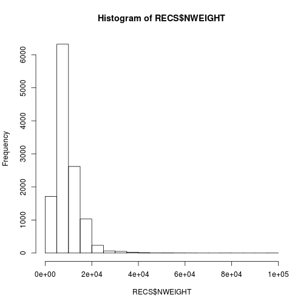
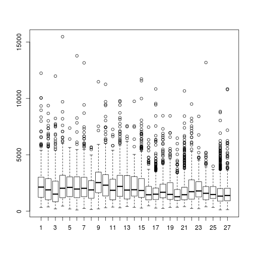
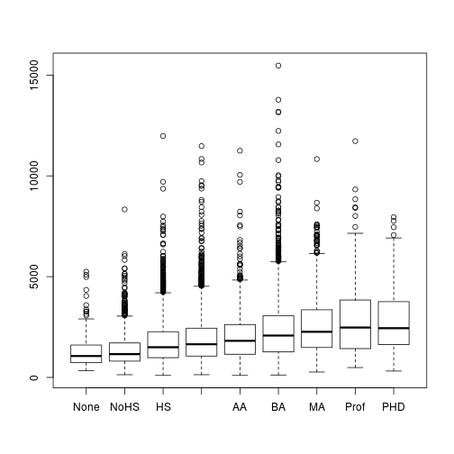
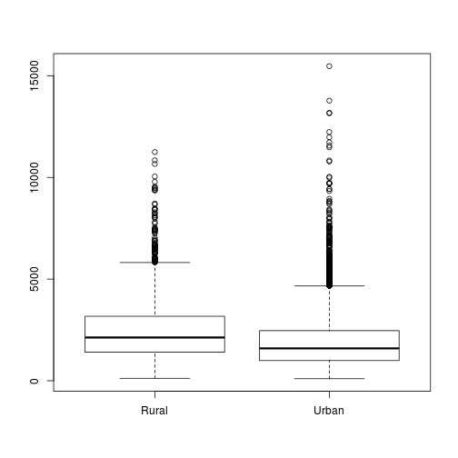
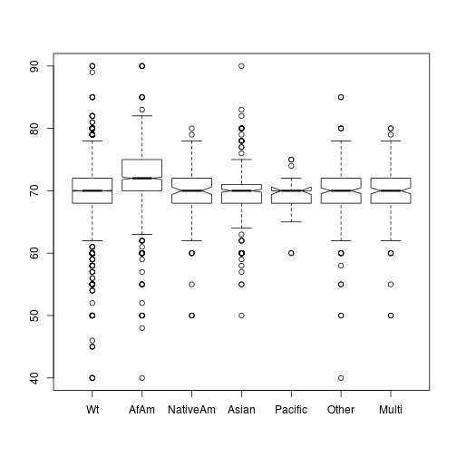
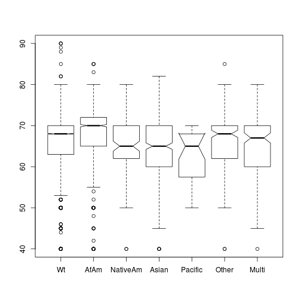
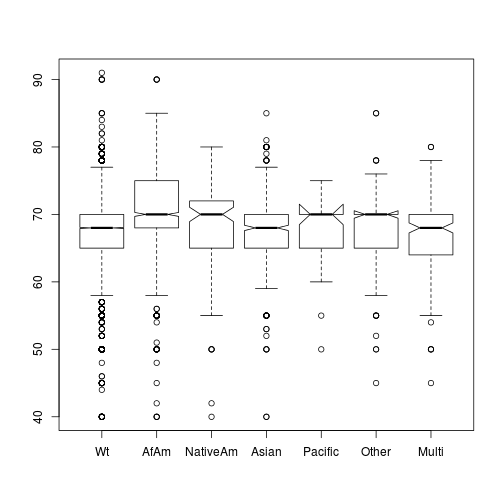
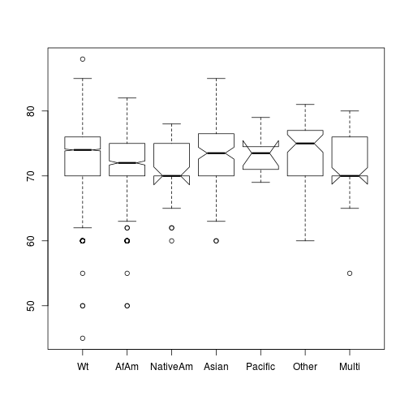
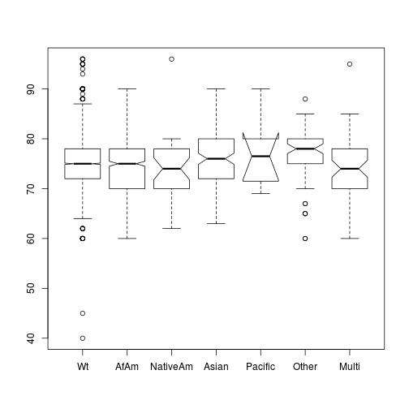

Research Notes for Housing Market Institutions Drive Race and Ethnicity Differences in Energy Consumption
========================================================

Load in the raw data.

```r
RECS <- read.csv("~/Research/EnergyEthnicity/Data/recs2009_public.csv")

#summary(RECS)
```

Lots of recodes in there.


```r
library(plyr)
#ID
RECS$DOEID<-as.factor(RECS$DOEID)  

#Region
RECS$REGIONC<-revalue(as.factor(RECS$REGIONC),c("1"="NE", "2"="MidWest","3"="South","4"="West"))

#Type of Structure
RECS$TYPEHUQ<-revalue(as.factor(RECS$TYPEHUQ), c("1"="Mobile", "2"="SFDetached", "3"="SFAttached", "4"="SmApartment", "5"="LgApartment"))

#Climate zone
RECS$Climate_Region_Pub<-revalue(as.factor(RECS$Climate_Region_Pub),c("1"="VColdCold","2"="HotDryMixedDry","3"="HotHumid","4"="MixedHumid","5"="Marine"))

#Urban vs Rural
RECS$UR<-revalue(as.factor(RECS$UR), c("U"="Urban","R"="Rural"))

RECS$KOWNRENT<-revalue(as.factor(RECS$KOWNRENT),c("1"="Own","2"="Rent","3"="Free"))

#Year Built
summary(RECS$YEARMADE)
```

```
##    Min. 1st Qu.  Median    Mean 3rd Qu.    Max. 
##    1920    1955    1975    1971    1991    2009
```

```r
#Moved in
RECS$OCCUPYYRANGE<-revalue(as.factor(RECS$OCCUPYYRANGE),c("1"="Pre50", "2"="5059","3"="6069","4"="7079","5"="8089","6"="9099", "7"="0004","8"="0509"))

#Bedrooms
RECS$BEDROOMS[RECS$BEDROOMS==-2]<-NA
summary(RECS$BEDROOMS)
```

```
##    Min. 1st Qu.  Median    Mean 3rd Qu.    Max.    NA's 
##    0.00    2.00    3.00    2.86    3.00   13.00     215
```

```r
#Working with cooking end use
summary(RECS$STOVEN)
```

```
##    Min. 1st Qu.  Median    Mean 3rd Qu.    Max. 
##  0.0000  1.0000  1.0000  0.9112  1.0000  3.0000
```

```r
summary(RECS$STOVE)
```

```
##    Min. 1st Qu.  Median    Mean 3rd Qu.    Max. 
##  0.0000  0.0000  0.0000  0.1233  0.0000  2.0000
```

```r
summary(RECS$OVEN)
```

```
##    Min. 1st Qu.  Median    Mean 3rd Qu.    Max. 
##  0.0000  0.0000  0.0000  0.1567  0.0000  3.0000
```

```r
#Stove and oven fuel are only reported if separate

RECS$CookTopElectric<-FALSE
RECS$CookTopElectric[RECS$STOVENFUEL=='5' | RECS$STOVEFUEL=='5' ]<-TRUE

RECS$OvenElectric<-FALSE
RECS$OvenElectric[RECS$STOVENFUEL=='5' | RECS$OVENFUEL=='5' ]<-TRUE

#Just indicating that that cook with electricity
summary(RECS$CookTopElectric)
```

```
##    Mode   FALSE    TRUE    NA's 
## logical    4750    7333       0
```

```r
summary(RECS$OvenElectric)
```

```
##    Mode   FALSE    TRUE    NA's 
## logical    4395    7688       0
```

```r
#How much they use it
RECS$NUMMEAL<-revalue(as.factor(RECS$NUMMEAL),c("0"="Never","1"="ThreeDay","2"="TwoDay", "3"="OneDay", "4"="FewWeek","5"="OneWeek","6"="LessWeek"))

#this is better on cooking fuel.  Don't use the separate oven and cook top from above
RECS$ELectricCook<-FALSE
RECS$ELectricCook[RECS$FUELFOOD=="5"]<-TRUE

#Number of fridges.  Watch out for those with more than 4.
table(RECS$NUMFRIG)
```

```
## 
##    0    1    2    3    4    5    6    7 
##   19 9167 2626  226   34    9    1    1
```

```r
#age of fridge
RECS$AgeFridge<-revalue(as.factor(RECS$AGERFRI1), c("1"="Less2", "2"="2to4Years", "3"="5to9Years","41"="10to14Years","42"="15to19Years","5"="20PlusYears","-2"=NA))

summary(RECS$AgeFridge)
```

```
##       Less2   2to4Years   5to9Years 20PlusYears 10to14Years 15to19Years 
##        1523        2886        4212         546        2163         734 
##        NA's 
##          19
```

```r
#Has Dishwasher
RECS$DishwaherTrue<-revalue(as.factor(RECS$DISHWASH),c("0"=TRUE, "1"=FALSE))

RECS$WASHLOAD<-revalue(as.factor(RECS$WASHLOAD),c("1"="1Less","2"="2to4Loads","3"="5to9Loads","4"="10to15Loads","5"="15PlusLoads","-2"=NA))

RECS$DRYER<-revalue(as.factor(RECS$DRYER), c("0"=FALSE,"1"=TRUE))

RECS$DRYRFUEL<-revalue(as.factor(RECS$DRYRFUEL), c("1"="NG","2"="LPG","5"="Elec","-2"=NA))

##Start Recoding HERE

#Age of Dryer
AGECDRYER<-revalue(as.factor(RECS$AGECDRYER),c("1"="Less2","2"="TwoTo4", "3"="FiveTo9", "41"="TenTo14", "42"="FifteenTo19", "5"="Gr20", "-2"=NA))
summary(RECS$AGECDRYER)
```

```
##    Min. 1st Qu.  Median    Mean 3rd Qu.    Max. 
##   -2.00    1.00    3.00    9.24    3.00   42.00
```

```r
#Number of TVs
summary(RECS$TVCOLOR)
```

```
##    Min. 1st Qu.  Median    Mean 3rd Qu.    Max. 
##   0.000   2.000   2.000   2.588   3.000  14.000
```

```r
#Type of TV 
RECS$TVTYPE1<-revalue(as.factor(RECS$TVTYPE1),c("1"="Standard","2"="LCD", "3"="Plasma", "4"="Projection", "5"="LED", "-2"=NA))

summary(RECS$TVTYPE1)
```

```
##   Standard        LCD     Plasma Projection        LED       NA's 
##       5218       4979       1059        549        130        148
```

```r
#Weekday Use of TV
RECS$TVONWD1<-revalue(as.factor(RECS$TVONWD1),c("1"="LessHour","2"="OneTo3Hrs", "3"="ThreeTo6Hrs", "4"="SixTo10Hrs", "5"="Gr10", "-2"=NA))

summary(RECS$TVONWD1)
```

```
##    LessHour   OneTo3Hrs ThreeTo6Hrs  SixTo10Hrs        Gr10        NA's 
##         621        2991        4608        2249        1466         148
```

```r
#number of computers

summary(RECS$NUMPC)
```

```
##    Min. 1st Qu.  Median    Mean 3rd Qu.    Max. 
##   0.000   1.000   1.000   1.387   2.000  15.000
```

```r
#Time computers on
RECS$TIMEON1<-revalue(as.factor(RECS$TIMEON1),c("1"="LessHour","2"="OneTo3Hrs", "3"="ThreeTo6Hrs", "4"="SixTo10Hrs", "5"="Gr10", "-2"=NA))
summary(RECS$TIMEON1)
```

```
##    LessHour   OneTo3Hrs ThreeTo6Hrs  SixTo10Hrs        Gr10        NA's 
##        1741        3504        1960         873        1391        2614
```

```r
#Well Pump?
RECS$WELLPUMP<-revalue(as.factor(RECS$WELLPUMP),c("0"=FALSE,"1"=TRUE, "-2"=FALSE))
summary(RECS$WELLPUMP)
```

```
## FALSE  TRUE 
## 10688  1395
```

```r
#Heating Fuel
RECS$FUELHEAT<-revalue(as.factor(RECS$FUELHEAT),c("1"="NG","2"="LPG","3"="Oil", "4"="Kerosene", "5"="Elec", "7"="Wood", "8"="Solar", "9"="District", "21"="Other", "-2"=NA))
  
summary(RECS$FUELHEAT)
```

```
##       NG      LPG      Oil Kerosene     Elec     Wood    Solar District 
##     5903      487      817       52     4038      295        1       23 
##    Other     NA's 
##       21      446
```

```r
#Heating Age
RECS$EQUIPAGE<-revalue(as.factor(RECS$EQUIPAGE),c("1"="Less2","2"="TwoTo4", "3"="FiveTo9", "41"="TenTo14", "42"="FifteenTo19", "5"="Gr20", "-2"=NA))
summary(RECS$EQUIPAGE)
```

```
##       Less2      TwoTo4     FiveTo9        Gr20     TenTo14 FifteenTo19 
##        1157        1727        2821        2901        2150        1178 
##        NA's 
##         149
```

```r
#Winter Temp Day when home
RECS$TEMPHOME[RECS$TEMPHOME==-2]<-NA
summary(RECS$TEMPHOME)
```

```
##    Min. 1st Qu.  Median    Mean 3rd Qu.    Max.    NA's 
##   40.00   68.00   70.00   69.68   72.00   90.00     446
```

```r
#Winter Temp Day when away
RECS$TEMPGONE[RECS$TEMPGONE==-2]<-NA
summary(RECS$TEMPGONE)
```

```
##    Min. 1st Qu.  Median    Mean 3rd Qu.    Max.    NA's 
##   40.00   64.00   68.00   66.37   70.00   90.00     446
```

```r
#Winter Temp at Night
RECS$TEMPNITE[RECS$TEMPNITE==-2]<-NA
summary(RECS$TEMPNITE)
```

```
##    Min. 1st Qu.  Median    Mean 3rd Qu.    Max.    NA's 
##   40.00   65.00   68.00   67.69   70.00   91.00     446
```

```r
#Water heater type
RECS$H2OTYPE1<-revalue(as.factor(RECS$H2OTYPE1),c("1"="Storage", "2"="Tankless", "-2"=NA))

summary(RECS$H2OTYPE1)
```

```
##  Storage Tankless     NA's 
##    11727      322       34
```

```r
#Water service fuel
RECS$FUELH2O<-revalue(as.factor(RECS$FUELH2O),c("1"="NG","2"="LPG","3"="Oil", "4"="Kerosene", "5"="Elec", "7"="Wood", "8"="Solar", "9"="District", "21"="Other", "-2"=NA))
```

```
## The following `from` values were not present in `x`: 9
```

```r
summary(RECS$FUELH2O)
```

```
##       NG      LPG      Oil Kerosene     Elec     Wood    Solar    Other 
##     6380      399      457        3     4773       11       17        9 
##     NA's 
##       34
```

```r
#Water heater size.  Keep in mind the tankless.
RECS$WHEATSIZ<-revalue(as.factor(RECS$WHEATSIZ),c("1"="Small", "2"="Med", "3"="Lrg", "-2"=NA))

summary(RECS$WHEATSIZ)
```

```
## Small   Med   Lrg  NA's 
##  1611  6098  4018   356
```

```r
#Water heater age
RECS$WHEATAGE<-revalue(as.factor(RECS$WHEATAGE),c("1"="Less2","2"="TwoTo4", "3"="FiveTo9", "41"="TenTo14", "42"="FifteenTo19", "5"="Gr20", "-2"=NA))

summary(RECS$WHEATAGE)
```

```
##       Less2      TwoTo4     FiveTo9        Gr20     TenTo14 FifteenTo19 
##        1513        2256        3776        1197        2354         953 
##        NA's 
##          34
```

```r
#AC is used?
RECS$AIRCOND<-revalue(as.factor(RECS$AIRCOND),c("0"=FALSE, "1"=TRUE))
summary(RECS$AIRCOND)
```

```
## FALSE  TRUE 
##  2143  9940
```

```r
#AC Type
RECS$COOLTYPE<-revalue(as.factor(RECS$COOLTYPE),c("1"="Central", "2"="Window", "3"="Both", "-2"=NA))
summary(RECS$COOLTYPE)
```

```
## Central  Window    Both    NA's 
##    7283    2504     153    2143
```

```r
#Central AC is heatpump.  Remember only Central AC
RECS$CENACHP<-revalue(as.factor(RECS$CENACHP),c("0"=FALSE, "1"=TRUE, "-2"=NA))
summary(RECS$CENACHP)
```

```
## FALSE  TRUE  NA's 
##  6102  1334  4647
```

```r
#Age Central AC
RECS$AGECENAC<-revalue(as.factor(RECS$AGECENAC),c("1"="Less2","2"="TwoTo4", "3"="FiveTo9", "41"="TenTo14", "42"="FifteenTo19", "5"="Gr20", "-2"=NA))

summary(RECS$AGECENAC)
```

```
##       Less2      TwoTo4     FiveTo9        Gr20     TenTo14 FifteenTo19 
##         658        1237        2269         925        1626         721 
##        NA's 
##        4647
```

```r
#Use Central AC?
RECS$USECENAC<-revalue(as.factor(RECS$USECENAC),c("1"="Rare","2"="Frequent", "3"="All", "-2"=NA))
summary(RECS$USECENAC)
```

```
##     Rare Frequent      All     NA's 
##     2104     1494     3838     4647
```

```r
#Temp AC when home in day
RECS$TEMPHOMEAC[RECS$TEMPHOMEAC=="-2"]<-NA
summary(RECS$TEMPHOMEAC)
```

```
##    Min. 1st Qu.  Median    Mean 3rd Qu.    Max.    NA's 
##   45.00   70.00   73.00   73.25   76.00   88.00    6751
```

```r
#Temp AC no home in day
RECS$TEMPGONEAC[RECS$TEMPGONEAC==-2]<-NA
summary(RECS$TEMPGONEAC)
```

```
##    Min. 1st Qu.  Median    Mean 3rd Qu.    Max.    NA's 
##   40.00   72.00   75.00   75.16   78.00   96.00    6751
```

```r
#Temp AC at night
RECS$TEMPNITEAC[RECS$TEMPNITEAC==-2]<-NA
summary(RECS$TEMPNITEAC)
```

```
##    Min. 1st Qu.  Median    Mean 3rd Qu.    Max.    NA's 
##   45.00   70.00   73.00   73.02   76.00   96.00    6751
```

```r
#Number of wall AC units
RECS$NUMBERAC[RECS$NUMBERAC==-2]<-NA
summary(RECS$NUMBERAC)
```

```
##    Min. 1st Qu.  Median    Mean 3rd Qu.    Max.    NA's 
##   1.000   1.000   2.000   1.811   2.000   9.000    9426
```

```r
#age of wall AC
RECS$WWACAGE<-revalue(as.factor(RECS$WWACAGE),c("1"="Less2","2"="TwoTo4", "3"="FiveTo9", "41"="TenTo14", "42"="FifteenTo19", "5"="Gr20", "-2"=NA))
summary(RECS$WWACAGE)
```

```
##       Less2      TwoTo4     FiveTo9        Gr20     TenTo14 FifteenTo19 
##         390         823         840         169         338          97 
##        NA's 
##        9426
```

```r
#Wall AC is energy Star?
RECS$ESWWAC<-revalue(as.factor(RECS$ESWWAC),c("0"=TRUE, "1"=FALSE, "-2"=FALSE, "-8"=FALSE, "-9"=FALSE))
summary(RECS$ESWWAC)
```

```
## FALSE  TRUE 
## 11404   679
```

```r
#How frequent wall ac
RECS$USEWWAC<-revalue(as.factor(RECS$USEWWAC),c("1"="Rare","2"="Frequent", "3"="All", "-2"=NA))
summary(RECS$USEWWAC)
```

```
##     Rare Frequent      All     NA's 
##     1501      553      603     9426
```

```r
#Have pool?
RECS$SWIMPOOL<-revalue(as.factor(RECS$SWIMPOOL),c("0"=FALSE,"1"=TRUE, "-2"=FALSE))
summary(RECS$SWIMPOOL)
```

```
## FALSE  TRUE 
## 11186   897
```

```r
#Pool heated?
RECS$POOL<-revalue(as.factor(RECS$POOL),c("0"=FALSE,"1"=TRUE, "-2"=FALSE))

summary(RECS$POOL)
```

```
## FALSE  TRUE 
## 11846   237
```

```r
#Fuel used for pool
RECS$FUELPOOL<-revalue(as.factor(RECS$FUELPOOL),c("1"="NG","2"="LPG", "3"="FuelOil","4"="Kerosene", "5"="Elec","8"="Solar","21"="Other", "-2"=NA))
```

```
## The following `from` values were not present in `x`: 4
```

```r
summary(RECS$FUELPOOL)
```

```
##      NG     LPG FuelOil    Elec   Solar   Other    NA's 
##     118      24       2      60      32       1   11846
```

```r
#Hot Tub used
RECS$RECBATH<-revalue(as.factor(RECS$RECBATH),c("0"=FALSE,"1"=TRUE))
summary(RECS$RECBATH)
```

```
## FALSE  TRUE 
## 11389   694
```

```r
#Hot tub fuel
RECS$FUELTUB<-revalue(as.factor(RECS$FUELTUB),c("1"="NG","2"="LPG", "3"="FuelOil","4"="Kerosene", "5"="Elec","8"="Solar","21"="Other", "-2"=NA))
```

```
## The following `from` values were not present in `x`: 4
```

```r
summary(RECS$FUELTUB)
```

```
##      NG     LPG FuelOil    Elec   Solar   Other    NA's 
##     168      18       7     493       5       3   11389
```

```r
RECS$TYPEGLASS<-revalue(as.factor(RECS$TYPEGLASS),c("1"="SinglePane","2"="DoublePane", "3"="TriplePane", "-2"=NA))
summary(RECS$TYPEGLASS)
```

```
## SinglePane DoublePane TriplePane       NA's 
##       5071       6766        177         69
```

```r
#Electricity used for cooling
RECS$ELCOOL<-revalue(as.factor(RECS$ELCOOL),c("0"=FALSE,"1"=TRUE))
summary(RECS$ELCOOL)
```

```
## FALSE  TRUE 
##  2143  9940
```

```r
#Electricity used for space heating
RECS$ELWARM<-revalue(as.factor(RECS$ELWARM),c("0"=FALSE,"1"=TRUE))
summary(RECS$ELWARM)
```

```
## FALSE  TRUE 
##  5929  6154
```

```r
#Electricity used for water heating
RECS$ELWATER<-revalue(as.factor(RECS$ELWATER),c("0"=FALSE,"1"=TRUE))
summary(RECS$ELWATER)
```

```
## FALSE  TRUE 
##  7270  4813
```

```r
#Electricity used for cooking
RECS$ELFOOD<-revalue(as.factor(RECS$ELFOOD),c("0"=FALSE,"1"=TRUE))
summary(RECS$ELFOOD)
```

```
## FALSE  TRUE 
##  4387  7696
```

```r
#May need to do some editing on this.  Low values are too low
summary(RECS$KWH)/12
```

```
##      Min.   1st Qu.    Median      Mean   3rd Qu.      Max. 
##     1.417   486.417   801.917   940.833  1230.000 12525.000
```

```r
#This is the sqft variable to use
summary(RECS$TOTSQFT_EN)
```

```
##    Min. 1st Qu.  Median    Mean 3rd Qu.    Max. 
##     100    1052    1696    2022    2606   15470
```

```r
#Get income working two ways
#MONEYPY 
RECS$MONEYPY<-revalue(as.factor(RECS$MONEYPY),c("1"="Less2500", "2"="Less5K", "3"="Less7500","4"="Less10K","5"="Less15K","6"="Less20K","7"="Less25K","8"="Less30K", "9"="Less35K","10"="Less40K","11"="Less45K","12"="Less50K","13"="Less55K","14"="Less60","15"="Less65","16"="Less70","17"="Less75","18"="Less80", "19"="Less85", "20"="Less90","21"="Less95","22"="Less100K","23"="Less120K","24"="Gr120K"))
summary(RECS$MONEYPY)
```

```
## Less2500   Less5K Less7500  Less10K  Less15K  Less20K  Less25K  Less30K 
##      310      152      176      328      686      602      746      755 
##  Less35K  Less40K  Less45K  Less50K  Less55K   Less60   Less65   Less70 
##      698      671      622      787      526      374      450      406 
##   Less75   Less80   Less85   Less90   Less95 Less100K Less120K   Gr120K 
##      393      302      289      287      231      250      653     1389
```

```r
RECS$RENTHELP<-revalue(as.factor(RECS$RENTHELP),c("0"=FALSE, "1"=TRUE, "-2"=FALSE))
summary(RECS$RENTHELP)
```

```
## FALSE  TRUE 
## 11913   170
```

```r
RECS$FOODASST<-revalue(as.factor(RECS$FOODASST),c("0"=FALSE, "1"=TRUE))
summary(RECS$FOODASST)
```

```
## FALSE  TRUE 
## 10795  1288
```

```r
#Age of HH looks ok
summary(RECS$HHAGE)
```

```
##    Min. 1st Qu.  Median    Mean 3rd Qu.    Max. 
##   16.00   37.00   49.00   49.74   62.00   85.00
```

```r
#number of people
summary(RECS$NHSLDMEM)
```

```
##    Min. 1st Qu.  Median    Mean 3rd Qu.    Max. 
##   1.000   2.000   2.000   2.666   4.000  14.000
```

```r
#Ed level of HH
RECS$EDUCATION<-revalue(as.factor(RECS$EDUCATION),c("0"="None","1"="NoHS","2"="HS","3"="SomeCol","4"="AA","5"="BA", "6"="MA", "7"="Prof", "8"="PHD"))
summary(RECS$EDUCATION)
```

```
##    None    NoHS      HS SomeCol      AA      BA      MA    Prof     PHD 
##     200    1033    3193    2701    1193    2428     957     221     157
```

```r
#HH Race
RECS$Householder_Race<-revalue(as.factor(RECS$Householder_Race),c("1"="Wt","2"="AfAm","3"="NativeAm","4"="Asian","5"="Pacific", "6"="Other", "7"="Multi"))
summary(RECS$Householder_Race)
```

```
##       Wt     AfAm NativeAm    Asian  Pacific    Other    Multi 
##     9578     1517      110      457       40      211      170
```

```r
#Hispanic
RECS$Hispanic<-FALSE
RECS$Hispanic[RECS$SDESCENT=="1"]<-TRUE
summary(RECS$Hispanic)
```

```
##    Mode   FALSE    TRUE    NA's 
## logical   10409    1674       0
```

```r
#Need state ie REPORTABLE_DOMAIN
```
Checkign out the weight variable

```r
summary(RECS$NWEIGHT)
```

```
##    Min. 1st Qu.  Median    Mean 3rd Qu.    Max. 
##   476.1  6297.0  7971.0  9403.0 11330.0 95780.0
```

```r
plot(hist(RECS$NWEIGHT))
```

  
Looks like it is the number of equivelent HH in population style.

the weights are a little odd, too large differences.  Investigate the top end to find.

```r
#summary(RECS[RECS$NWEIGHT>40000,])
```
They are very poor.  Solution is to drop the ones with weights greater than 40K.  TODO


Looking at weather

```r
summary(RECS$HDD65)
```

```
##    Min. 1st Qu.  Median    Mean 3rd Qu.    Max. 
##       0    2198    4483    4141    5913   12520
```

```r
summary(RECS$CDD65)
```

```
##    Min. 1st Qu.  Median    Mean 3rd Qu.    Max. 
##       0     561    1045    1415    1897    5480
```
Nothing odd.


This is the data ME created from the HUD report on the number of complaints per 100K population


```r
HUD <- read.csv("~/Research/EnergyEthnicity/Data/HUD.csv")

#And the clean up from importing from excell
HUD$pop<-as.numeric(gsub(",","",HUD$pop))
HUD$reportablen<-as.factor(HUD$reportablen)
summary(HUD)
```

```
##         state    compltothudfhap       pop              comppop      
##  Alabama   : 1   Min.   :   4.0   Min.   :  532981   Min.   :0.4132  
##  Alaska    : 1   1st Qu.:  63.5   1st Qu.: 1654728   1st Qu.:2.1526  
##  Arizona   : 1   Median : 107.0   Median : 4287931   Median :2.8810  
##  Arkansas  : 1   Mean   : 200.2   Mean   : 5968134   Mean   :3.4185  
##  California: 1   3rd Qu.: 202.0   3rd Qu.: 6554834   3rd Qu.:4.3463  
##  Colorado  : 1   Max.   :1108.0   Max.   :36580371   Max.   :8.7306  
##  (Other)   :45                                                       
##   reportablen   reporttot     
##  1      : 5   Min.   : 1.812  
##  10     : 4   1st Qu.: 4.222  
##  14     : 4   Median : 9.258  
##  23     : 4   Mean   : 9.592  
##  27     : 4   3rd Qu.:13.504  
##  18     : 3   Max.   :20.496  
##  (Other):27
```
# Some Ideas on what matters

```r
table(RECS$UR, RECS$RENTHELP)
```

```
##        
##         FALSE TRUE
##   Rural  2416   11
##   Urban  9497  159
```

```r
table(RECS$TYPEHUQ,RECS$KOWNRENT)
```

```
##              
##                Own Rent Free
##   Mobile       431   99   11
##   SFDetached  6835  879   89
##   SFAttached   506  373   11
##   SmApartment  144  769   13
##   LgApartment  224 1681   18
```

```r
#Dump the houses that are free

boxplot(RECS$TOTSQFT_EN~RECS$REPORTABLE_DOMAIN )
```

 

```r
boxplot(RECS$TOTSQFT_EN~RECS$EDUCATION )
```

 

```r
boxplot(RECS$TOTSQFT_EN~RECS$UR )
```

 

```r
table(RECS$EDUCATION)
```

```
## 
##    None    NoHS      HS SomeCol      AA      BA      MA    Prof     PHD 
##     200    1033    3193    2701    1193    2428     957     221     157
```

```r
table(RECS$UR,RECS$Householder_Race)
```

```
##        
##           Wt AfAm NativeAm Asian Pacific Other Multi
##   Rural 2131  201       28    14       6    17    30
##   Urban 7447 1316       82   443      34   194   140
```


That should finish the data wrangling.

# Electricity Model

A really basic model

```r
summary(lm(KWH~TOTSQFT_EN:HDD65+TOTSQFT_EN:CDD65 +Householder_Race+KOWNRENT:TYPEHUQ, data=RECS))
```

```
## 
## Call:
## lm(formula = KWH ~ TOTSQFT_EN:HDD65 + TOTSQFT_EN:CDD65 + Householder_Race + 
##     KOWNRENT:TYPEHUQ, data = RECS)
## 
## Residuals:
##    Min     1Q Median     3Q    Max 
## -34086  -3877  -1131   2708 111470 
## 
## Coefficients: (1 not defined because of singularities)
##                                   Estimate Std. Error t value Pr(>|t|)    
## (Intercept)                      6.147e+03  1.508e+03   4.077 4.60e-05 ***
## Householder_RaceAfAm             3.298e+02  1.805e+02   1.827  0.06772 .  
## Householder_RaceNativeAm         6.714e+02  6.132e+02   1.095  0.27358    
## Householder_RaceAsian           -2.063e+03  3.074e+02  -6.710 2.03e-11 ***
## Householder_RacePacific         -1.146e+03  1.012e+03  -1.132  0.25769    
## Householder_RaceOther           -8.584e+02  4.459e+02  -1.925  0.05423 .  
## Householder_RaceMulti           -1.146e+02  4.948e+02  -0.232  0.81692    
## TOTSQFT_EN:HDD65                 1.041e-04  7.276e-06  14.312  < 2e-16 ***
## TOTSQFT_EN:CDD65                 1.192e-03  2.270e-05  52.485  < 2e-16 ***
## KOWNRENTOwn:TYPEHUQMobile        3.889e+03  1.538e+03   2.529  0.01147 *  
## KOWNRENTRent:TYPEHUQMobile       5.147e+03  1.638e+03   3.142  0.00168 ** 
## KOWNRENTFree:TYPEHUQMobile       4.586e+03  2.445e+03   1.876  0.06074 .  
## KOWNRENTOwn:TYPEHUQSFDetached    2.021e+03  1.511e+03   1.338  0.18103    
## KOWNRENTRent:TYPEHUQSFDetached   1.380e+03  1.522e+03   0.907  0.36445    
## KOWNRENTFree:TYPEHUQSFDetached   2.713e+03  1.653e+03   1.641  0.10073    
## KOWNRENTOwn:TYPEHUQSFAttached   -1.030e+03  1.533e+03  -0.671  0.50192    
## KOWNRENTRent:TYPEHUQSFAttached   6.819e+02  1.542e+03   0.442  0.65828    
## KOWNRENTFree:TYPEHUQSFAttached  -1.517e+03  2.444e+03  -0.621  0.53483    
## KOWNRENTOwn:TYPEHUQSmApartment  -1.445e+03  1.598e+03  -0.905  0.36567    
## KOWNRENTRent:TYPEHUQSmApartment -1.080e+03  1.523e+03  -0.709  0.47823    
## KOWNRENTFree:TYPEHUQSmApartment -1.295e+03  2.324e+03  -0.557  0.57735    
## KOWNRENTOwn:TYPEHUQLgApartment  -2.185e+03  1.566e+03  -1.395  0.16303    
## KOWNRENTRent:TYPEHUQLgApartment -1.443e+03  1.514e+03  -0.954  0.34034    
## KOWNRENTFree:TYPEHUQLgApartment         NA         NA      NA       NA    
## ---
## Signif. codes:  0 '***' 0.001 '**' 0.01 '*' 0.05 '.' 0.1 ' ' 1
## 
## Residual standard error: 6384 on 12060 degrees of freedom
## Multiple R-squared:  0.3032,	Adjusted R-squared:  0.3019 
## F-statistic: 238.5 on 22 and 12060 DF,  p-value: < 2.2e-16
```

Time to kill those living for free and with the crazy large weights

```r
summary(lm(KWH~TOTSQFT_EN:HDD65+TOTSQFT_EN:CDD65 +Householder_Race:Hispanic+KOWNRENT:TYPEHUQ, data=RECS[RECS$KOWNRENT!="Free" & RECS$NWEIGHT<40000,]))
```

```
## 
## Call:
## lm(formula = KWH ~ TOTSQFT_EN:HDD65 + TOTSQFT_EN:CDD65 + Householder_Race:Hispanic + 
##     KOWNRENT:TYPEHUQ, data = RECS[RECS$KOWNRENT != "Free" & RECS$NWEIGHT < 
##     40000, ])
## 
## Residuals:
##    Min     1Q Median     3Q    Max 
## -34514  -3878  -1058   2702 111142 
## 
## Coefficients: (2 not defined because of singularities)
##                                          Estimate Std. Error t value
## (Intercept)                             3.282e+03  1.391e+03   2.360
## TOTSQFT_EN:HDD65                        9.650e-05  7.367e-06  13.099
## TOTSQFT_EN:CDD65                        1.202e-03  2.266e-05  53.037
## Householder_RaceWt:HispanicFALSE        1.760e+03  1.386e+03   1.270
## Householder_RaceAfAm:HispanicFALSE      1.886e+03  1.394e+03   1.353
## Householder_RaceNativeAm:HispanicFALSE  3.167e+03  1.570e+03   2.017
## Householder_RaceAsian:HispanicFALSE    -5.895e+02  1.416e+03  -0.416
## Householder_RacePacific:HispanicFALSE  -2.247e+02  1.741e+03  -0.129
## Householder_RaceOther:HispanicFALSE     2.092e+02  1.509e+03   0.139
## Householder_RaceMulti:HispanicFALSE     1.625e+03  1.480e+03   1.098
## Householder_RaceWt:HispanicTRUE         4.638e+02  1.394e+03   0.333
## Householder_RaceAfAm:HispanicTRUE       1.128e+03  1.760e+03   0.641
## Householder_RaceNativeAm:HispanicTRUE   2.704e+02  1.732e+03   0.156
## Householder_RaceAsian:HispanicTRUE     -2.371e+03  2.936e+03  -0.808
## Householder_RacePacific:HispanicTRUE    5.490e+03  3.459e+03   1.587
## Householder_RaceOther:HispanicTRUE      1.179e+03  1.523e+03   0.774
## Householder_RaceMulti:HispanicTRUE             NA         NA      NA
## KOWNRENTOwn:TYPEHUQMobile               5.222e+03  3.474e+02  15.033
## KOWNRENTRent:TYPEHUQMobile              6.401e+03  6.641e+02   9.640
## KOWNRENTOwn:TYPEHUQSFDetached           3.330e+03  1.959e+02  16.999
## KOWNRENTRent:TYPEHUQSFDetached          2.820e+03  2.682e+02  10.515
## KOWNRENTOwn:TYPEHUQSFAttached           2.903e+02  3.270e+02   0.888
## KOWNRENTRent:TYPEHUQSFAttached          2.085e+03  3.642e+02   5.726
## KOWNRENTOwn:TYPEHUQSmApartment         -2.336e+02  5.543e+02  -0.422
## KOWNRENTRent:TYPEHUQSmApartment         4.297e+02  2.771e+02   1.551
## KOWNRENTOwn:TYPEHUQLgApartment         -8.855e+02  4.531e+02  -1.954
## KOWNRENTRent:TYPEHUQLgApartment                NA         NA      NA
##                                        Pr(>|t|)    
## (Intercept)                              0.0183 *  
## TOTSQFT_EN:HDD65                        < 2e-16 ***
## TOTSQFT_EN:CDD65                        < 2e-16 ***
## Householder_RaceWt:HispanicFALSE         0.2041    
## Householder_RaceAfAm:HispanicFALSE       0.1760    
## Householder_RaceNativeAm:HispanicFALSE   0.0437 *  
## Householder_RaceAsian:HispanicFALSE      0.6772    
## Householder_RacePacific:HispanicFALSE    0.8973    
## Householder_RaceOther:HispanicFALSE      0.8897    
## Householder_RaceMulti:HispanicFALSE      0.2722    
## Householder_RaceWt:HispanicTRUE          0.7393    
## Householder_RaceAfAm:HispanicTRUE        0.5215    
## Householder_RaceNativeAm:HispanicTRUE    0.8759    
## Householder_RaceAsian:HispanicTRUE       0.4192    
## Householder_RacePacific:HispanicTRUE     0.1125    
## Householder_RaceOther:HispanicTRUE       0.4390    
## Householder_RaceMulti:HispanicTRUE           NA    
## KOWNRENTOwn:TYPEHUQMobile               < 2e-16 ***
## KOWNRENTRent:TYPEHUQMobile              < 2e-16 ***
## KOWNRENTOwn:TYPEHUQSFDetached           < 2e-16 ***
## KOWNRENTRent:TYPEHUQSFDetached          < 2e-16 ***
## KOWNRENTOwn:TYPEHUQSFAttached            0.3746    
## KOWNRENTRent:TYPEHUQSFAttached         1.05e-08 ***
## KOWNRENTOwn:TYPEHUQSmApartment           0.6734    
## KOWNRENTRent:TYPEHUQSmApartment          0.1210    
## KOWNRENTOwn:TYPEHUQLgApartment           0.0507 .  
## KOWNRENTRent:TYPEHUQLgApartment              NA    
## ---
## Signif. codes:  0 '***' 0.001 '**' 0.01 '*' 0.05 '.' 0.1 ' ' 1
## 
## Residual standard error: 6338 on 11891 degrees of freedom
## Multiple R-squared:  0.3106,	Adjusted R-squared:  0.3092 
## F-statistic: 223.2 on 24 and 11891 DF,  p-value: < 2.2e-16
```
May have to chunk that up a bit


Time to see if the behaviors are different, all exogenous.  Checking temperatures

Here are the winter temps

```r
boxplot(TEMPHOME~Householder_Race, notch=TRUE,data=RECS[RECS$KOWNRENT!="Free" & RECS$NWEIGHT<40000,])
```

```
## Warning in bxp(structure(list(stats = structure(c(62, 68, 70, 72, 78, 63,
## : some notches went outside hinges ('box'): maybe set notch=FALSE
```

 


```r
boxplot(TEMPGONE~Householder_Race, notch=TRUE,data=RECS[RECS$KOWNRENT!="Free" & RECS$NWEIGHT<40000,])
```

```
## Warning in bxp(structure(list(stats = structure(c(53, 63, 68, 70, 80, 55,
## : some notches went outside hinges ('box'): maybe set notch=FALSE
```

 


```r
boxplot(TEMPNITE~Householder_Race, notch=TRUE, data=RECS[RECS$KOWNRENT!="Free" & RECS$NWEIGHT<40000,])
```

```
## Warning in bxp(structure(list(stats = structure(c(58, 65, 68, 70, 77, 58,
## : some notches went outside hinges ('box'): maybe set notch=FALSE
```

 


and the summer temps

```r
boxplot(TEMPHOMEAC~Householder_Race, notch=TRUE, data=RECS[RECS$KOWNRENT!="Free" & RECS$NWEIGHT<40000,])
```

```
## Warning in bxp(structure(list(stats = structure(c(62, 70, 74, 76, 85, 63,
## : some notches went outside hinges ('box'): maybe set notch=FALSE
```

 


```r
boxplot(TEMPGONEAC~Householder_Race, notch=TRUE, data=RECS[RECS$KOWNRENT!="Free" & RECS$NWEIGHT<40000,])
```

```
## Warning in bxp(structure(list(stats = structure(c(64, 72, 75, 78, 87, 60,
## : some notches went outside hinges ('box'): maybe set notch=FALSE
```

 


```r
boxplot(TEMPNITEAC~Householder_Race, notch=TRUE, data=RECS[RECS$KOWNRENT!="Free" & RECS$NWEIGHT<40000,])
```

```
## Warning in bxp(structure(list(stats = structure(c(62, 70, 73, 76, 85, 63,
## : some notches went outside hinges ('box'): maybe set notch=FALSE
```

 

There are differences and it looks like AA are more energy intensive with respect to setpoints


Checking TV use


```r
xtabs(~RECS$TVONWD1+RECS$Householder_Race, data=RECS[RECS$KOWNRENT!="Free" & RECS$NWEIGHT<40000,])
```

```
##              RECS$Householder_Race
## RECS$TVONWD1    Wt AfAm NativeAm Asian Pacific Other Multi
##   LessHour     484   57        7    53       2    10     8
##   OneTo3Hrs   2440  252       26   165       5    66    37
##   ThreeTo6Hrs 3705  552       40   155      16    77    63
##   SixTo10Hrs  1750  359       15    51      11    30    33
##   Gr10        1090  284       21    18       6    24    23
```

